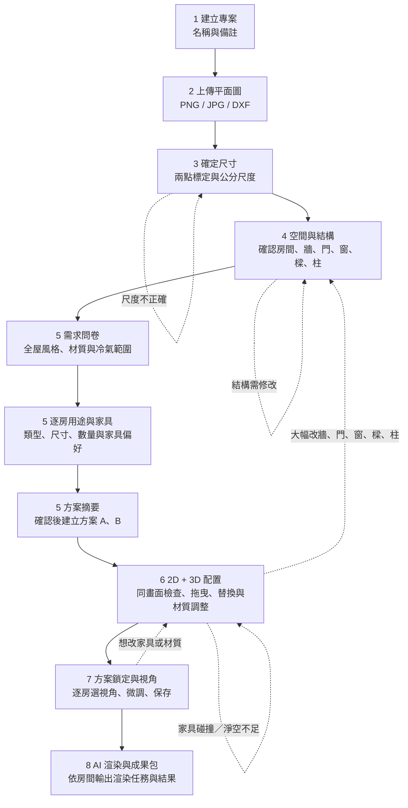
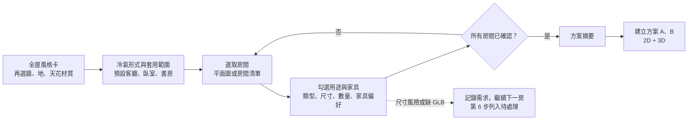
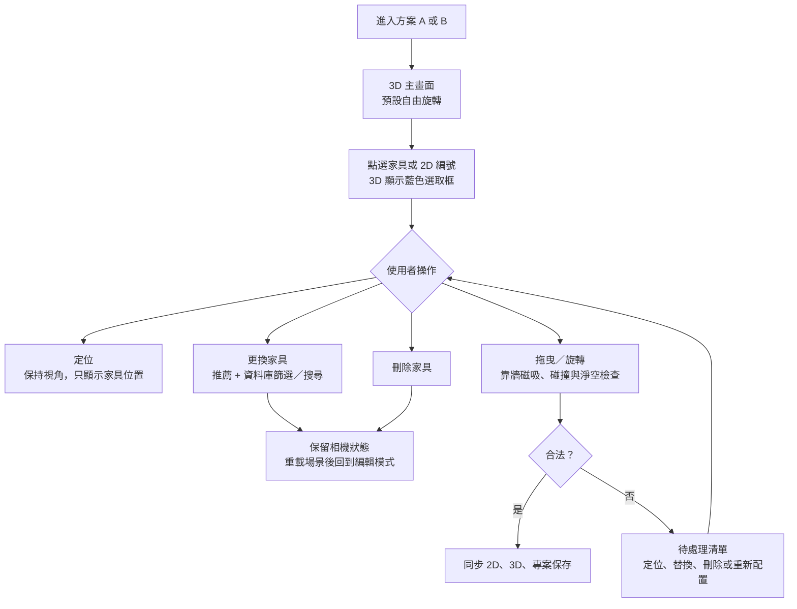
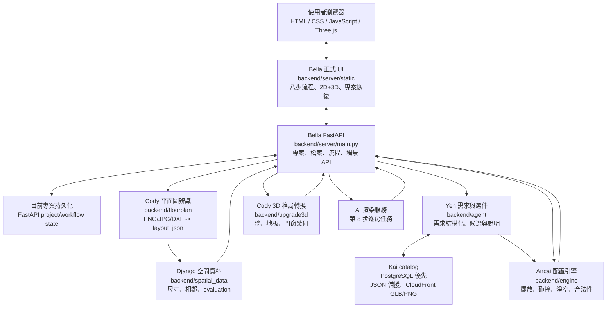
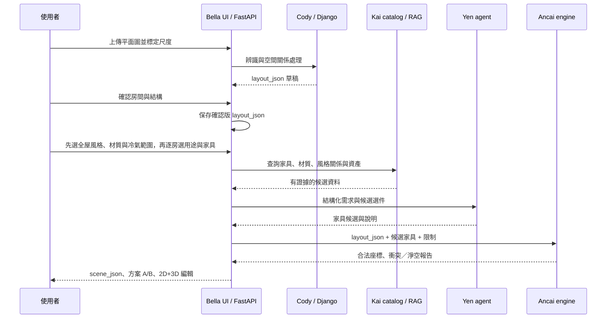
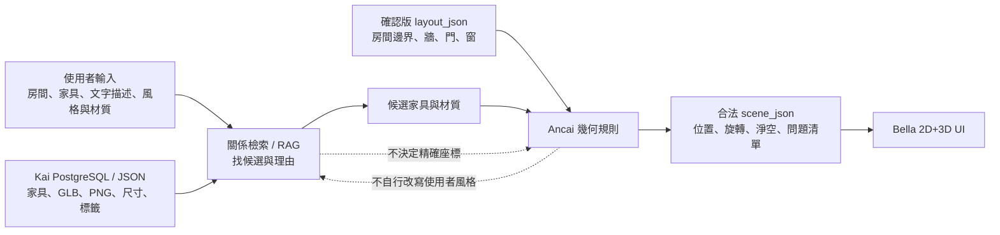
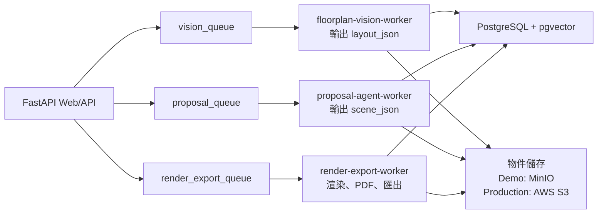

# RoomPilot 使用者流程與系統架構圖

最後更新：2026-07-29  
適用分支：`bella-test1`

本文件以目前正式網頁 `backend/server/static/scene.html`、`scene_v2.js`、FastAPI 與既有跨模組契約為準。圖中的「目前」表示已接入 Bella 流程；「部署擴充」表示可採用、但尚未拆成正式背景 worker 的架構。

## 1. 使用者八步流程

### 第 5 步精簡問卷

使用者在第 5 步不需要再回答「整面衣櫃或更衣區」、「電視或閱讀角」等強制極與極題目。舊視覺題庫仍可供 RAG 作關係與偏好證據，但不會阻擋問卷完成。

2026-08-02 補充：「全屋風格與設備」新增「生圖細節（可留白）」六題——間接光、天花分區、送風方式、維修口、吊扇、廚房家電外露。這不是把極與極問卷收回來：逐房視覺題庫維持停用（`state.visualQuestions` 仍為空），這六題只問一次、可全部留白，而且只進第 8 步生圖 prompt，不碰選件也不碰擺放參數。理由是這六個軸在 3D 場景裡沒有對應物件，模型本來就得自行補完；不問的話等於讓 AI 亂猜天花與設備。界線由 `docs/contracts/REMOTE_RENDER_CONTRACT.md` 與 `tests/test_questionnaire_visual_catalog.py` 的守門測試維持。

### 第 6 步家具操作

## 2. 現行系統架構

## 3. 主要資料生命週期

### 資料責任

| 資料 | 生產者 | 用途 | 不能承擔的責任 |
|---|---|---|---|
| `layout_json` | Cody 辨識，使用者於第 4 步確認 | 空間、牆、門、窗、房間、尺度 | 家具、材質、視角、設計決策 |
| RAG 關係證據 | Kai catalog + Django spatial metadata | 推薦家具、風格、材質與限制關聯 | 座標、碰撞、淨空、結構合法性 |
| `scene_json` | Yen 候選 + Ancai 幾何 + Bella service | 家具、材質、燈光、配置與方案 | 取代 layout 的建築辨識結果 |
| 2D/3D 編輯狀態 | Bella UI | 使用者調整、方案 A/B、視角與保存 | 判定幾何是否合法 |
| 合法性報告 | Ancai engine | 碰撞、淨空、門窗、邊界與朝向 | 選擇使用者風格或資料庫資料 |

## 4. Catalog、RAG 與幾何配置的分工

## 5. 部署擴充架構

目前 demo 以 FastAPI 同步流程為主。專案正式部署或耗時工作增加後，可改成下列非同步架構；這不是目前網頁必須依賴的條件。

## 6. 回退與提醒規則

- 大幅修改牆、門、窗、樑、柱：回第 4 步重新確認，原家具重新驗證。
- 家具無法合法放入：不硬塞；顯示原因、較小同類替代品或讓使用者第 6 步手動處理。
- PostgreSQL 暫不可用：第 6 步可回退到已驗證 JSON catalog；正式資料優先仍是 Kai PostgreSQL。
- 本機 IKEA GLB 備援：尚未完成，不可視為正式資料來源或提交大量 GLB。
- Graph RAG：只提供關係檢索與可追溯候選證據，不能取代 Ancai 的幾何驗證。

## 7. 相關文件

- [現行版本總覽](RoomPilot_現行版本總覽.md)
- [團隊 AI 責任與整合架構](TEAM_AI_OWNERSHIP.md)
- [Layout 與 Scene 邊界契約](contracts/LAYOUT_SCENE_BOUNDARY_CONTRACT.md)
- [Agent 前後端契約](contracts/AGENT_FRONTEND_BACKEND_CONTRACT.md)
- [家具工程規則](contracts/FURNITURE_ENGINEERING_RULES.md)
