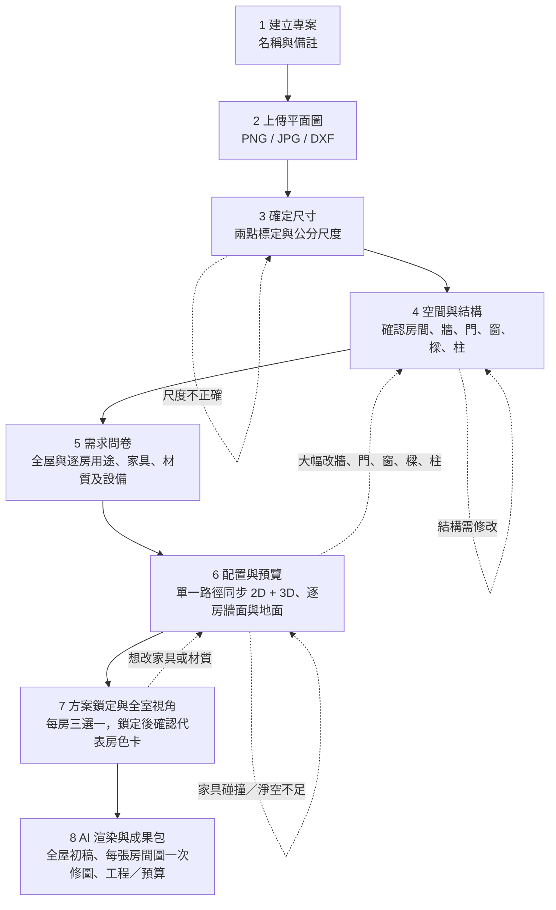
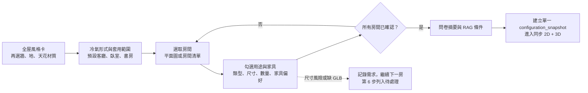
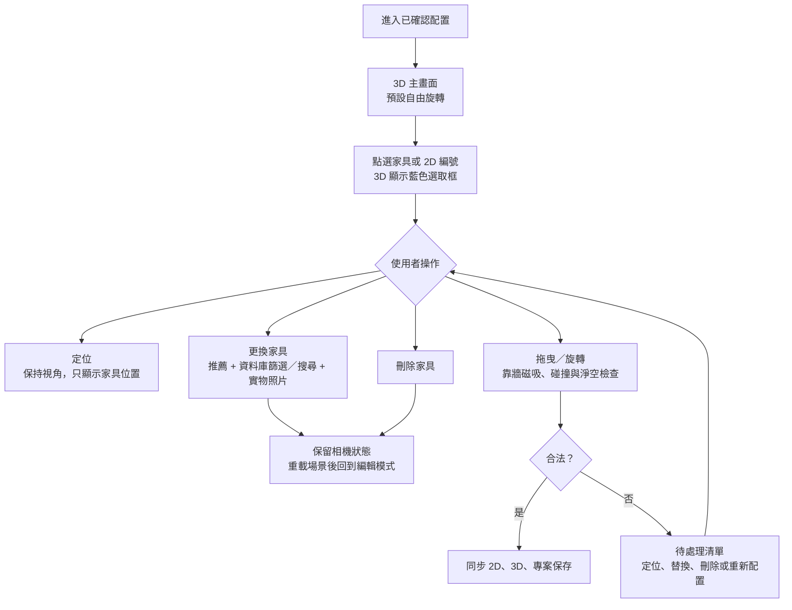
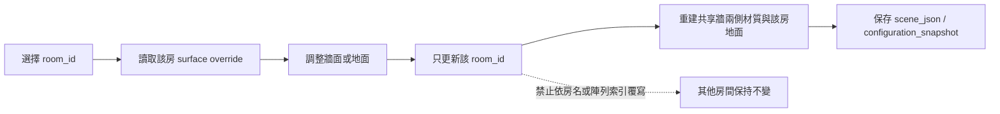
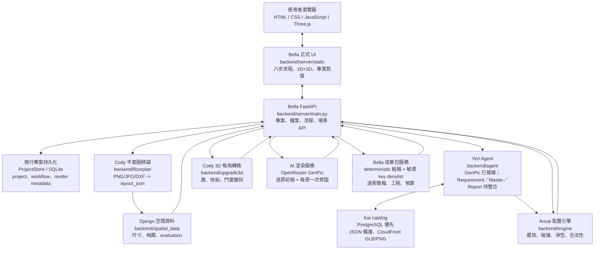
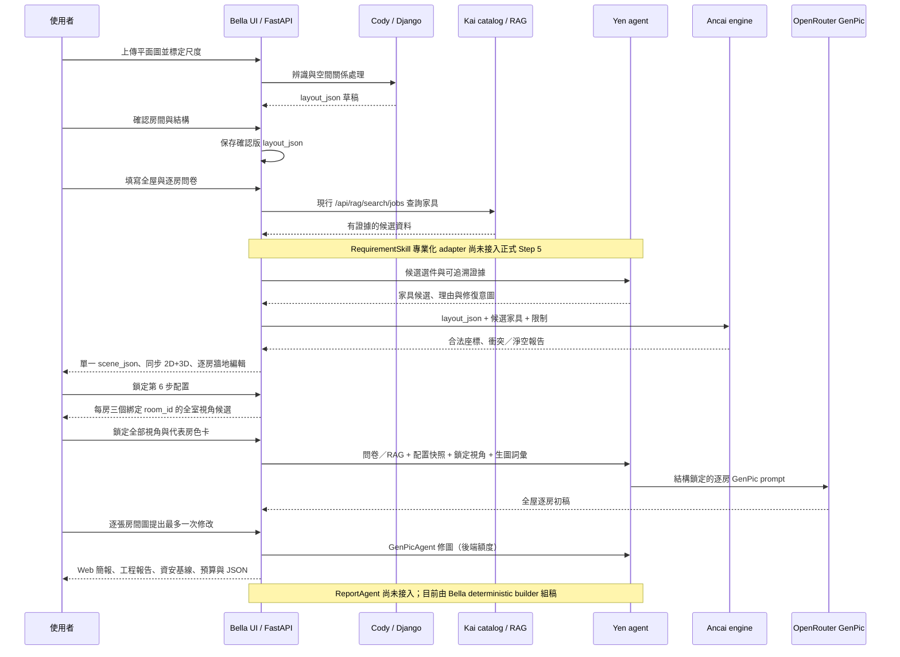
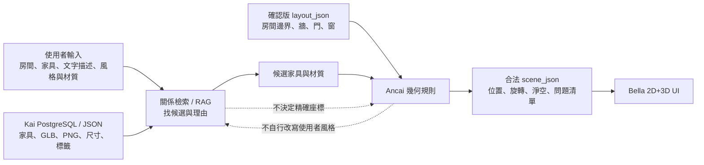
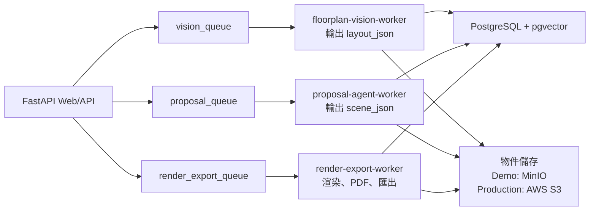

# RoomPilot 使用者流程與系統架構圖

最後更新：2026-08-06
適用分支：`bella-test1`

本文件以目前正式網頁 `backend/server/static/scene.html`、`scene_v2.js`、FastAPI 與既有跨模組契約為準。圖中的「目前」表示已接入 Bella 流程；「部署擴充」表示可採用、但尚未拆成正式背景 worker 的架構。

## 1. 使用者八步流程

### 第 5 步精簡問卷

使用者在第 5 步不需要再回答「整面衣櫃或更衣區」、「電視或閱讀角」等強制極與極題目。舊視覺題庫仍可供 RAG 作關係與偏好證據，但不會阻擋問卷完成。

### 第 6 步家具操作

家具候選卡先讀 catalog 的 `image_url`／`thumbnail_url`，再依序使用 front、angle、side
三視圖；每張卡保留固定 4:3 圖片區。網路或資產錯誤時顯示「暫無圖片」，不可讓使用者
只靠名稱與尺寸猜家具外觀。

### 第 6 步逐房牆面與地面

房間 polygon、地面 mesh、牆與家具一律使用確認版平面圖的全域公分座標。切換
房間只允許移動相機；不得把目前房間平移到場景中心。共享牆的兩個面分別依其相鄰
房間材質解析，廚房牆面不得污染臥室、浴室或其他房間。

天花板不提供獨立「調整天花與照明」操作。能由問卷與 catalog 表達的樣式直接預覽；
幾何無法精確呈現時，以同一標高與一致色彩覆蓋房間，並在 UI 註明最終生圖會依問卷
呈現天花造型。

### 第 7 步全室視角約束

每個候選 camera manifest 必須包含 `room_id`，相機位置需落在該房 polygon 內，目標點
以該房中心與主要家具群為基準。候選縮圖需能辨識全室主要家具、門窗與動線，不可只
面向單一牆面；以 `room_id` 對應，不能用畫面順序或中文房名猜測，因此陽台不會套用
臥室視角。

## 2. 現行系統架構

### 現行接線矩陣

| 元件 | 狀態 | 正式流程中的事實 |
|---|---|---|
| 家具 RAG API | 已實作 | Step 5 前端可建立 `/api/rag/search/jobs` 並輪詢結果 |
| Yen `GenPicAgent` | 已實作 | Step 8 `ai_render_service.py` 直接使用，需 `OPENROUTER_API_KEY` |
| Yen `RequirementSkill`／`MasterAgent` | 待整合 | 類別與測試存在，但 `backend/server/` 沒有呼叫 `build_master()` 或 `RequirementSkill` |
| Yen `ReportAgent` | 待整合 | Agent 與 PDF 工具存在，但 `/design-delivery` 未呼叫 |
| Bella `design-delivery` | 已實作 | 回傳 Web/JSON 的簡報、工程、預算與安全檢查節點 |
| 最終資安工程審核 | 部分實作 | 目前只做固定敏感 key denylist 遞迴移除；完整 schema allowlist、內容與權限審查待補 |
| PostgreSQL 整體 readiness | 待整合 | 現行沒有 `/api/health`；分別使用 catalog、RAG、scene 與 render status API |

現行 Step 8 AI 生圖以 `OPENROUTER_API_KEY` 啟用。Legacy `/render-jobs` 則以
`ROOMPILOT_RENDER_PROVIDER_URL` 啟用，兩條 provider 設定互不替代。

## 3. 主要資料生命週期

### 資料責任

| 資料 | 生產者 | 用途 | 不能承擔的責任 |
|---|---|---|---|
| `layout_json` | Cody 辨識，使用者於第 4 步確認 | 空間、牆、門、窗、房間、尺度 | 家具、材質、視角、設計決策 |
| RAG 關係證據 | Kai catalog + Django spatial metadata | 推薦家具、風格、材質與限制關聯 | 座標、碰撞、淨空、結構合法性 |
| `scene_json` | Yen 候選 + Ancai 幾何 + Bella service | 家具、材質、燈光與單一確認配置 | 取代 layout 的建築辨識結果 |
| 2D/3D 編輯狀態 | Bella UI | 使用者調整、configuration snapshot 與保存 | 判定幾何是否合法 |
| 合法性報告 | Ancai engine | 碰撞、淨空、門窗、邊界與朝向 | 選擇使用者風格或資料庫資料 |
| Yen 視角 | Bella Three.js + Yen 視角契約 | 每房候選相機、鎖定截圖與 prompt 構圖 | 移動家具、材質或固定結構 |
| 生圖與修圖狀態 | Yen GenPic + Bella ProjectStore | 逐房初稿、每房一次修圖額度與最終圖片 | 假裝 provider 失敗為成功 |
| 成果包 | Bella deterministic delivery builder + 各 owner 快照 | 逐房簡報、工程、敏感 key 檢查與預算 | 把 denylist 說成完整 whitelist／最終資安審查，或猜測價格 |

## 4. Catalog、RAG 與幾何配置的分工

## 5. 部署擴充架構

目前 demo 以 FastAPI 同步流程為主。專案正式部署或耗時工作增加後，可改成下列非同步架構；這不是目前網頁必須依賴的條件。

## 6. 回退與提醒規則

- 大幅修改牆、門、窗、樑、柱：回第 4 步重新確認，原家具重新驗證。
- 家具無法合法放入：不硬塞；顯示原因、較小同類替代品或讓使用者第 6 步手動處理。
- Kai PostgreSQL catalog 不可用：正式 `postgres` 模式回 503，不得自動偷換資料源；只有明確設定 `ROOMPILOT_CATALOG_PROVIDER=json` 的離線環境才使用已驗證 JSON。
- ProjectStore：現行專案、workflow 與 render metadata 使用 SQLite；PostgreSQL project store 仍是目標架構，不是目前可切換的實作。
- OpenRouter 未設定、額度不足或供應商失敗：保留各房既有結果並顯示真實錯誤；不得用 placeholder 假裝正式生圖。
- Provider 設定：現行 Step 8 只看 `OPENROUTER_API_KEY`；legacy `/render-jobs` 只看 `ROOMPILOT_RENDER_PROVIDER_URL`，不得混稱同一條 provider。
- 健康檢查：現行沒有 `/api/health`，不可把 Phase 5 目標端點寫成已上線。
- 本機 IKEA GLB 備援：尚未完成，不可視為正式資料來源或提交大量 GLB。
- Graph RAG：只提供關係檢索與可追溯候選證據，不能取代 Ancai 的幾何驗證。
- Yen Agent：`GenPicAgent` 已接 Step 8；`RequirementSkill`、`MasterAgent`、`ReportAgent` 仍待正式 adapter，不得因模組與單元測試存在就標成八步流程已完成。

## 7. 相關文件

- [現行版本總覽](RoomPilot_現行版本總覽.md)
- [團隊 AI 責任與整合架構](TEAM_AI_OWNERSHIP.md)
- [Layout 與 Scene 邊界契約](contracts/LAYOUT_SCENE_BOUNDARY_CONTRACT.md)
- [Agent 前後端契約](contracts/AGENT_FRONTEND_BACKEND_CONTRACT.md)
- [家具工程規則](contracts/FURNITURE_ENGINEERING_RULES.md)
