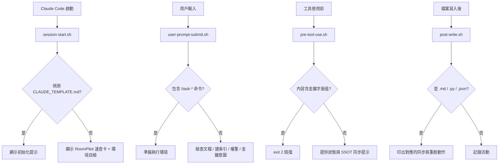

# 🪝 RoomPilot TaskMaster Hooks 系統

> 本目錄的 hook 全部是 **bash（僅需 macOS 版）+ jq**，
> 專案本體為 **Python 3.11.15 / `.venv-rag/`**；**本專案無 CI、無容器化部署**，全部本機 macOS 執行。
> 所有 hook 以 stdin 讀取 Claude Code 傳入的 JSON，用 `jq` 解析。

## ⚠️ 配置目錄名不得硬寫

本目錄下的腳本**一律不硬寫 `.claude-roompilot`**，改由腳本自身位置推導：

```bash
SCRIPT_DIR="$(cd "$(dirname "${BASH_SOURCE[0]}")" && pwd)"
CLAUDE_DIR="$(cd "$SCRIPT_DIR/.." && pwd)"      # = 配置目錄本身
CLAUDE_DIR_NAME="$(basename "$CLAUDE_DIR")"     # = .claude-roompilot 或 .claude
```

`hook-utils.sh` 另外匯出 `CLAUDE_CONFIG_DIR` / `CLAUDE_DIR_NAME` 供 source 它的腳本共用。

**為什麼**：啟用本配置＝`mv .claude-roompilot .claude`（見上層 `README.md` 的「如何啟用」）。
若腳本硬寫舊目錄名，改名後 `validate_environment()` 會直接判定「配置目錄不存在」而失敗，
`statusline.sh` 也會找不到 `taskmaster-data/`。

**唯一需要手動改路徑的檔案是 `settings.json`** —— 它由 Claude Code 在讀取腳本之前解析，
腳本無從自我推導。新增 hook 時請沿用上述推導寫法，勿貼死目錄名。

## 📁 檔案結構

```
.claude-roompilot/hooks/
├── README.md                    # 本文件：Hooks 系統說明
├── hook-utils.sh               # 共用工具函數庫
├── session-start.sh            # 會話開始 Hook
├── user-prompt-submit.sh       # 用戶輸入提交 Hook
├── pre-tool-use.sh            # 工具使用前 Hook（含金鑰阻擋閘門）
├── post-write.sh              # 檔案寫入後 Hook
├── agent-monitor.sh           # Subagent 活動記錄 Hook
└── watch-agents.sh            # Subagent 活動即時檢視工具（手動執行）
```

## 🎯 Hook 功能說明

### 1. `session-start.sh`
**觸發時機**: Claude Code 會話開始時

**主要功能**:
- 自動檢測 `CLAUDE_TEMPLATE.md` 檔案（本專案目前沒有此檔 → 改顯示 RoomPilot 速查卡）
- 判斷是否需要初始化 TaskMaster
- 顯示初始化提示訊息／管線常用指令
- 環境自檢：`.venv-rag/bin/python`、`chroma_db/`、`.anthropic_key`／`ANTHROPIC_API_KEY`
- 歸檔上一次 session 的時間到 `taskmaster-data/timelog.jsonl`

**使用場景**:
```bash
# 每次啟動 Claude Code 時自動執行
# 無需手動調用
```

### 2. `user-prompt-submit.sh`
**觸發時機**: 用戶提交 prompt 時

**主要功能**:
- 檢測 TaskMaster 相關命令 (`/task-*`)
- 識別文檔相關操作
- 準備初始化環境
- 更新系統狀態
- RoomPilot 意圖偵測：建索引、批次 LLM 工作、排序權重、六風格詞表、金鑰字串

**使用場景**:
```bash
# 當用戶輸入包含以下內容時觸發：
# - /task-init
# - /task-status
# - /task-next
# - /hub-delegate
# - docs/ 路徑
# - .md 檔案操作
# - embed_v3 / 建索引 / reclassify_styles / 權重 / taxonomy / .anthropic_key
```

### 3. `pre-tool-use.sh`
**觸發時機**: Claude Code 工具使用前

**主要功能**:
- 提供 TaskMaster 狀態上下文
- 顯示當前專案資訊
- 工具特定的預處理
- 智能體委派準備
- **金鑰安全閘門**（唯一會 `exit 2` 阻擋的地方）

**支援工具**:
- `Write`: 檔案寫入提示（`docs/` SSOT、`.py` 執行環境提醒）
- `Edit`: 核心檔案編輯警告（`retriever.py` 權重、`query_parser.py` schema、`taxonomy_v2.json`、`embed_v3.py`）
- `Read`: SSOT 契約文件讀取上下文、金鑰檔禁止回顯提醒
- `Bash`: 非 `.venv-rag/bin/python` 的 Python 呼叫提醒
- `Task` / `Agent`: 智能體委派準備

**Exit code 語義**:

| Code | 意義 | 觸發條件 |
| :--- | :--- | :--- |
| `0` | 放行 | 預設；所有提示都是非阻斷 |
| `2` | 阻擋 | 內容中含 Anthropic 金鑰字面值（`sk-ant-` + 20 碼以上）即將寫入檔案 |

### 4. `post-write.sh`
**觸發時機**: Claude Code 寫入檔案後

**主要功能**:
- 檢測 SSOT 文檔生成
- 觸發駕駛員審查流程
- 更新 TaskMaster 狀態
- 顯示審查通知
- 依檔案類型印出「後續動作」（同步哪份文件、重跑哪支腳本）

**監控檔案類型**:

| 類型 | 路徑範例 | 提示內容 |
| :--- | :--- | :--- |
| SSOT 文檔 | `docs/RAG檢索系統說明.md`、`docs/query_parser_spec.md` | 駕駛員審查檢查點 |
| 交付規格 | `json_adjustment/RAGSQL.md`、`i_need_rag.md` | 需重新產出 `rag_export/` |
| 管線程式 | `rag_pipeline/*.py`、`json_adjustment/*.py`、`vlm_annotation/*.py` | 對應驗證指令 |
| 資料契約 | `vlm_annotation/taxonomy_v2.json`、`rag_pipeline/category_groups.json` | 同步文件 + 重建索引 |
| 資料集／交付檔 | `rag_dataset/*.json`、`rag_export/*.json` | 需重建 `chroma_db`／勿手改 |
| WBS | `taskmaster-data/wbs.md` | 任務清單已同步 |
| 金鑰檔 | `.anthropic_key`、`.env` | 內容不得回顯、需維持在 `.gitignore` |
| Hooks 配置 | `hooks-config.json`、`settings.local.json` | 需重開 session 生效 |

### 5. `hook-utils.sh`
**功能**: 共用工具函數庫

**提供函數**:
- 日誌函數 (`log_info`, `log_success`, `log_warning`, `log_error`, `log_debug`)
- 狀態檢查 (`check_taskmaster_status`, `check_required_files`)
- 檔案類型判斷 (`is_document_file`, `is_project_document`, `is_ssot_document`, `is_pipeline_source`, `is_data_contract_json`)
- 金鑰防呆 (`is_secret_file`, `contains_anthropic_key`)
- 駕駛員通知 (`show_driver_notification`)
- 環境驗證 (`validate_environment`：檢查 `.venv-rag/bin/python` 與 `jq`)

### 6. `agent-monitor.sh`
**觸發時機**: `Agent` 工具的 PreToolUse / PostToolUse

**主要功能**:
- 記錄 subagent 啟動（型別、描述、模型、背景執行、prompt 前 500 字元）
- 記錄 subagent 完成（回應前 800 字元、回應長度）
- 同時寫人類可讀 log 與結構化 JSONL
- 非 `Agent` 工具直接 `exit 0`，不影響任何流程

**輸出檔案**:
- `.claude-roompilot/logs/agent-activity.log`
- `.claude-roompilot/logs/agent-activity.jsonl`

### 7. `watch-agents.sh`
**觸發時機**: 手動執行（不由 Claude Code 呼叫）

**主要功能**:
```bash
bash .claude-roompilot/hooks/watch-agents.sh            # 即時追蹤
bash .claude-roompilot/hooks/watch-agents.sh --json     # 結構化 JSONL
bash .claude-roompilot/hooks/watch-agents.sh --last 20  # 最近 20 行
bash .claude-roompilot/hooks/watch-agents.sh --summary  # 依 agent 類型統計
bash .claude-roompilot/hooks/watch-agents.sh --clear    # 清除 log
```

## 🔧 設定和使用

### 1. 權限設定
```bash
# 確保所有 hook 腳本具有執行權限
chmod +x .claude-roompilot/hooks/*.sh
```

### 2. 環境變數
```bash
# 開啟除錯模式（可選）
export TASKMASTER_DEBUG=true

# 覆寫專案 Python 直譯器（預設 .venv-rag/bin/python）
export RAG_PY=.venv-rag/bin/python
```

### 3. 日誌檔案
所有 Hook 活動記錄在：`.claude-roompilot/logs/hooks.log`
Subagent 活動另記錄在：`.claude-roompilot/logs/agent-activity.log`／`.jsonl`

### 4. Claude Code 整合
hooks 通過 `.claude-roompilot/settings.json`（或 `settings.local.json`）整合到 Claude Code：

```json
{
  "hooks": {
    "SessionStart": [
      {
        "matcher": "*",
        "hooks": [
          {
            "type": "command",
            "command": "bash .claude-roompilot/hooks/session-start.sh",
            "timeout": 30
          }
        ]
      }
    ],
    "UserPromptSubmit": [
      {
        "matcher": "*",
        "hooks": [
          {
            "type": "command",
            "command": "bash .claude-roompilot/hooks/user-prompt-submit.sh",
            "timeout": 15
          }
        ]
      }
    ]
  }
}
```

## 🎯 Hook 執行流程



## 🛠️ 自定義 Hooks

### 創建新 Hook
```bash
# 1. 創建新的 hook 腳本
touch .claude-roompilot/hooks/my-custom-hook.sh
chmod +x .claude-roompilot/hooks/my-custom-hook.sh

# 2. 加入基本結構
cat << 'EOF' > .claude-roompilot/hooks/my-custom-hook.sh
#!/bin/bash

# 載入共用工具函數
SCRIPT_DIR="$(cd "$(dirname "${BASH_SOURCE[0]}")" && pwd)"
source "$SCRIPT_DIR/hook-utils.sh"

# 從 stdin 讀取 Claude Code 傳入的 JSON
INPUT=$(cat)
FILE_PATH=$(echo "$INPUT" | jq -r '.tool_input.file_path // ""')

# Hook 主邏輯
log_info "自定義 Hook 執行中: $FILE_PATH"
exit 0
EOF

# 3. 在 settings.json / settings.local.json 中註冊
```

### Hook 最佳實踐
1. **總是載入 `hook-utils.sh`** 使用共用函數
2. **適當的日誌記錄** 便於除錯和監控
3. **錯誤處理** 使用 `set -e` 和適當的錯誤檢查
4. **效能考慮** hooks 應該快速執行，避免阻塞（UI 常駐模型已佔約 4.6 GB，別再加負擔）
5. **狀態檢查** 在執行動作前檢查必要條件
6. **語法檢查** 改完一律跑 `bash -n .claude-roompilot/hooks/<script>.sh`
7. **絕不回顯金鑰** log 與 stdout 都不得出現 `.anthropic_key` 的內容

## 🔍 除錯和監控

### 查看 Hook 日誌
```bash
# 實時監控 Hook 活動
tail -f .claude-roompilot/logs/hooks.log

# 查看最近的 Hook 活動
tail -n 50 .claude-roompilot/logs/hooks.log
```

### 手動測試 Hook
所有 hook 都從 **stdin 讀 JSON**，測試時用 here-string 餵入：

```bash
# 測試會話開始 Hook（不吃 stdin）
bash .claude-roompilot/hooks/session-start.sh

# 測試用戶輸入 Hook
echo '{"prompt":"幫我重建 embed_v3 索引"}' | bash .claude-roompilot/hooks/user-prompt-submit.sh

# 測試工具使用前 Hook（金鑰阻擋應回傳 exit 2）
# 假金鑰用組字產生，避免這份文件本身被自己的閘門攔下
FAKE_KEY="sk-ant-$(printf 'A%.0s' $(seq 24))"
echo "{\"tool_name\":\"Write\",\"tool_input\":{\"file_path\":\"a.py\",\"content\":\"KEY=$FAKE_KEY\"}}" \
  | bash .claude-roompilot/hooks/pre-tool-use.sh; echo "exit=$?"

# 測試檔案寫入 Hook
echo '{"tool_input":{"file_path":"docs/RAG檢索系統說明.md"}}' | bash .claude-roompilot/hooks/post-write.sh

# 測試資料契約提示
echo '{"tool_input":{"file_path":"vlm_annotation/taxonomy_v2.json"}}' | bash .claude-roompilot/hooks/post-write.sh
```

### 除錯模式
```bash
# 啟用詳細日誌
export TASKMASTER_DEBUG=true

# 執行 Hook 查看除錯資訊
bash .claude-roompilot/hooks/session-start.sh

# 語法檢查（改完必做）
for f in .claude-roompilot/hooks/*.sh; do bash -n "$f" && echo "OK $f"; done
```

---

**🎯 設計原則**: 所有 Hooks 都設計為非侵入性，確保即使在 Hook 失敗的情況下，Claude Code 的正常功能也不會受到影響。
唯一的例外是 `pre-tool-use.sh` 的金鑰阻擋閘門（`exit 2`）—— 那是刻意的硬煞車。
