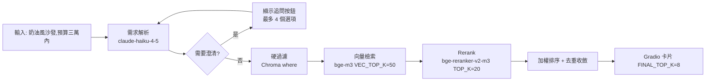

# 指令 (你是產品策略顧問)

以結構化、可驗證的方式輸出產品需求文件 (PRD)。所有陳述必須基於數據或明確的假設,避免模糊用語。優先釐清「為何做」勝過「怎麼做」。

本樣式的所有範例一律取自 **RoomPilot 家具風格檢索系統**:輸入自然語言的家具風格／設計需求,
從 **9,349 件家具**中檢索最合適的物件。**純檢索系統 (R 沒有 G)**,結果直接呈現於 Gradio UI 卡片,**無 LLM 生成端**。

**撰寫 PRD 時的事實基準** (與 `.claude-roompilot/PROJECT_BRIEF.md` 一致,衝突時以 PROJECT_BRIEF 為準):

| 項目 | 值 |
|------|-----|
| 語言／環境 | Python 3.11.15,唯一環境 `.venv-rag/`(一律 `.venv-rag/bin/python`) |
| UI | Gradio 6.20.0 (`rag_pipeline/app.py`,`127.0.0.1:7860`) |
| 向量庫 | ChromaDB 1.5.9 (`chroma_db/`,collection `furniture_v3`,cosine,9,349 筆) |
| Embedding／Rerank | `BAAI/bge-m3` (1024 維) ／ `BAAI/bge-reranker-v2-m3` (中文 cross-encoder) |
| 需求解析 LLM | `claude-haiku-4-5` (structured outputs + prompt caching) |
| 測試／CI／部署 | 測試框架建議 pytest **尚未建置**;**本專案無 CI、無 Docker**,本機 macOS 執行 |

## 交付結構

### 1. 執行摘要 (Executive Summary)
- **一句話價值主張**: 用一句話說明這個產品解決什麼問題
- **目標用戶**: 精確描述 2-3 個核心用戶角色
- **商業價值**: 量化預期影響 (營收、成本節省、效率提升等)

**RoomPilot 範例**:
```markdown
一句話價值主張:
  用一句「奶油風沙發,預算三萬內」就從 9,349 件家具中挑出 8 件真的搭的物件,
  不必再用「沙發 米色 現代」這種關鍵字組合反覆試。

目標用戶:
  1. 室內設計助理 —— 每案要在數十分鐘內備妥風格一致的選品清單
  2. 自住裝修者 —— 說得出「想要日式侘寂感」但說不出商品分類與規格
  3. SQL 端整合工程師 —— 需要 rag_export/ 的向量與 metadata 接進既有商品庫

商業價值:
  選品前置作業從「每案 40 分鐘關鍵字翻找」降到「一次查詢 < 15 秒 + 人工挑選」;
  需求解析每次成本約 US$0.005,單案 LLM 成本 < US$0.05。
```

### 2. 問題定義 (Problem Statement)
- **核心問題**: 當前痛點是什麼?誰遇到這個問題?
- **問題規模**: 影響範圍與頻率的量化數據
- **現有替代方案**: 用戶目前如何解決?(及其不足之處)
- **非目標 (Out of Scope)**: 明確列出不做什麼

**RoomPilot 範例**:
```markdown
核心問題:
  家具商品庫用「分類 + 關鍵字」檢索,但使用者的語言是「風格 + 氛圍 + 預算」。
  「奶油風」不是任何一個商品欄位,關鍵字搜尋直接命中 0 筆。

問題規模:
  9,349 件家具分屬 64 個細類;僅靠細類下拉選單,使用者平均要展開 3 層才看得到候選。
  六風格 (scandinavian / japanese / modern_minimal / cream / industrial / american)
  在原始商品資料中完全沒有欄位,必須靠 VLM 標註補齊。

現有替代方案:
  - 商品站內搜尋:只能比對標題字串,「侘寂」查不到任何東西
  - 人工建風格選集:維護成本高,新品進來就過期
  - 純向量檢索 (無 rerank):中文長句相似度不穩,價格/尺寸條件無法保證

非目標 (Out of Scope):
  - ❌ 不做生成端 —— 本系統是純檢索 (R 沒有 G),不產生文案或設計圖
  - ❌ 不做 3D 場景擺放模擬 (rendering/ 只提供預渲染正面圖)
  - ❌ 不做下單、購物車、金流
  - ❌ 不做多使用者帳號與雲端部署 (本機單進程,無 CI、無 Docker)
```

### 3. 目標與成功指標 (Goals & Success Metrics)
- **商業目標**: 3-5 個可量測的業務目標
- **用戶目標**: 用戶期望達成的結果
- **成功指標 (KPIs)**:
  - 北極星指標 (North Star Metric)
  - 關鍵結果 (Key Results) - 每個需可量測、有時限
  - 監控指標 (Health Metrics) - 需避免負面影響的指標

**RoomPilot 範例**:

| 指標類型 | 指標 | 目標值 | 數據來源 |
|----------|------|--------|----------|
| 北極星 | 單次檢索的可用命中數 (Top-8 中被使用者判定「可用」的件數) | ≥ 3 件 | 人工標註 30 題評測集 |
| Key Result | 需求解析欄位正確率 (room_type / category_group / price_max) | ≥ 90% | `query_parser.py` 對照人工標註 |
| Key Result | 端到端檢索延遲 (模型預熱後) | P95 < 15 秒 | `retriever.py` CLI 計時 |
| Key Result | 主導風格收斂率 (Top-8 中屬主導風格或相容度 ≥ 0.7 的比例) | ≥ 75% | `style_compat` 矩陣統計 |
| Health | 每次需求解析成本 | ≤ US$0.006 | Anthropic 用量報表 |
| Health | 命中 0 筆的查詢比率 | < 2% | 檢索日誌 (硬過濾條件過嚴的警訊) |
| Health | UI 常駐記憶體 (bge-m3 + reranker) | ≤ 5 GB | `app.py` 執行時實測約 4.6 GB |

### 4. 用戶研究與洞察 (User Research)
- **用戶畫像**: 每個角色的背景、動機、痛點
- **用戶旅程**: 關鍵場景的端到端流程
- **引用證據**: 訪談摘錄、問卷數據、行為日誌分析

**RoomPilot 用戶旅程範例**:



**引用證據 (本專案可用的證據來源)**:
- `rag_pipeline/app.py` 內建的 5 個 `gr.Examples` 查詢,即最初的使用者語句樣本
- `json_adjustment/reclassify_styles.py --compare 30` 的六風格判定一致率比對
- `rag_export/embedding_validation_report.json` 的索引驗證統計

### 5. 功能需求 (Functional Requirements)
- **必須有 (Must-Have)**: P0 功能,缺少則無法交付價值
- **應該有 (Should-Have)**: P1 功能,重要但可延後
- **可以有 (Could-Have)**: P2 功能,錦上添花
- **每項需求格式**:
  ```
  作為 [用戶角色]
  我想要 [功能描述]
  以便 [達成目標/解決問題]

  驗收標準:
  - [ ] 可驗證的條件 1
  - [ ] 可驗證的條件 2
  ```

**RoomPilot 需求分級範例**:

| 優先級 | 需求 | 對應模組 |
|--------|------|----------|
| P0 (Must-Have) | 自然語言需求 → 受控詞彙的結構化條件 | `rag_pipeline/query_parser.py` |
| P0 (Must-Have) | 兩階段檢索 (硬過濾 → 向量 → rerank → 加權 → 去重) | `rag_pipeline/retriever.py` |
| P0 (Must-Have) | Gradio 卡片呈現 Top-8 結果與預渲染正面圖 | `rag_pipeline/app.py` |
| P0 (Must-Have) | 全量索引建置與 `rag_export/` 四個交付檔 | `rag_pipeline/embed_v3.py` |
| P1 (Should-Have) | 條件不足時追問澄清 (最多 4 個按鈕選項) | `app.py` 的 `clarify_options` |
| P1 (Should-Have) | 整組配置 (房型典型組合,多品項一次檢索) | `category_groups.json` 的 `room_default_sets` |
| P2 (Could-Have) | 增量索引 `--only-changed` (text_hash 比對) | `embed_v3.py` |
| P2 (Could-Have) | 六風格判定改用本機 Ollama `qwen3:8b` 降成本 | `json_adjustment/reclassify_styles.py` |

**P0 User Story 範例**:

```
作為 自住裝修者
我想要 用「奶油風沙發,預算三萬內」這樣的一句話描述需求
以便 不必知道商品分類與規格,也能拿到 8 件真的搭的候選家具

驗收標準:
- [ ] 解析結果 styles 包含 `cream`,price_max = 30000,category_group 為沙發群組
- [ ] 回傳 8 筆結果,且每筆 price_twd ≤ 30000 (價格是硬過濾,不得超出)
- [ ] Top-8 中 style_primary 為 `cream` 或與 cream 相容度 ≥ 0.7 的比例 ≥ 75%
- [ ] 每張卡片顯示預渲染正面圖 (base64 內嵌縮圖,240px)
- [ ] 模型預熱後端到端 P95 < 15 秒
- [ ] 條件不足時 needs_clarification = true 並給出 ≤ 4 個追問選項
```

### 6. 非功能需求 (Non-Functional Requirements)
- **性能**: 響應時間、吞吐量、併發量
- **可用性**: SLA/SLO 目標
- **安全性**: 認證、授權、數據保護需求
- **合規性**: 法規、隱私、稽核要求
- **可擴展性**: 預期增長量與擴展計畫

**RoomPilot 範例**:

| 類別 | 需求 | 驗證方式 |
|------|------|----------|
| 性能 | 模型預熱後端到端 P95 < 15 秒;cross-encoder 每 50 筆約 10 秒是延遲主因,故 `RERANK_TOP_K=20`、配件 `RERANK_TOP_K_LIGHT=12` | `retriever.py` CLI 計時 |
| 性能 | 啟動時預熱 bge-m3 / reranker / Chroma,避免首次查詢乾等一分鐘 | `app.py` `__main__` 區塊 |
| 吞吐／併發 | 本機單進程、單人使用,**不設併發目標**;批次工作 (建索引、風格判定) 不與 UI 同時執行 | 16 GB 機器實測 |
| 可用性 | **無 SLA** —— 本機執行、非常駐服務;失敗即 CLI 報錯,由使用者重跑 | 本機 runbook |
| 安全性 | `.anthropic_key` 為純文字檔、已列入 `.gitignore`,**絕不可提交或回顯內容** | commit 前檢查 |
| 安全性 | 無帳號、無登入、無授權層;UI 綁定 `127.0.0.1`,不對外開放 | `app.py` `server_name` |
| 合規性 | 家具資料與渲染圖來自 ABO／IKEA 來源,僅供專題展示,不作商用 | 資料來源標註 |
| 可擴展性 | 現況 9,349 筆;成長到十萬筆時 Chroma 單機仍可,但 rerank 候選數與延遲需重新調參 | 壓測 (尚未執行) |

### 7. 約束與依賴 (Constraints & Dependencies)
- **技術約束**: 必須使用的技術、系統、標準
- **資源約束**: 時間、預算、人力限制
- **外部依賴**: 第三方服務、其他團隊交付物
- **假設 (Assumptions)**: 明確列出所有假設及其影響

**RoomPilot 範例**:

```markdown
技術約束:
  - Python 3.11.15,唯一環境 `.venv-rag/`,一律以 `.venv-rag/bin/python` 執行
  - Gradio 6.20.0 —— Gradio 6 的 theme 必須在 `launch()` 傳,不能在 `Blocks()` 傳
  - ChromaDB 1.5.9,collection `furniture_v3`,cosine 距離
  - reranker 必須用中文模型 `bge-reranker-v2-m3`,不得換成 ms-marco MiniLM (英文模型會劣化中文查詢)
  - 本機 macOS (Apple Silicon),device 優先 MPS 退 CPU;無 CI、無 Docker

資源約束:
  - 16 GB 機器;UI 執行時 bge-m3 + reranker 常駐約 4.6 GB,不可同時跑批次
  - 全量建索引約 27 分鐘;增量 (--only-changed) 646 筆約 1.5 分鐘
  - 六風格全量判定約 US$7 —— 會燒額度的是批次工作

外部依賴:
  - Anthropic API (`claude-haiku-4-5`) —— 需求解析與 VLM 標註;金鑰失效則整條解析失效
  - 本機 Ollama `qwen3:8b` —— 批次風格判定;可 `--provider anthropic` 切 Haiku 作為備援
  - Hugging Face 模型快取 —— 程式已 `setdefault("HF_HUB_OFFLINE", "1")`,勿移除
  - SQL 端整合團隊 —— 消費 `rag_export/` 的四個交付檔

假設 (Assumptions):
  - 假設使用者以中文描述需求 (影響:reranker 與 embedding 皆為中文優先模型)
  - 假設六風格詞表 (taxonomy_v2.json) 足以涵蓋使用者語彙 (影響:超出詞表的風格會被歸到最近的一類)
  - 假設預渲染正面圖已備妥於 `rendering/output/…/正面(abo|ikea)/` (影響:缺圖的卡片只有文字)
  - 假設專案維持單人本機使用 (影響:不投資帳號、部署與監控)
```

### 8. 風險評估 (Risk Assessment)
| 風險類型 | 描述 | 機率 | 影響 | 緩解策略 | 負責人 |
|---------|------|------|------|---------|--------|
| 技術 | ... | 高/中/低 | 高/中/低 | ... | ... |
| 市場 | ... | ... | ... | ... | ... |
| 運營 | ... | ... | ... | ... | ... |

**RoomPilot 風險登記範例**:

| 風險類型 | 描述 | 機率 | 影響 | 緩解策略 | 負責人 |
|---------|------|------|------|---------|--------|
| 技術 | `rag_indexable` 誤寫進 Chroma `where`,查詢命中 0 筆 | 中 | 高 | 該欄位是頂層欄位、不在 `chroma_metadata`;過濾條件加單元檢查 (pytest 尚未建置,現階段靠 CLI 冒煙) | 檢索模組維護者 |
| 技術 | rerank 分數被再套一次 sigmoid,排序整體壓縮 | 中 | 高 | `bge-reranker-v2-m3` 經 CrossEncoder 已輸出 0–1;於 `retriever.py` 註記並禁止二次正規化 | 檢索模組維護者 |
| 技術 | structured outputs 的 nullable enum 直接寫 type 陣列 → API 400 | 中 | 中 | 一律用 `anyOf` 包一層 (`query_parser.py` 的 `nullable()`) | 解析模組維護者 |
| 技術 | LLM 用常識推測尺寸,硬過濾直接濾掉正確結果 | 高 | 高 | prompt 明令尺寸未提及即回 null;尺寸/價格/房型/類別為硬過濾,風格/氛圍才是軟加權 | 解析模組維護者 |
| 技術 | HF Hub 未登入被限流,模型載入卡數分鐘 | 中 | 中 | 程式已 `setdefault("HF_HUB_OFFLINE", "1")`,勿移除;新機器首次跑需 `HF_HUB_OFFLINE=0` | 環境維護者 |
| 市場 | 六風格詞表涵蓋不了使用者實際語彙 (如「中古世紀現代」) | 高 | 中 | 以 `style_compat` 相容矩陣軟著陸;蒐集未命中查詢,下一版擴充 taxonomy | 產品負責人 |
| 運營 | 批次工作燒額度 (六風格全量判定約 US$7) | 中 | 中 | 預設走本機 Ollama `qwen3:8b`,僅在需要時 `--provider anthropic` | 資料維護者 |
| 運營 | UI 與批次同時執行導致 16 GB 機器記憶體吃緊 | 中 | 中 | runbook 明訂不得並行;UI 常駐約 4.6 GB | 環境維護者 |
| 運營 | `.anthropic_key` 意外提交或被回顯 | 低 | 極高 | 已列入 `.gitignore`;禁止在任何輸出中回顯內容;外洩即輪換 | 全體 |
| 交付 | `rag_export/` 向量與 Chroma 內向量不同批,SQL 端結果對不上 | 低 | 高 | `embed_v3.py` 一次算向量同時寫兩邊,共用同一個 `text_hash` | 索引模組維護者 |

### 9. 里程碑與交付計畫 (Milestones)
- **MVP 範圍**: 最小可行產品包含哪些功能
- **階段規劃**:
  - Phase 1 (MVP): [時間範圍] - [核心功能]
  - Phase 2: [時間範圍] - [擴展功能]
- **決策點 (Decision Points)**: 何時評估是否繼續/調整/停止

**RoomPilot 範例**:

```markdown
MVP 範圍 (已交付):
  單物件檢索 —— 需求解析 → 硬過濾 → 向量 → rerank → 加權 → Gradio 卡片 Top-8

階段規劃:
  Phase 1 (MVP,已完成): furniture_v3 索引 9,349 筆 + 單物件檢索 + Gradio 卡片
  Phase 2 (已完成): 多品項「整組配置」+ 預算中位價比例分配 + 追問澄清按鈕
  Phase 3 (進行中): rag_export/ 四個交付檔對接 SQL 端 (RAGSQL.md / i_need_rag.md 規格)
  Phase 4 (未排程): 建立 pytest 測試套件 (**尚未建置**) 與 30 題人工評測集

決策點 (Decision Points):
  - 建索引冒煙測試 (`embed_v3.py --limit 50`) 失敗 → 停止全量,先修 metadata
  - 六風格判定一致率 (`reclassify_styles.py --compare 30`) < 70% → 重審 taxonomy 定義
  - 命中 0 筆的查詢比率 > 5% → 重新檢討硬過濾 vs 軟加權的界線
```

### 10. 附錄 (Appendix)
- **競品分析**: 對比主要競爭對手
- **技術研究**: 概念驗證結果、技術評估
- **開放問題**: 尚未解決的疑問及擬定決策時程

**RoomPilot 範例**:

```markdown
競品分析:
  - 商品站內關鍵字搜尋:覆蓋率高但語意零理解,「侘寂」命中 0 筆
  - 純向量檢索 (無 rerank):中文長句排序不穩,且價格/尺寸無法保證
  - 商用風格推薦引擎:需人工維護風格選集,新品上架即過期

技術研究 (已完成的概念驗證):
  - bge-m3 vs 其他中文 embedding:選 bge-m3 (1024 維、normalized、MAX_SEQ_LEN=512,
    文本中位 326 字,無需預設的 8192)
  - reranker 選型:bge-reranker-v2-m3 (中文) 勝過 ms-marco MiniLM (英文)
  - 風格硬過濾 vs 軟加權:硬過濾後疊房型與類別常只剩個位數 → 改用 6×6 style_compat 加權

開放問題:
  - 未命中查詢的日誌要不要落地?落地在哪 (目前無資料庫,只有 Chroma)?
  - `.venv/` (Python 3.9,舊渲染／VLM 環境) 目前不存在,rendering/ 重跑前何時重建?
  - pytest 測試套件何時建置?最小起步範圍是 query_parser 的 schema 驗證還是 retriever 的過濾邏輯?
```

## 蘇格拉底檢核

產出 PRD 後,必須能回答以下問題:

1. **為何此時 (Why Now)**:
   - 為什麼現在是做這件事的最佳時機?
   - 不做的機會成本是什麼?
   - *RoomPilot 回答*: 9,349 件家具的 VLM 標註與六風格 taxonomy 已固化進
     `furniture_enriched_v2/v3.json`,語意檢索所需的欄位第一次備齊;
     不做的話這批標註成果只能停在 JSON,無法變成可查詢的產品。

2. **用戶價值 (User Value)**:
   - 用戶願意為此付出什麼 (時間、金錢、改變習慣)?
   - 如何驗證用戶真的需要這個?
   - *RoomPilot 回答*: 使用者付出的是「等 15 秒」與「改用整句話描述需求」的習慣改變;
     驗證方式是 30 題人工評測集的可用命中數 (Top-8 中 ≥ 3 件可用)。

3. **可行性 (Feasibility)**:
   - 技術可行性如何驗證?
   - 資源是否充足?缺口如何補足?
   - *RoomPilot 回答*: 以 `embed_v3.py --limit 50` 冒煙測試驗證索引管線,
     再以 `retriever.py "<需求>"` CLI 驗證端到端;缺口是**尚未建置**的 pytest 測試套件。

4. **可測量性 (Measurability)**:
   - 每個 KPI 的數據來源是什麼?
   - 如何區分因果關係與相關性?
   - *RoomPilot 回答*: 延遲來自 CLI 計時、解析正確率來自人工標註對照、
     風格收斂率來自 `style_compat` 統計;調權重時一次只改一項再重跑同一組評測題。

5. **替代方案 (Alternatives)**:
   - 是否考慮過不開發、購買第三方、簡化需求等選項?
   - 為何當前方案是最優解?
   - *RoomPilot 回答*: 評估過「只做關鍵字搜尋」與「只做向量檢索不 rerank」;
     前者對「奶油風」命中 0 筆,後者中文排序不穩,故採兩階段檢索 + 軟加權。

## 輸出格式

- 使用 Markdown,遵循 VibeCoding_Workflow_Templates/02_project_brief_and_prd.md 結構
- 所有表格使用標準 Markdown 表格格式
- 圖表使用 Mermaid 語法 (用戶旅程、流程圖等)
- 數據與假設需明確標註來源
- 所有指令一律寫成 `.venv-rag/bin/python <script>` 形式,不得出現其他直譯器或套件管理器
- 事實 (版本、筆數、模型名、路徑) 一律對齊 `.claude-roompilot/PROJECT_BRIEF.md`

## 審查清單

PRD 完成後,檢查以下項目:

- [ ] 問題陳述清晰且有數據支撐
- [ ] 目標用戶畫像具體 (非泛泛而談的「所有人」)
- [ ] 至少有 3 個可量測的 KPI
- [ ] 非目標 (Out of Scope) 已明確定義
- [ ] 風險評估包含緩解策略
- [ ] MVP 範圍明確且可在時限內交付
- [ ] 所有假設已列出並標註影響程度
- [ ] 利益相關者已審核並簽核
- [ ] 技術棧敘述與 `PROJECT_BRIEF.md` 一致 (Python 3.11.15 / Gradio 6.20.0 / ChromaDB 1.5.9 / `furniture_v3`)
- [ ] 未承諾本專案沒有的能力 (無 CI、無 Docker、無測試套件、尚未 git init)
- [ ] 硬過濾 (房型/類別/價格/尺寸) 與軟加權 (風格/氛圍) 的界線在需求中寫清楚

## 關聯文件

- **後續階段**: 03_behavior_driven_development_guide.md (BDD 情境) → 本專案對應 `02-bdd-scenario-spec.md`
- **架構決策**: 04_architecture_decision_record_template.md (技術選型)
- **API 設計**: 06_api_design_specification.md (介面契約) → 本專案的「介面契約」即
  `docs/query_parser_spec.md` 的 structured outputs schema 與 `json_adjustment/RAGSQL.md` 的交付規格
- **專案事實來源**: `.claude-roompilot/PROJECT_BRIEF.md`
- **系統規格 SSOT**: `docs/RAG檢索系統說明.md`、`rag_pipeline/README.md`

---

**記住**: PRD 是團隊對齊的契約,是後續所有設計與開發決策的依據。模糊的需求會導致大量返工,精確的需求能加速交付。
