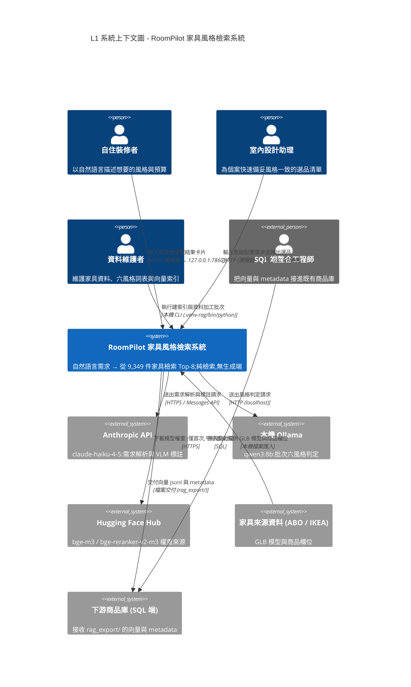
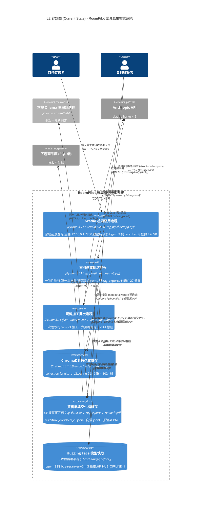
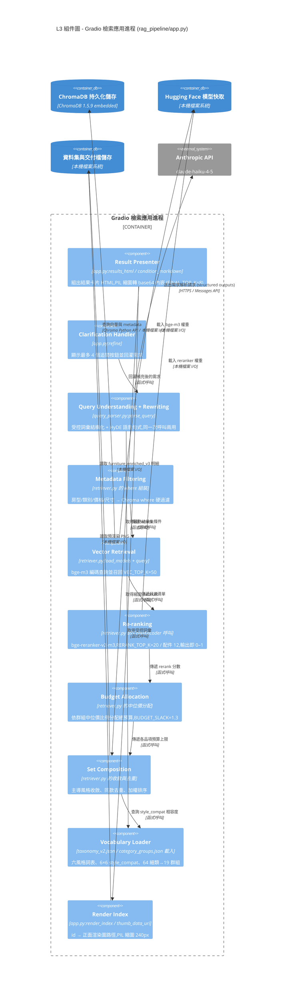
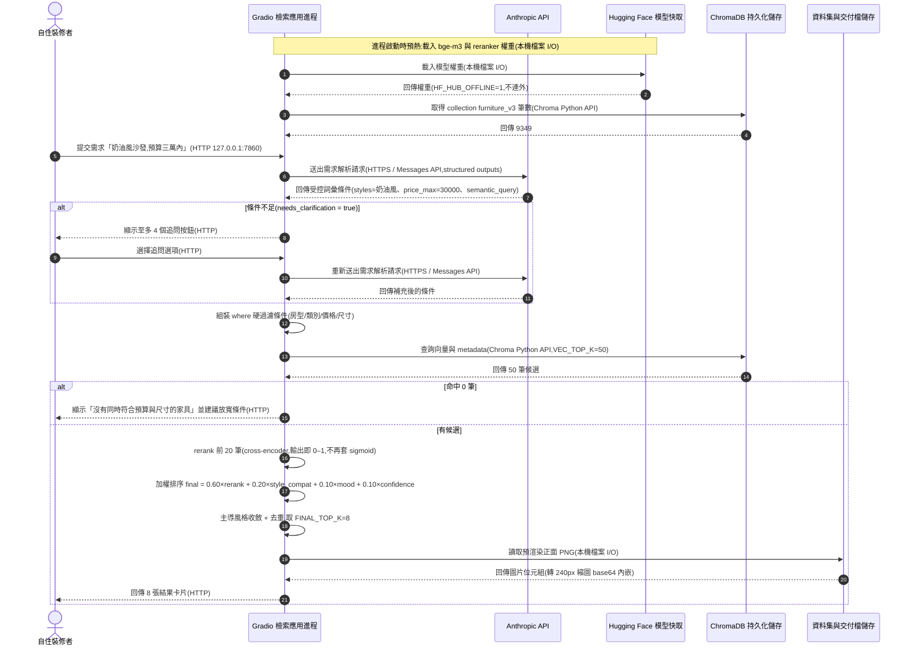
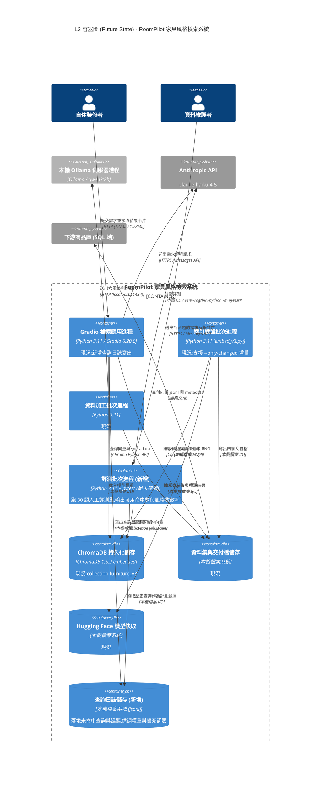
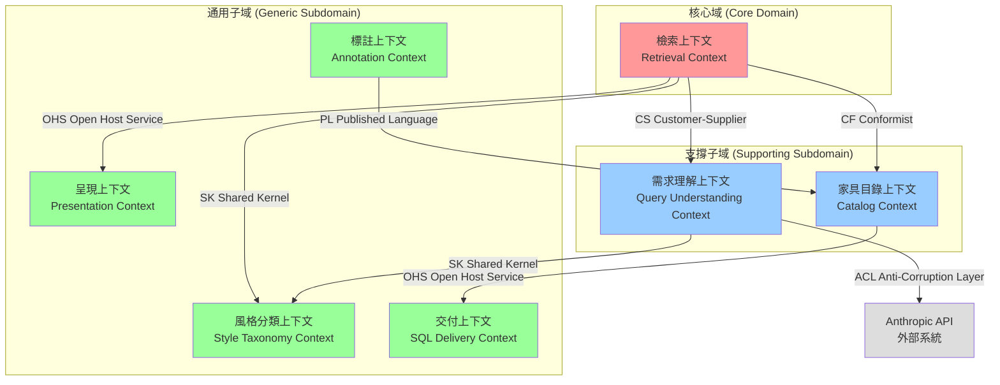
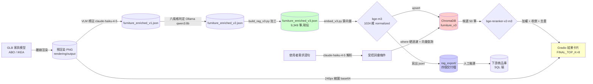
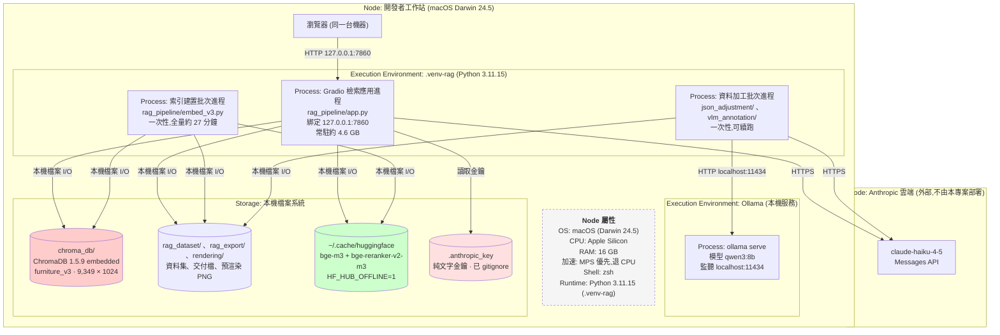

# 指令 (你是系統架構師)

以多視圖、多層次的方式輸出系統架構與設計文件。結合 C4 模型、DDD 戰略設計、Clean Architecture 原則,確保設計決策可追溯、可驗證、可演進。

本樣式的所有範例一律取自 **RoomPilot 家具風格檢索系統**(自然語言需求 → 從 9,349 件家具檢索 Top-8,**純檢索無生成端**)。

## C4 / DDD 鐵律 (產出前先讀)

- L1 只有**一個**系統邊界;不畫 IDE、版本控管等開發工具
- L2 Container = **runtime / process**(或持久化儲存),**不是** Python module
  → 本專案的 Container 是:Gradio 檢索應用進程、索引建置批次進程、資料加工批次進程、
    ChromaDB 持久化儲存、Hugging Face 模型快取、本機 Ollama 伺服器進程、Anthropic API
- 一張 L3 圖對應**且僅對應**一個 L2 Container
- 所有跨 Container 箭頭必標 **protocol + 動詞**(例:「查詢向量 / Chroma Python API」)
- 必有 **Sequence Diagram**(跨 Container use case)與 **Deployment Diagram**(含 Node 屬性)
- 必有 **Future State** 獨立 L2 圖;外部系統須完整揭露五類(資料源 / 交易 / 推送 / 備份 / 雲端),
  沒有的類別要明寫「無」,避免 Partial Disclosure
- DDD 限界上下文 **≠** C4 Context;Context Map 箭頭一律用 Strategic Relationship
  (PL / CS / ACL / CF / SK / OHS)
- **模組沒出現在本架構文件 = 不存在**

## 環境事實基準

一律對齊 `.claude-roompilot/PROJECT_BRIEF.md`:Python 3.11.15(唯一環境 `.venv-rag/`,
執行方式 `.venv-rag/bin/python`)、Gradio 6.20.0、ChromaDB 1.5.9(collection `furniture_v3`)、
`BAAI/bge-m3`、`BAAI/bge-reranker-v2-m3`、`claude-haiku-4-5`。
**本專案無 CI、無 Docker、無 Kubernetes**,單機 macOS(Apple Silicon,MPS 優先退 CPU)執行。

## 交付結構

### 1. 架構概述 (Architecture Overview)

#### 1.1 系統背景與目標
- **問題域**: 這個系統解決什麼業務問題?
- **關鍵驅動力**: 哪些因素驅動了架構決策?
  - 業務驅動力 (功能需求、市場機會)
  - 技術驅動力 (現有系統約束、技術債)
  - 品質驅動力 (性能、安全、可維護性)

**RoomPilot 範例**:

```markdown
問題域:
  家具商品庫用「分類 + 關鍵字」檢索,使用者的語言卻是「風格 + 氛圍 + 預算」。
  「奶油風」不是任何商品欄位,關鍵字搜尋命中 0 筆。
  RoomPilot 把自然語言需求轉成受控詞彙的結構化條件,再從 9,349 件家具檢索 Top-8。

關鍵驅動力:
  - 業務驅動力:六風格 taxonomy 與 VLM 標註已固化進 furniture_enriched_v3.json,
    語意檢索所需欄位第一次備齊;下游 SQL 端等待 rag_export/ 交付
  - 技術驅動力:單機 macOS 16 GB,bge-m3 + reranker 常駐約 4.6 GB;
    cross-encoder 每 50 筆約 10 秒,是延遲主因 → 決定了兩階段檢索的候選數上限
  - 品質驅動力:檢索結果的「搭不搭」比毫秒級延遲重要 → 願意用 rerank 換排序品質
```

#### 1.2 利益相關者與關注點
| 角色 | 關注點 | 優先級 |
|------|--------|--------|
| 最終用戶 | 功能、性能、易用性 | 高 |
| 產品經理 | 功能完整性、上線時程 | 高 |
| 開發團隊 | 可維護性、技術棧 | 高 |
| 運維團隊 | 可部署性、可監控性 | 中 |
| 安全團隊 | 數據安全、合規性 | 高 |

**RoomPilot 對應**:

| 角色 | 對應到本專案 | 關注點 | 優先級 |
|------|-------------|--------|--------|
| 最終用戶 | 自住裝修者、室內設計助理 | Top-8 真的搭、預算不超出、等待 < 15 秒 | 高 |
| 產品經理 | 專題負責人 | 六風格覆蓋度、demo 可重現 | 高 |
| 開發團隊 | 管線維護者 (`rag_pipeline/`) | 六個坑不再踩、SSOT 文件與程式同步 | 高 |
| 運維團隊 | 環境維護者 (本人) | 本機可重跑、模型離線可用、**無 CI／無 Docker** | 中 |
| 安全團隊 | 同上 (無獨立團隊) | `.anthropic_key` 不外洩、UI 只綁 127.0.0.1 | 高 |
| 下游整合 | SQL 端整合工程師 | `rag_export/` 四個交付檔的欄位與向量批次一致 | 高 |

#### 1.3 品質屬性權衡 (Quality Attributes)

使用 ATAM (Architecture Tradeoff Analysis Method) 分析:

```markdown
| 品質屬性 | 目標 | 度量方式 | 優先級 | 權衡考量 |
|----------|------|----------|--------|----------|
| 可用性 (Availability) | 99.9% uptime | 月度統計 | P0 | vs 成本 |
| 性能 (Performance) | API響應<200ms | P95延遲 | P0 | vs 簡單性 |
| 安全性 (Security) | 零數據洩露 | 稽核報告 | P0 | vs 開發速度 |
| 可維護性 (Maintainability) | 新功能交付<2週 | Lead Time | P1 | vs 性能 |
| 可擴展性 (Scalability) | 支持10x增長 | 壓力測試 | P1 | vs 複雜度 |
```

**RoomPilot 實際目標值** (通用模板的數字不適用於單機本地系統,改以下表為準):

| 品質屬性 | 目標 | 度量方式 | 優先級 | 權衡考量 |
|----------|------|----------|--------|----------|
| 檢索品質 (Relevance) | Top-8 可用命中 ≥ 3 件 | 30 題人工評測集 | P0 | vs 延遲 (rerank 候選數) |
| 性能 (Performance) | 預熱後端到端 P95 < 15 秒 | `retriever.py` CLI 計時 | P0 | vs 檢索品質 |
| 可用性 (Availability) | **無 SLA** —— 本機前景進程,失敗即報錯重跑 | 本機 runbook | P2 | vs 投入成本 |
| 安全性 (Security) | 金鑰零外洩、UI 不對外監聽 | commit 前檢查 + `server_name` 設定 | P0 | vs 便利性 |
| 可維護性 (Maintainability) | 換模型／調權重只動 `retriever.py` 頂部常數 | 改動涉及檔案數 | P1 | vs 效能微調空間 |
| 可擴展性 (Scalability) | 9,349 → 10 萬筆仍可單機檢索 | 尚未壓測 | P2 | vs 複雜度 |
| 可重現性 (Reproducibility) | Chroma 向量與 `rag_export/` jsonl 出自同一批、同一 `text_hash` | `embedding_validation_report.json` | P0 | vs 建索引時間 |
| 成本 (Cost) | 解析每次 ≤ US$0.006;批次判定走本機 Ollama | Anthropic 用量報表 | P1 | vs 判定品質 |

**關鍵權衡決策**:
- **性能 vs 可維護性**: 選擇分層架構而非單體,犧牲少量性能換取長期可維護性
- **一致性 vs 可用性**: 關鍵業務使用強一致性,非關鍵業務使用最終一致性
- **成本 vs 可用性**: 核心服務多區域部署,非核心服務單區域

**RoomPilot 的權衡決策**:
- **檢索品質 vs 延遲**: 送進 cross-encoder 的候選數壓在 `RERANK_TOP_K=20`
  (配件品項 `RERANK_TOP_K_LIGHT=12`),換取 P95 < 15 秒;向量召回仍放寬到 `VEC_TOP_K=50`
- **召回率 vs 精準度**: 風格走**軟加權**而非硬過濾 —— 單一風格硬過濾後疊上房型與類別
  常只剩個位數,改用 6×6 `style_compat` 矩陣加權,相容風格也撈得進來但排後面
- **正確性 vs 召回率**: 房型／類別／價格／尺寸一律**硬過濾**,寧可回 0 筆也不回不符條件的結果
- **成本 vs 判定品質**: 批次六風格判定預設走本機 Ollama `qwen3:8b`(免費、慢),
  僅在需要時 `--provider anthropic` 切 Haiku(全量約 US$7)
- **可用性 vs 投入**: 明確不投資高可用 —— 單機、單進程、無 CI、無容器編排

### 2. C4 模型 - 多層次視圖

#### 2.1 Level 1: 系統上下文圖 (System Context)



**外部系統依賴分析**:
- **Anthropic API**: 高依賴 —— 需求解析失效則整條檢索無法啟動;
  無備用方案,降級行為是明確報錯「需求解析暫時無法使用」,**不**回傳未經解析的結果
- **本機 Ollama**: 低依賴 —— 只用於批次六風格判定;
  失效可 `--provider anthropic` 切 Haiku(全量約 US$7)
- **Hugging Face Hub**: 低依賴(執行期) —— 程式已 `setdefault("HF_HUB_OFFLINE", "1")`,
  正常執行完全不連線;僅新機器首次下載需 `HF_HUB_OFFLINE=0`
- **家具來源資料 (ABO / IKEA)**: 一次性依賴 —— 已固化進 `furniture_enriched_v3.json`
- **下游商品庫 (SQL 端)**: 單向交付依賴 —— 本系統只產出檔案,不讀取對方

**外部系統五類揭露** (避免 Partial Disclosure,沒有的類別必須明寫「無」):

| 類別 | 本專案的外部系統 | 說明 |
|------|-----------------|------|
| 資料源 (Data Source) | Hugging Face Hub、家具來源資料 (ABO / IKEA) | 模型權重與原始家具資料 |
| 交易 (Transactional) | Anthropic API | 按 token 計費;解析每次約 US$0.005,六風格全量判定約 US$7 |
| 推送 (Push / Notification) | **無** | 系統不發送任何通知、郵件或 webhook |
| 備份 (Backup) | **無** | `chroma_db/`、`rag_dataset/` **無自動備份**;重建依靠 `embed_v3.py` 重跑 |
| 雲端 (Cloud) | Anthropic API | 唯一的雲端依賴;**無雲端部署、無物件儲存、無託管資料庫** |

#### 2.2 Level 2: 容器圖 (Container Diagram)

**Container 的定義**:一個獨立啟動的 **runtime / process**,或一份獨立的**持久化儲存**。
Python module (`query_parser.py`、`retriever.py`) **不是** Container —— 它們是 L3 的 Component。



**容器職責與技術選型理由**:
- **Gradio 檢索應用進程**: Gradio 6.20.0 選擇理由 —— 純 Python、零前端建置步驟,
  單人 demo 場景不值得自建前端;注意 Gradio 6 的 theme 必須在 `launch()` 傳
- **索引建置批次進程**: 獨立進程而非 UI 內的按鈕 —— 全量 27 分鐘、記憶體吃緊,
  與 UI 並行會拖垮 16 GB 機器;獨立進程也讓 `--limit 50` 冒煙測試可單獨執行
- **ChromaDB 持久化儲存**: embedded 模式 (非 server 模式) —— 單機單使用者不需要獨立服務進程,
  少一個要顧的 runtime;cosine 距離配合 bge-m3 的 normalized 向量
- **Hugging Face 模型快取**: 獨立列為儲存 Container —— 它決定了系統能否離線執行,
  是可用性的關鍵資產 (`HF_HUB_OFFLINE=1` 讓執行期完全不連線)
- **本機 Ollama 伺服器進程**: 外部 runtime —— 批次判定量大,免費的本機推論比雲端便宜;
  外部化的代價是要另外確認它有在跑
- **Anthropic API**: 唯一的雲端外部系統 —— `claude-haiku-4-5` 的 structured outputs
  保證解析結果落在受控詞彙內,prompt caching 讓長 system prompt 的成本可控

**明確不存在的 Container** (避免讀者誤推):
無 API 閘道、無訊息佇列、無關聯式資料庫、無快取服務、無容器編排 —— 本系統是單機檔案系統 + embedded 向量庫。

#### 2.3 Level 3: 組件圖 (Component Diagram)

**鐵律**:一張 L3 圖對應**且僅對應**一個 L2 Container。以下這張只畫「Gradio 檢索應用進程」;
「索引建置批次進程」與「資料加工批次進程」各自另有一張 L3 圖 (此處省略,實際文件必須補齊)。



**Component ↔ 架構模組命名對照** (與專題架構圖一致):

| 架構模組名 | 實作位置 | 關鍵常數 |
|-----------|---------|---------|
| Query Understanding | `query_parser.py:parse_query` | `MODEL="claude-haiku-4-5"`、`MAX_ITEMS=6` |
| Query Rewriting | 同上 (同一次呼叫的 `semantic_query`) | HyDE 句式對齊 `embedded_text` |
| Metadata Filtering | `retriever.py` 的 `where` 組裝 | 硬過濾:房型/類別/價格/尺寸 |
| Vector Retrieval | `retriever.py` | `VEC_TOP_K=50`、`EMBED_MODEL="BAAI/bge-m3"` |
| Re-ranking | `retriever.py` | `RERANK_TOP_K=20`、`RERANK_TOP_K_LIGHT=12` |
| Budget Allocation | `retriever.py` | `BUDGET_SLACK=1.3` |
| Set Composition | `retriever.py` | `style_compat` 6×6 矩陣 |
| Result Presenter | `app.py` | `FINAL_TOP_K=8`、`THUMB=240`、`MAX_CLARIFY=4` |

排序公式 (權重定義在 `rag_pipeline/retriever.py:47`):

```
final = 0.60×rerank + 0.20×style_compat + 0.10×mood命中率 + 0.10×confidence
```

#### 2.4 Level 4: 代碼視圖 (可選,關鍵模組)

關鍵類別與交互序列圖 (詳見 10_class_relationships_template.md)。

RoomPilot 目前的關鍵「類別」極少 —— 管線以純函式 + `@lru_cache` 單例為主:
`load_data()` / `load_models()` / `load_collection()` 三個 `lru_cache(maxsize=1)` 單例
確保 Gradio 重複查詢不重載模型與索引;`thumb_data_uri()` 以 `lru_cache(maxsize=2048)` 快取縮圖。
需要畫 L4 時,以這三個單例的生命週期與資料流為主體。

#### 2.5 Sequence Diagram (跨 Container use case)

**Use case**:使用者輸入「奶油風沙發,預算三萬內」→ 取得 8 張結果卡片。



**異常路徑**:`Anthropic API` 無回應時,UI 直接顯示「需求解析暫時無法使用,請稍後重試」,
**不**降級為未經解析的關鍵字查詢 —— 未經硬過濾的結果會違反預算與尺寸契約。

#### 2.6 Future State - L2 容器圖 (獨立圖,不與 Current State 混畫)



**Current → Future 差異**:
- **新增** 查詢日誌儲存 (jsonl) —— 目前完全沒有查詢落地,無法量測「命中 0 筆比率」
- **新增** 評測批次進程 (pytest,**尚未建置**) —— 目前調權重只能靠人眼比對
- **不變** 仍為單機、無 CI、無容器、無雲端部署;未來狀態**不引入**任何新的外部系統

### 3. DDD 戰略設計 (Strategic Design)

> **鐵律提醒**:DDD 限界上下文 **≠** C4 Context。限界上下文是**語言邊界**,
> 一個 Container 內可以有多個限界上下文;Context Map 的箭頭一律標
> Strategic Relationship(PL / CS / ACL / CF / SK / OHS),不標 protocol。

#### 3.1 界限上下文映射 (Context Mapping)



**上下文關係說明**:
- **CS (Customer-Supplier)**: 檢索 → 需求理解 —— 檢索是下游客戶,可要求上游補欄位,
  但不干涉需求理解如何取得結果
- **CF (Conformist)**: 檢索 → 家具目錄 —— 檢索完全遵從 `furniture_enriched_v3.json`
  的欄位命名,不做轉譯層 (資料量大、翻譯成本高於收益)
- **SK (Shared Kernel)**: 檢索、需求理解 ↔ 風格分類 —— 兩者共用 `taxonomy_v2.json`
  的六風格詞表與 6×6 `style_compat`;改詞表必須兩邊同時驗證
- **ACL (Anti-Corruption Layer)**: 需求理解 → Anthropic API ——
  `query_parser.py` 的 structured outputs schema 就是防腐層,
  把 LLM 自由文字硬鎖進受控詞彙,模型換代不影響下游
- **OHS (Open Host Service)**: 檢索 → 呈現 —— 檢索輸出固定結構的結果集,
  Gradio 只負責視覺化;家具目錄 → 交付 —— `rag_export/` 的四個檔即公開契約
- **PL (Published Language)**: 標註 → 家具目錄 —— VLM 標註以
  `taxonomy_v2.json` 定義的詞表為發布語言寫回目錄

**限界上下文 ↔ C4 Container 對照** (證明兩者不是同一件事):

| 限界上下文 | 所在 Container |
|-----------|---------------|
| 需求理解上下文 | Gradio 檢索應用進程 |
| 檢索上下文 | Gradio 檢索應用進程 |
| 呈現上下文 | Gradio 檢索應用進程 |
| 風格分類上下文 | 跨 Container(檔案 `taxonomy_v2.json`,三個進程都讀) |
| 家具目錄上下文 | 資料加工批次進程 + 索引建置批次進程 |
| 標註上下文 | 資料加工批次進程 |
| 交付上下文 | 索引建置批次進程 |

#### 3.2 統一語言 (Ubiquitous Language)

| 業務術語 | 定義 | 別名/反例 | 所屬上下文 |
|----------|------|-----------|------------|
| 檢索需求 (Query Intent) | 使用者一句話描述經解析後的結構化條件,含房型、風格、預算、品項清單 | ≠ 原始輸入字串 | 需求理解上下文 |
| 品項 (Item Spec) | 檢索需求中的單一家具需求條目,含類別群組、件數、優先級、專屬語意描述 | ≠ 家具 (Furniture Item) | 需求理解上下文 |
| 家具 (Furniture Item) | 目錄中的一件實體家具,含售價、尺寸、主導風格、氛圍詞、渲染圖 | ≠ 品項 (Item Spec) | 家具目錄上下文 |
| 候選 (Candidate) | 通過硬過濾並取得 rerank 分數的家具,尚未定案 | ≠ 最終結果 (Result) | 檢索上下文 |
| 主導風格 (Dominant Style) | 一次檢索中被判定為整體基調的風格,用來收斂結果集 | ≠ 物件的 `style_primary` | 檢索上下文 |
| 風格相容度 (Style Compatibility) | 6×6 矩陣中兩種風格的搭配分數 (0–1),如日式↔北歐 0.9、奶油↔美式 0.7 | ≠ 相似度 (Similarity) | 風格分類上下文 |
| 硬條件 (Hard Filter) | 房型/類別/價格/尺寸 —— 不符者完全不出現 | ≠ 軟條件 | 檢索上下文 |
| 軟條件 (Soft Weight) | 風格/氛圍 —— 不符者仍可出現,只是排序下降 | ≠ 硬條件 | 檢索上下文 |
| 檢索群組 (Category Group) | 64 個細類收斂成的 19 個檢索用群組 | ≠ 細類 (`category_final`) | 家具目錄上下文 |
| 交付檔 (Export Bundle) | `rag_export/` 的向量 jsonl、metadata、失敗清單、驗證報告 | ≠ Chroma 索引 | 交付上下文 |

#### 3.3 聚合設計 (Aggregate Design)

詳見後續 `04-ddd-aggregate-spec.md` 的詳細設計。

RoomPilot 的候選聚合根:**檢索需求 (Query Intent)** —— 聚合內含品項清單 (Item Spec),
不變條件是「品項數 ≤ 6」「每個品項的類別群組必須屬於 19 個受控群組之一」
「尺寸與價格未明說時必須為 null,不得由 LLM 臆測」。

### 4. 架構分層 (Layered Architecture)

遵循 Clean Architecture / Hexagonal Architecture 原則:

```
┌─────────────────────────────────────────────────┐
│  表現層 (Presentation Layer)                    │
│  - Gradio Blocks 事件處理 (app.py:search/refine)│
│  - 結果卡片 HTML 組裝 (results_html)            │
│  - 追問按鈕與條件摘要 (condition_markdown)      │
└───────────────────┬─────────────────────────────┘
                    │
┌───────────────────▼─────────────────────────────┐
│  應用層 (Application Layer)                     │
│  - 檢索用例編排 (retriever.py:retrieve)         │
│  - 需求解析用例 (query_parser.py:parse_query)   │
│  - 條件 DTO (受控詞彙的 structured outputs 結構)│
└───────────────────┬─────────────────────────────┘
                    │
┌───────────────────▼─────────────────────────────┐
│  領域層 (Domain Layer) - 核心業務邏輯           │
│  - 排序公式與權重 (W_RERANK/W_STYLE/W_MOOD/W_CONF) │
│  - 風格相容度規則 (6×6 style_compat)            │
│  - 預算分配規則 (中位價比例、BUDGET_SLACK)      │
│  - 主導風格收斂與去重的不變條件                 │
└───────────────────┬─────────────────────────────┘
                    │
┌───────────────────▼─────────────────────────────┐
│  基礎設施層 (Infrastructure Layer)              │
│  - Chroma 讀寫 (load_collection,persistent client)│
│  - 模型載入 (SentenceTransformer / CrossEncoder)│
│  - Anthropic 用戶端 (金鑰讀取、prompt caching)  │
│  - 檔案資源存取 (v3 資料集、taxonomy、渲染 PNG) │
└─────────────────────────────────────────────────┘
```

> ⚠️ **誠實標註**:上述為**邏輯分層**,不是目錄結構。
> 現況 `rag_pipeline/` 是扁平的三支腳本(`app.py` / `query_parser.py` / `retriever.py`),
> 領域規則與基礎設施呼叫寫在同一個檔內。
> 專案未採用 `src/domains|application|infrastructure` 佈局;若日後檔案超過 800 行上限,
> 優先把領域層(排序公式、相容度、預算分配)抽成獨立純函式模組。

**依賴規則**:
- ✅ 外層可依賴內層
- ❌ 內層不可依賴外層
- ✅ 領域層無任何外部依賴 (純業務邏輯)
- ✅ 基礎設施層通過接口實現依賴反轉

**RoomPilot 的具體檢核**:
- ✅ `app.py` 依賴 `retriever.py` / `query_parser.py`,反向依賴則禁止
- ✅ 排序公式與 `style_compat` 計算是純函式,不碰 Chroma、不碰 Anthropic
- ❌ 不可在領域層直接讀 `taxonomy_v2.json` —— 詞表由基礎設施層以 `@lru_cache` 載入後注入
- ✅ 模型與索引一律經 `@lru_cache(maxsize=1)` 單例取得,避免各層各自載入

### 5. 數據架構 (Data Architecture)

#### 5.1 數據流圖



**資料流關鍵事實**:
- `embed_v3.py` **一次算向量、同時寫兩邊** —— Chroma 內的向量與交給 SQL 的 jsonl
  是同一批、同一個 `text_hash`,不會出現「demo 正常但 SQL 端結果不同」
- 兩個上游來源檔 (`taiwan_style_cards.json`、`all_furniture_vlm_responses_.json`)
  已不在專案內,內容已固化進 `taxonomy_v2.json` 與 `furniture_enriched_v2.json`
- 顏色與材質**不寫進 metadata 過濾條件**,只進 `semantic_query` 影響向量相似度

#### 5.2 數據模型設計原則

- **單一現役資料集**: `furniture_enriched_v3.json` 是唯一現役來源,v1/v2 僅保留為加工歷程
- **向量與交付一次產出**: 同一次執行同時寫 Chroma 與 `rag_export/`,以 `text_hash` 綁定批次
- **增量以內容雜湊判定**: `--only-changed` 比對 `text_hash`,646 筆約 1.5 分鐘;不做時間戳判定
- **metadata 扁平化**: Chroma `where` 只認 `chroma_metadata` 內的欄位 ——
  `rag_indexable` 是頂層欄位,**寫進 where 會命中 0 筆**
- **分數不重複正規化**: `bge-reranker-v2-m3` 經 CrossEncoder 已輸出 0–1,**不可再套 sigmoid**

#### 5.3 數據治理

- **數據所有權**: `rag_dataset/` 屬家具目錄上下文;`chroma_db/` 屬檢索上下文;
  `rag_export/` 屬交付上下文 —— 每份資料只有一個產生者
- **跨上下文查詢**: 一律透過檔案契約 (`taxonomy_v2.json`、`category_groups.json`),
  不讓任一模組直接改寫他人資料
- **Schema 版本管理**: 以檔名版本號 (`furniture_enriched_v1/v2/v3.json`) 與
  collection 名 (`furniture_v3`) 標示版本;**無 migration 工具**,換版即重建索引
- **交付規格 SSOT**: `json_adjustment/RAGSQL.md` 與 `i_need_rag.md` 為 SQL 端欄位契約;
  舊規格用 `furniture_id`,現行交付檔名為 `furniture_embeddings_bge_m3.jsonl`
- **備份**: **無自動備份** —— `chroma_db/` 毀損時以 `embed_v3.py` 全量重建 (約 27 分鐘)

### 6. 部署架構 (Deployment Architecture)

> **本專案無 CI、無 Docker、無 Kubernetes、無雲端部署**。
> 「部署」即「在開發者本機依 runbook 啟動進程」。以下 Deployment Diagram 必須標明 Node 屬性。



**部署特性**:
- **高可用**: **不適用** —— 單機、單進程、前景執行;進程結束即服務中止,由使用者手動重啟
- **自動擴展**: **不適用** —— 無編排器;擴展手段是調 `VEC_TOP_K` / `RERANK_TOP_K` 常數
- **容災**: 無自動容災;`chroma_db/` 毀損以 `.venv-rag/bin/python rag_pipeline/embed_v3.py`
  全量重建 (約 27 分鐘),資料來源是 `furniture_enriched_v3.json`
- **回滾**: 無藍綠／金絲雀;回滾方式是把 `rag_pipeline/` 的檔案還原後重啟進程
  (**專案尚未 git init**,還原目前只能靠手動備份)
- **資源互斥**: UI 常駐約 4.6 GB,16 GB 機器**不得**同時執行批次進程

**本機 Runbook (取代 CI/CD 流水線)**:

```bash
PY=.venv-rag/bin/python

# 1. 冒煙測試索引管線(先跑這個,失敗就別跑全量)
$PY rag_pipeline/embed_v3.py --limit 50

# 2. 全量建索引(約 27 分鐘)或增量(646 筆約 1.5 分鐘)
$PY rag_pipeline/embed_v3.py
$PY rag_pipeline/embed_v3.py --only-changed

# 3. 單測需求解析與完整檢索(不開 UI 也能驗收)
$PY rag_pipeline/query_parser.py "奶油風沙發,預算三萬內"
$PY rag_pipeline/retriever.py   "奶油風沙發,預算三萬內"

# 4. 啟動 UI
$PY rag_pipeline/app.py          # → http://127.0.0.1:7860

# 5. 資料加工(需要時才跑;會燒額度的是批次工作)
python3 json_adjustment/build_rag_v3.py --dry-run
$PY json_adjustment/reclassify_styles.py --compare 30
```

**回滾／故障排除順序**:
1. 模型載入卡住 → 確認 `HF_HUB_OFFLINE=1` 未被移除
2. 查詢命中 0 筆 → 檢查是否誤把 `rag_indexable` 寫進 Chroma `where`
3. 排序整體壓縮 → 檢查 rerank 分數是否被二次套 sigmoid
4. 需求解析 400 → 檢查 nullable enum 是否用 `anyOf` 包一層
5. MPS 出問題 → `$PY rag_pipeline/embed_v3.py --device cpu` 退回 CPU

### 7. 架構決策記錄 (ADR)

每個重要決策應建立 ADR 文件,格式參考 `04_architecture_decision_record_template.md`。

關鍵 ADR 索引 (RoomPilot):
- [ADR-001] 純檢索 (R 沒有 G) vs 檢索後生成 —— 決定不做 LLM 生成端,結果直接呈現於卡片
- [ADR-002] 向量庫選型: ChromaDB embedded vs 獨立向量服務 —— 單機單使用者選 embedded
- [ADR-003] Embedding 選型: `BAAI/bge-m3` (1024 維、`MAX_SEQ_LEN=512`) vs 其他中文模型
- [ADR-004] Reranker 選型: `BAAI/bge-reranker-v2-m3` vs ms-marco MiniLM —— 中文查詢不得用英文模型
- [ADR-005] 風格採軟加權 (6×6 `style_compat`) vs 硬過濾 —— 硬過濾疊房型類別後常只剩個位數
- [ADR-006] 需求解析用 `claude-haiku-4-5` structured outputs —— 以 schema 當防腐層鎖住受控詞彙
- [ADR-007] UI 選 Gradio 6.20.0 vs 自建前端 —— 純 Python、零前端建置步驟
- [ADR-008] 批次六風格判定預設走本機 Ollama `qwen3:8b` vs 一律用 Haiku —— 成本考量
- [ADR-009] 建索引時一次算向量同時寫 Chroma 與 `rag_export/` —— 保證兩邊同批同 `text_hash`
- [ADR-010] 不採用容器與 CI —— 單人本機專題,投入產出比不成立 (**本專案無 CI／無 Docker**)

## 蘇格拉底檢核

完成架構設計後,回答以下問題:

1. **品質屬性權衡**:
   - 性能、安全、成本三者的優先級如何排序?為什麼?
   - 如何驗證這些品質屬性是否達成?
   - *RoomPilot 回答*: 檢索品質 > 安全 (金鑰) > 成本 > 延遲;
     驗證靠 30 題人工評測集與 `retriever.py` CLI 計時。

2. **單點故障分析**:
   - 系統中是否存在單點故障 (SPOF)?
   - 如果某個關鍵組件失效,系統如何降級?
   - *RoomPilot 回答*: 存在三個 SPOF —— Anthropic API、`chroma_db/`、HF 模型快取。
     Anthropic 失效即明確報錯不降級;Chroma 毀損以 `embed_v3.py` 重建;
     模型快取遺失需 `HF_HUB_OFFLINE=0` 重新下載。

3. **數據一致性**:
   - 哪些場景需要強一致性?哪些可接受最終一致性?
   - 如何處理分布式事務?
   - *RoomPilot 回答*: Chroma 向量與 `rag_export/` jsonl 必須強一致 (同批、同 `text_hash`),
     故由 `embed_v3.py` 一次寫兩邊;下游 SQL 端接受最終一致 (檔案交付有時間差);
     **無分散式交易** —— 系統只有單一寫入進程。

4. **演進性**:
   - 未來需求變化時,哪些部分容易擴展?哪些是瓶頸?
   - 技術棧是否有升級或遷移計畫?
   - *RoomPilot 回答*: 擴充風格詞表容易 (改 `taxonomy_v2.json`,prompt 動態注入);
     瓶頸是 cross-encoder 延遲與 16 GB 記憶體上限;
     升級計畫:先建 pytest 評測 (**尚未建置**),有基準才敢換模型。

5. **可觀測性**:
   - 如何監控系統健康狀態?
   - 故障發生時,如何快速定位問題?
   - *RoomPilot 回答*: **目前沒有任何監控或日誌落地** —— 只有進程 stdout。
     定位問題靠 Runbook 的五步排除順序;Future State 已規劃查詢日誌儲存。

## 輸出格式

- 使用 Markdown + Mermaid 圖表
- 遵循 VibeCoding_Workflow_Templates/05_architecture_and_design_document.md 結構
- 關鍵決策必須鏈接到對應的 ADR 文件
- 所有圖表需提供文字說明,不可僅有圖無說明
- 所有指令一律寫成 `.venv-rag/bin/python <script>`;不得出現其他直譯器或套件管理器
- 不得出現本專案沒有的技術 (容器、編排器、CI 流水線、關聯式資料庫連線、訊息佇列)

## 審查清單

- [ ] C4 模型至少包含 Level 1 (Context) 和 Level 2 (Container)
- [ ] 品質屬性目標可量測且有度量方式
- [ ] 關鍵技術選型有明確理由 (參考 ADR)
- [ ] 界限上下文清晰,上下文間關係明確
- [ ] 數據模型設計遵循服務獨立原則
- [ ] 部署架構考慮高可用與災備
- [ ] 所有外部依賴有降級或備用方案
- [ ] 架構圖與實作代碼一致
- [ ] L1 只有**一個**系統邊界,且未畫 IDE／版本控管等開發工具
- [ ] L2 的每個 Container 都是 runtime／process 或持久化儲存,**沒有** Python module 混入
- [ ] 每張 L3 圖只對應一個 L2 Container
- [ ] 所有跨 Container 箭頭都標了 **protocol + 動詞**
- [ ] 已附 Sequence Diagram (跨 Container use case) 與 Deployment Diagram (含 Node 屬性)
- [ ] 已附獨立的 Future State L2 圖,且與 Current State 分開
- [ ] 外部系統五類 (資料源／交易／推送／備份／雲端) 全部揭露,沒有的明寫「無」
- [ ] Context Map 箭頭使用 Strategic Relationship (PL/CS/ACL/CF/SK/OHS),未與 C4 Context 混淆
- [ ] 沒有承諾本專案不存在的能力 (無 CI、無 Docker、無測試套件、尚未 git init)

## 關聯文件

- **需求來源**: 02_project_brief_and_prd.md (PRD) → 本專案對應 `01-prd-product-spec.md`
- **決策記錄**: 04_architecture_decision_record_template.md (ADR)
- **API設計**: 06_api_design_specification.md (介面契約) → 本專案的介面契約是
  `docs/query_parser_spec.md` 的 structured outputs schema 與 `json_adjustment/RAGSQL.md`
- **領域設計**: 04-ddd-aggregate-spec.md (聚合詳細設計)
- **類別關係**: 10_class_relationships_template.md (靜態結構)
- **專案事實來源**: `.claude-roompilot/PROJECT_BRIEF.md`
- **系統規格 SSOT**: `docs/RAG檢索系統說明.md`、`rag_pipeline/README.md`、
  `vlm_annotation/taxonomy_v2.json`、`rag_pipeline/category_groups.json`

---

**記住**: 架構是為業務目標服務的,好的架構平衡了當前需求與未來演進,是團隊共識的結晶。
**模組沒出現在本架構文件 = 不存在**;架構變更必須同步 08(結構)、09(依賴)、10(類別)、14(部署) 相關文件。
