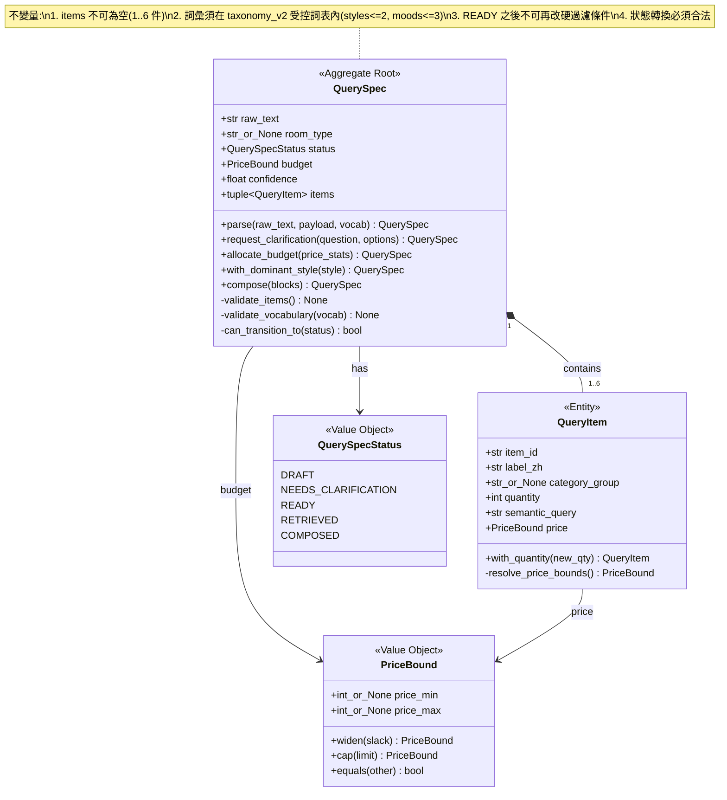
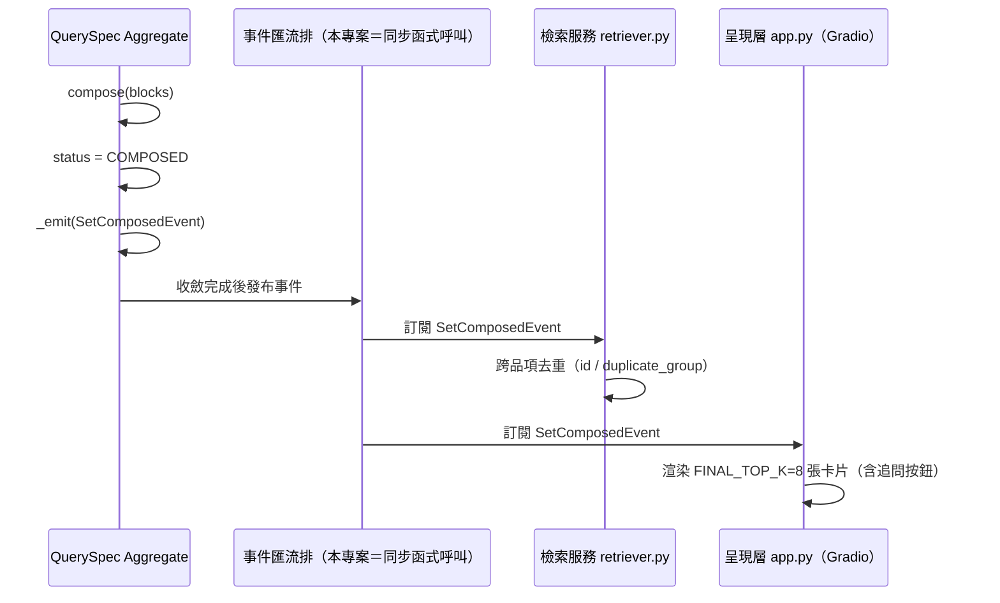

# 指令 (你是 DDD 領域建模專家)

以 Domain-Driven Design (DDD) 戰術設計輸出 RoomPilot 家具風格檢索系統的聚合規格。本專案沒有關聯式資料庫交易(ChromaDB 無 transaction),聚合是**一致性邊界**而非事務邊界,一致性靠「不可變取代 + text_hash 重算」保證。必須明確聚合根、成員實體、不變量、領域事件與倉儲接口。

## 交付結構

### 1. 界限上下文與聚合總覽

#### 1.1 界限上下文 (Bounded Context)

RoomPilot 共五個限界上下文(限界上下文 ≠ C4 Context):

| 限界上下文 | 對應目錄 | 職責 | 聚合根 |
| :--- | :--- | :--- | :--- |
| 標註 (Annotation) | `vlm_annotation/` | GLB 渲染圖 → claude-haiku-4-5 外觀描述、氛圍詞 | `FurnitureAnnotation` |
| 詞表 (Taxonomy) | `vlm_annotation/taxonomy_v2.json` | 六風格、18 張色卡、24 氛圍詞、6×6 相容矩陣 | `StyleCard` |
| 資料加工 (Dataset Build) | `json_adjustment/` | v2 → v3 加工、`embedded_text` 組句、`text_hash` | `FurnitureItem` |
| 檢索 (Retrieval) | `rag_pipeline/` | 需求解析 → 硬過濾 → 向量 → rerank → 收斂 | `QuerySpec` |
| 交付 (Export) | `rag_export/` | `embed_v3.py` 產出 SQL 端四個交付檔(RAGSQL.md) | `EmbeddingBatch` |

本檔以**檢索上下文**作為完整範例:

```markdown
**上下文名稱**: 檢索上下文 (Retrieval Context)

**職責**: 管理一次家具檢索需求的全生命週期,包含需求解析、硬過濾條件推導、向量召回、
重排、預算分配與組合收斂等核心流程。純檢索(R 沒有 G),終點是 Gradio 卡片,不做生成。

**統一語言 (Ubiquitous Language)**:
- **需求規格 (QuerySpec)**: 使用者自然語言需求經 claude-haiku-4-5 解析後的結構化檢索條件
- **品項 (QueryItem)**: 需求規格中的單一家具品項(`items` 陣列元素,最多 6 件)
- **規格狀態 (QuerySpecStatus)**: 草稿、待追問、可檢索、已召回、已收斂
- **主導風格 (DominantStyle)**: 整組結果收斂用的六風格之一,由使用者指定或 anchor 品項 top-1 決定

**聚合清單**:
1. QuerySpec Aggregate (需求規格聚合) - 核心聚合
2. RetrievalResult Aggregate (檢索結果聚合) - 獨立聚合
```

#### 1.2 聚合設計原則

- **小聚合 (Small Aggregates)**: 聚合應盡可能小,只包含必須保持一致性的實體。`QuerySpec` 只含 1–6 個 `QueryItem`,不內嵌 9,349 筆家具資料
- **通過ID引用 (Reference by ID)**: 聚合間通過 ID 引用,而非對象引用。檢索結果只持有家具 `id` 字串(如 `abo-bed-frames-19-…`),需要細節時再向倉儲取
- **最終一致性 (Eventual Consistency)**: 索引重建(`embed_v3.py`)與線上檢索是兩條獨立流程,靠 `text_hash` 對齊;`retriever.query_collection()` 攔下 `NotFoundError` 重連,就是最終一致性的落地手段
- **不可變取代 (Immutable Replacement)**: 沒有資料庫交易可用 —— 聚合的每次狀態變更都回傳**新實例**;索引側則以 `delete_collection` + `create_collection` 做整批原子替換

### 2. 聚合詳細設計

#### 2.1 聚合結構圖



#### 2.2 聚合根 (Aggregate Root): QuerySpec

**職責**:
- 維護需求規格與品項的一致性(`items` 內容、數量上限、詞彙合法性)
- 強制執行狀態轉換規則與「硬過濾 vs 軟加權」界線
- 發布領域事件通知檢索與呈現流程

**不變量 (Invariants)**:

```python
"""需求規格聚合必須始終滿足的業務規則(Python 3.11,執行:.venv-rag/bin/python)。

不可變性:frozen dataclass + dataclasses.replace,任何變更都回傳新實例,
不修改既有物件——與 rag_pipeline 的純函式風格(build_where / style_score)一致。
"""
from __future__ import annotations

from dataclasses import dataclass, replace
from enum import Enum

MAX_ITEMS = 6    # query_parser.MAX_ITEMS
MAX_STYLES = 2   # prompt 規定最多 2 個風格,程式端再 [:2] 裁切
MAX_MOODS = 3    # prompt 規定最多 3 個氛圍詞,程式端再 [:3] 裁切


class DomainError(Exception):
    """領域規則違反(對使用者顯示友善訊息,對 stderr 記錄完整上下文)。"""


@dataclass(frozen=True)
class QuerySpec:
    raw_text: str
    status: "QuerySpecStatus"
    room_type: str | None
    styles: tuple[str, ...]
    moods: tuple[str, ...]
    items: tuple["QueryItem", ...]
    budget: "PriceBound"
    confidence: float

    # 不變量 1: 品項不可為空,且不超過 MAX_ITEMS
    def _validate_items_not_empty(self) -> None:
        if not self.items:
            raise DomainError("需求規格至少需要包含一個品項")
        if len(self.items) > MAX_ITEMS:
            raise DomainError(f"品項最多 {MAX_ITEMS} 件")

    # 不變量 2: 只能使用 taxonomy_v2.json 的受控詞彙,且數量有上限
    def _validate_vocabulary(self, vocab: "Vocabulary") -> None:
        unknown_styles = set(self.styles) - vocab.style_keys   # 六風格
        if unknown_styles:
            raise DomainError(f"風格不在受控詞表內:{sorted(unknown_styles)}")
        unknown_moods = set(self.moods) - vocab.mood_words     # 24 個氛圍詞
        if unknown_moods:
            raise DomainError(f"氛圍詞不在受控詞表內:{sorted(unknown_moods)}")
        if len(self.styles) > MAX_STYLES or len(self.moods) > MAX_MOODS:
            raise DomainError("風格最多 2 個、氛圍最多 3 個")

    # 不變量 3: 進入 READY 之後不可再改硬過濾條件(房型/類別/價格/尺寸)
    def with_room_type(self, room_type: str | None) -> "QuerySpec":
        if self.status.is_ready_or_later():
            raise DomainError("已進入檢索的需求規格不可再改硬過濾條件")
        return replace(self, room_type=room_type)

    # 不變量 4: 狀態轉換必須合法
    def _can_transition_to(self, new_status: "QuerySpecStatus") -> bool:
        allowed = {
            QuerySpecStatus.DRAFT: [QuerySpecStatus.NEEDS_CLARIFICATION,
                                    QuerySpecStatus.READY],
            QuerySpecStatus.NEEDS_CLARIFICATION: [QuerySpecStatus.DRAFT,
                                                  QuerySpecStatus.READY],
            QuerySpecStatus.READY: [QuerySpecStatus.RETRIEVED],
            QuerySpecStatus.RETRIEVED: [QuerySpecStatus.COMPOSED],
            QuerySpecStatus.COMPOSED: [],  # 終態
        }
        return new_status in allowed[self.status]

    # 所有不變量檢查
    def _validate_invariants(self, vocab: "Vocabulary") -> None:
        self._validate_items_not_empty()
        self._validate_vocabulary(vocab)
```

**領域方法 (Domain Methods)**:

```python
class QuerySpec:
    # 工廠方法 - 從 query_parser 的 structured outputs 產生需求規格
    @staticmethod
    def parse(raw_text: str, payload: dict, vocab: "Vocabulary") -> "QuerySpec":
        spec = QuerySpec(
            raw_text=raw_text,
            status=QuerySpecStatus.DRAFT,
            room_type=payload["room_type"],
            styles=tuple(payload["styles"][:MAX_STYLES]),
            moods=tuple(payload["moods"][:MAX_MOODS]),
            items=tuple(QueryItem.from_payload(i) for i in payload["items"][:MAX_ITEMS]),
            budget=PriceBound(None, payload["budget_total"]),
            confidence=float(payload["confidence"]),
        )
        spec._validate_invariants(vocab)

        # 發布領域事件
        return spec._emit(
            QuerySpecParsedEvent(spec.raw_text, spec.styles, len(spec.items),
                                 spec.confidence)
        )

    # 需求太模糊 → 追問一個最關鍵的問題(Gradio 以快速選項按鈕呈現)
    def request_clarification(self, question: str, options: tuple[str, ...]) -> "QuerySpec":
        if self.status is not QuerySpecStatus.DRAFT:
            raise DomainError("只有草稿狀態的需求規格可以發起追問")

        # 業務規則: 選項最多 4 個(app.MAX_CLARIFY)
        return replace(self, status=QuerySpecStatus.NEEDS_CLARIFICATION)._emit(
            ClarificationRequestedEvent(question, options[:4])
        )

    # 預算分配 - 依各類別群組實際中位價按比例分配,再乘 BUDGET_SLACK=1.3
    def allocate_budget(self, price_stats: dict) -> "QuerySpec":
        if not self.budget.price_max:
            return replace(self, status=QuerySpecStatus.READY)

        weights = {
            it.item_id: price_stats.get(it.category_group or "", {}).get("median", 5000)
                        * max(1, it.quantity)
            for it in self.items
        }
        total = sum(weights.values()) or 1
        items = tuple(
            it.with_price(self.budget.share(weights[it.item_id] / total))
            for it in self.items
        )
        return replace(self, items=items, status=QuerySpecStatus.READY)

    # 決定主導風格 - 使用者未指定時,由 anchor 品項 top-1 的 style_primary 回填
    def with_dominant_style(self, style: str) -> "QuerySpec":
        if not self._can_transition_to(QuerySpecStatus.RETRIEVED):
            raise DomainError(f"需求規格狀態 {self.status.name} 不可進入召回")

        return replace(self, status=QuerySpecStatus.RETRIEVED)._emit(
            CandidatesRerankedEvent(style, tuple(i.item_id for i in self.items))
        )

    # 收斂完成 - 跨品項去重後定案,交給 Gradio 呈現
    def compose(self, blocks: tuple[dict, ...]) -> "QuerySpec":
        if not self._can_transition_to(QuerySpecStatus.COMPOSED):
            raise DomainError(f"需求規格狀態 {self.status.name} 不可收斂")

        estimated = sum(b["hits"][0]["meta"]["price_twd"] * b["quantity"]
                        for b in blocks if b["hits"])
        return replace(self, status=QuerySpecStatus.COMPOSED)._emit(
            SetComposedEvent(len(blocks), estimated, self.budget.price_max)
        )
```

#### 2.3 成員實體 (Entity): QueryItem

```python
MAX_QUANTITY = 12  # 規格上限(成組餐椅最多 12 張);
                   # 程式端目前只在 query_parser 做 max(1, quantity) 的下限裁切


@dataclass(frozen=True)
class QueryItem:
    item_id: str                  # 英文 slug,如 main_sofa
    label_zh: str                 # 顯示用中文,如「主沙發」
    category_group: str | None    # 19 檢索群組之一;None = 跨類別語意檢索
    quantity: int
    semantic_query: str           # 快照,避免檢索期回頭依賴詞表上下文
    price: "PriceBound"
    role: str | None = None       # anchor / accent
    size_hint: str | None = None  # S / M / L
    is_inferred: bool = False     # true = 使用者沒明講、系統推論的品項

    @staticmethod
    def from_payload(payload: dict) -> "QueryItem":
        item = QueryItem(
            item_id=payload["item_id"],
            label_zh=payload["label_zh"],
            category_group=payload["category_group"],
            quantity=1,
            semantic_query=payload["semantic_query"],
            price=PriceBound(None, payload["price_max"]),
            role=payload["role"],
            size_hint=payload["size_hint"],
            is_inferred=payload["is_inferred"],
        )
        return item.with_quantity(payload["quantity"] or 1)  # 走方法以觸發驗證

    # 修改數量 (由聚合根控制是否允許;回傳新實例,不修改既有物件)
    def with_quantity(self, new_qty: int) -> "QueryItem":
        if new_qty <= 0:
            raise DomainError("數量必須大於 0")

        if new_qty > MAX_QUANTITY:
            raise DomainError(f"單一品項數量不可超過 {MAX_QUANTITY}")

        return replace(self, quantity=int(new_qty))

    def with_price(self, price: "PriceBound") -> "QueryItem":
        return replace(self, price=price)

    # 送進 cross-encoder 的候選數:推論出的配件降額,把算力留給使用者明講的主件
    def rerank_top_k(self) -> int:
        return 12 if (self.is_inferred or self.role == "accent") else 20
```

#### 2.4 值對象 (Value Objects)

```python
# PriceBound - 價格區間值對象(單位一律 TWD 整數,對應 chroma_metadata.price_twd)
BUDGET_SLACK = 1.3  # retriever.BUDGET_SLACK:檢索階段放寬,總價約束留到組合階段


@dataclass(frozen=True)
class PriceBound:
    price_min: int | None
    price_max: int | None

    def __post_init__(self) -> None:
        for value in (self.price_min, self.price_max):
            if value is not None and value < 0:
                raise DomainError("價格不可為負數")
        self._assert_ordered()

    def widen(self, slack: float = BUDGET_SLACK) -> "PriceBound":
        return PriceBound(
            self.price_min,
            int(self.price_max * slack) if self.price_max else None,
        )

    def cap(self, limit: int) -> "PriceBound":
        return PriceBound(self.price_min, min(self.price_max or limit, limit))

    def share(self, ratio: float) -> "PriceBound":
        """依比例切出這個品項可分到的預算(再乘 BUDGET_SLACK 放寬檢索)。"""
        if not self.price_max:
            return PriceBound(None, None)
        return PriceBound(None, int(self.price_max * ratio * BUDGET_SLACK))

    def equals(self, other: "PriceBound") -> bool:
        return (self.price_min, self.price_max) == (other.price_min, other.price_max)

    @staticmethod
    def unbounded() -> "PriceBound":
        return PriceBound(None, None)

    def _assert_ordered(self) -> None:
        if self.price_min and self.price_max and self.price_min > self.price_max:
            raise DomainError("價格下限不可大於上限")


# QuerySpecStatus - 需求規格狀態值對象
class QuerySpecStatus(Enum):
    DRAFT = "DRAFT"
    NEEDS_CLARIFICATION = "NEEDS_CLARIFICATION"
    READY = "READY"
    RETRIEVED = "RETRIEVED"
    COMPOSED = "COMPOSED"

    def is_ready_or_later(self) -> bool:
        return self in (QuerySpecStatus.READY, QuerySpecStatus.RETRIEVED,
                        QuerySpecStatus.COMPOSED)
```

### 3. 領域事件 (Domain Events)

```python
"""事件命名一律用業務語彙、過去式。本專案沒有訊息中介(無 Kafka／無佇列),
事件匯流排就是 rag_pipeline 內的同步函式呼叫 + stdout 記錄;
抽成事件型別的目的是讓「發生了什麼」可被斷言、可被記錄成本與延遲。
"""
import uuid
from dataclasses import dataclass, field
from datetime import datetime, timedelta, timezone

TZ8 = timezone(timedelta(hours=8))  # 與 embed_v3 交付檔的時間基準一致


# 基礎領域事件
@dataclass(frozen=True)
class DomainEvent:
    occurred_on: datetime = field(default_factory=lambda: datetime.now(TZ8))
    event_id: str = field(default_factory=lambda: str(uuid.uuid4()))


# 需求已解析(claude-haiku-4-5 structured outputs 回來)
@dataclass(frozen=True)
class QuerySpecParsedEvent(DomainEvent):
    raw_text: str = ""
    styles: tuple[str, ...] = ()
    item_count: int = 0
    confidence: float = 0.0


# 已發起追問(需求太模糊)
@dataclass(frozen=True)
class ClarificationRequestedEvent(DomainEvent):
    question: str = ""
    options: tuple[str, ...] = ()


# 硬過濾條件已套用(Chroma where;風格與氛圍不進來)
@dataclass(frozen=True)
class HardFilterAppliedEvent(DomainEvent):
    item_id: str = ""
    where: dict | None = None
    hit_count: int = 0


# 候選已重排(bge-reranker-v2-m3,分數已是 0–1 不再套 sigmoid)
@dataclass(frozen=True)
class CandidatesRerankedEvent(DomainEvent):
    dominant_style: str = ""
    item_ids: tuple[str, ...] = ()


# 組合已收斂(跨品項去重完成,交給 Gradio 呈現)
@dataclass(frozen=True)
class SetComposedEvent(DomainEvent):
    block_count: int = 0
    estimated_total: int = 0
    budget_total: int | None = None


# 索引已重建(交付上下文;跨上下文事件,檢索側據此清快取重連 collection)
@dataclass(frozen=True)
class IndexRebuiltEvent(DomainEvent):
    embedded_count: int = 0
    changed_count: int = 0
```

**領域事件處理流程**:


### 4. 倉儲接口 (Repository Interface)

```python
from typing import Protocol


# 家具倉儲接口 (領域層定義,基礎設施層以 ChromaDB furniture_v3 實現)
class FurnitureRepository(Protocol):
    # 根據ID查找
    def find_by_id(self, item_id: str) -> "FurnitureItem | None": ...

    # 根據檢索群組查找(19 個群組之一,游標式 limit/offset)
    def find_by_category_group(self, group: str, limit: int,
                               offset: int) -> list["FurnitureItem"]: ...

    # 向量檢索(where = 硬過濾;風格與氛圍不在此處,它們只影響排序)
    def search(self, query_vector: list[float], where: dict | None,
               n_results: int = 50) -> list["Candidate"]: ...

    # 保存 (新增或更新;embed_v3 以整批 add 寫入)
    def upsert_many(self, items: list["FurnitureItem"],
                    vectors: list[list[float]]) -> None: ...

    # 刪除 (軟刪除:rag_indexable=false,不進 collection,並記入 embedding_failures.jsonl)
    def soft_delete(self, item_id: str) -> None: ...

    # 根據主風格查找 (用於詞表校驗與一致率比對)
    def find_by_style(self, style: str, limit: int,
                      offset: int) -> list["FurnitureItem"]: ...

    # 索引重建 (取代工作單元 Unit of Work)
    # ChromaDB 無交易,一致性以 delete_collection + create_collection 的整批替換近似;
    # 重建會換掉 collection UUID,線上查詢需攔 NotFoundError 後重連
    def begin_rebuild(self) -> None: ...
    def commit_rebuild(self) -> None: ...
    def abort_rebuild(self) -> None: ...
```

### 5. 應用服務 (Application Service)

應用服務負責用例編排,協調聚合間的交互:

```python
# 檢索應用服務(對應 rag_pipeline/retriever.py 的 retrieve() 編排)
class RetrievalApplicationService:
    def __init__(self, furniture_repo: FurnitureRepository,
                 taxonomy_repo: "TaxonomyRepository",  # 跨上下文調用:詞表上下文
                 event_bus: "EventBus") -> None:
        self._furniture_repo = furniture_repo
        self._taxonomy_repo = taxonomy_repo
        self._event_bus = event_bus

    # 用例: 一次自然語言檢索
    def retrieve_by_text(self, command: "RetrieveCommand") -> "RetrievalResult":
        # 1. 取受控詞彙並驗證(調用詞表上下文:六風格 + 24 氛圍詞 + 6×6 相容矩陣)
        vocab = self._taxonomy_repo.load_vocabulary()
        if not vocab.style_keys:
            raise ApplicationError("taxonomy_v2.json 缺少風格詞表,無法解析需求")

        # 2. 解析需求(claude-haiku-4-5,每次約 US$0.005)並建立聚合
        payload = parse_query(command.raw_text)
        spec = QuerySpec.parse(command.raw_text, payload, vocab)
        if payload["needs_clarification"]:
            spec = spec.request_clarification(payload["clarify_question"],
                                              tuple(payload["clarify_options"]))
            return RetrievalResult.clarification(spec)

        # 3. 分配預算 → READY,再依 anchor 品項決定主導風格
        spec = spec.allocate_budget(self._taxonomy_repo.price_stats())
        blocks = self._furniture_repo_search(spec)
        spec = spec.with_dominant_style(blocks[0].dominant_style)

        # 4. 收斂聚合(跨品項去重、估算總價)
        spec = spec.compose(blocks)

        # 5. 發布領域事件
        self._event_bus.publish(spec.domain_events)

        return RetrievalResult.of(spec, blocks)

    # 用例: 重建索引(embed_v3.py;--only-changed 只重算 text_hash 變動者)
    def rebuild_index(self, command: "RebuildCommand") -> None:
        # 1. 載入來源聚合(rag_dataset/furniture_enriched_v3.json)
        items = self._furniture_repo.load_source(only_indexable=True)
        if not items:
            raise ApplicationError("找不到可索引的家具,請先跑 build_rag_v3.py")

        # 2. 執行領域邏輯(text_hash 比對決定重算範圍 → 冪等)
        changed = [i for i in items if command.is_changed(i.text_hash)]

        # 3. 保存聚合(整批替換,保持 Chroma 與 rag_export 同一批向量)
        self._furniture_repo.begin_rebuild()
        self._furniture_repo.upsert_many(items, command.encode(changed))
        self._furniture_repo.commit_rebuild()

        # 4. 發布領域事件
        self._event_bus.publish([IndexRebuiltEvent(len(items), len(changed))])
```

### 6. 測試策略

> 測試框架以 **pytest** 為預設建議,但本專案**尚未建置正式測試套件**;
> 下列範例是要補的測試長相,執行方式為 `.venv-rag/bin/python -m pytest tests/`。
> 聚合測試不需載入 bge-m3／reranker,可純記憶體跑,是最該優先補的一層。

#### 6.1 聚合單元測試 (測試不變量)

```python
import pytest


class TestQuerySpecAggregate:
    def test_應該拒絕空品項(self, vocab):
        with pytest.raises(DomainError, match="至少需要包含一個品項"):
            QuerySpec.parse("隨便給我點東西", payload_with_items([]), vocab)  # 空陣列

    def test_詞彙必須落在受控詞表內(self, vocab):
        payload = payload_with_styles(["boho"])  # 六風格以外的詞

        with pytest.raises(DomainError, match="風格不在受控詞表內"):
            QuerySpec.parse("波希米亞風客廳", payload, vocab)

    def test_進入檢索後不可再改硬過濾條件(self, vocab):
        spec = QuerySpec.parse("日式客廳沙發", payload_sofa(), vocab)
        spec = spec.allocate_budget(price_stats()).with_dominant_style("japanese")

        with pytest.raises(DomainError, match="不可再改硬過濾條件"):
            spec.with_room_type("bedroom")

    def test_狀態轉換應該遵循規則(self, vocab):
        spec = QuerySpec.parse("日式客廳沙發", payload_sofa(), vocab)
        spec = spec.allocate_budget(price_stats())

        spec = spec.with_dominant_style("japanese")  # READY -> RETRIEVED ✓

        with pytest.raises(DomainError, match="不可進入召回"):
            spec.with_dominant_style("japanese")     # RETRIEVED -> RETRIEVED ✗

    def test_預算依中位價比例分配且乘上寬容係數(self, vocab):
        # 6 萬 / 沙發(中位價 18,000) + 茶几(中位價 6,000)
        spec = QuerySpec.parse("六萬配一組客廳", payload_set(60000), vocab)

        spec = spec.allocate_budget(price_stats())

        sofa = next(i for i in spec.items if i.item_id == "main_sofa")
        assert sofa.price.price_max == int(60000 * (18000 / 24000) * BUDGET_SLACK)
```

#### 6.2 領域事件測試

```python
class TestQuerySpecDomainEvents:
    def test_解析需求時應該發布_QuerySpecParsedEvent(self, vocab):
        spec = QuerySpec.parse("日式客廳沙發", payload_sofa(), vocab)

        events = spec.domain_events
        assert len(events) == 1
        assert isinstance(events[0], QuerySpecParsedEvent)
        assert events[0].raw_text == spec.raw_text

    def test_收斂完成時應該發布_SetComposedEvent(self, vocab):
        spec = QuerySpec.parse("日式客廳沙發", payload_sofa(), vocab)
        spec = spec.allocate_budget(price_stats()).with_dominant_style("japanese")
        spec = spec.compose(blocks_fixture())

        composed = next(e for e in spec.domain_events
                        if isinstance(e, SetComposedEvent))
        assert composed is not None
        assert composed.estimated_total > 0
```

## 蘇格拉底檢核

完成聚合設計後,回答以下問題:

1. **聚合邊界**:
   - 這個聚合的唯一一致性邊界是什麼?(本專案沒有交易,靠不可變取代與 text_hash)
   - 違反不變量會導致什麼業務不一致?(例:詞表外的風格 → Chroma where 命中 0 筆)
   - 聚合是否太大?(`QuerySpec` 超過 6 個品項就該拆,`MAX_ITEMS=6` 是硬上限)

2. **不變量**:
   - 列出的規則是不變量還是流程慣例?(「尺寸不得推測」是不變量,「先跑 anchor」是流程慣例)
   - 不變量是否在所有公開方法中強制執行?
   - 如何破壞性驗證不變量?(編寫反例測試:空 items、詞表外風格、READY 後改房型)

3. **領域事件**:
   - 事件命名是否使用業務語彙?(用 `CandidatesRerankedEvent`,不要用 `Step3DoneEvent`)
   - 事件是否描述已發生的事實 (過去式)?
   - 哪些其他聚合會關注這些事件?(`IndexRebuiltEvent` → 檢索側清 `lru_cache` 重連)

4. **聚合間協作**:
   - 聚合間是否通過ID引用而非對象引用?(檢索結果只帶家具 `id` 與 `chroma_metadata`)
   - 跨聚合操作是否使用最終一致性?(索引重建與線上查詢不同步,靠 `text_hash` 對齊)
   - 是否有需要兩階段提交的場景?(盡量避免;Chroma 與 `rag_export/` 靠「同一次執行同一批向量」保證)

5. **持久化**:
   - 倉儲接口是否足夠簡單?(檢索側只需 `search` + `find_by_id`)
   - 聚合的加載/保存是否是原子性的?(`delete_collection` + `create_collection` 是唯一的原子替換點)

## 輸出格式

- 使用 Python 3.11 風格的程式碼範例(frozen dataclass + `dataclasses.replace`,執行方式一律 `.venv-rag/bin/python`)
- 使用 Mermaid 類圖與序列圖
- 遵循 VibeCoding_Workflow_Templates/05_architecture_and_design_document.md 的 DDD 章節

## 審查清單

- [ ] 聚合邊界清晰,大小適中 (< 5個實體;`QuerySpec` 只含 `QueryItem`)
- [ ] 所有不變量明確列出並有對應測試(pytest,標明尚未建置者需列入待辦)
- [ ] 聚合根的公開方法保護不變量,且回傳新實例而非就地修改
- [ ] 領域事件命名使用業務語彙且為過去式
- [ ] 倉儲接口在領域層定義,無基礎設施依賴(不得直接出現 `chromadb` 型別)
- [ ] 聚合間通過ID引用(家具 `id` 字串,非內嵌物件)
- [ ] 應用服務負責跨聚合編排(`retrieve()` 只編排,不放業務規則)
- [ ] 有對應的單元測試覆蓋不變量
- [ ] 硬過濾 / 軟加權的界線與 `docs/RAG檢索系統說明.md` 一致

## 關聯文件

- **架構設計**: 03-architecture-design-doc.md (C4 & Context Map)
- **模組規格**: 07_module_specification_and_tests.md (詳細實作)
- **內部介面契約**: 05-api-contract-spec.md (應用服務對外接口:`parse_query` / `retrieve` / `rag_export`)
- **專案 SSOT**: `docs/query_parser_spec.md`、`vlm_annotation/taxonomy_v2.json`、`rag_pipeline/category_groups.json`

---

**記住**: 聚合是 DDD 戰術設計的核心,好的聚合設計讓業務邏輯內聚、邊界清晰、易於測試與演進。
**模組沒出現在架構文件 = 不存在**;聚合有變動,05 架構文件與 `docs/` 下的 SSOT 必須同步。
