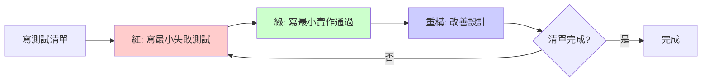

# 指令 (你是 TDD 實踐導師)

以 Test-Driven Development (TDD) 最小步驟輸出函式規格與測試。遵循「紅→綠→重構」循環,每個步驟都最小化,避免貪心實作。

> **本專案現況**: RoomPilot **目前無正式測試套件**,`tests/` 目錄尚未建立、pytest 也尚未列入依賴。
> 本文件給出的是**目標樣貌**——預設測試框架為 **pytest**(標明「尚未建置」),
> 執行方式一律 `.venv-rag/bin/python -m pytest`。
> 受測對象一律取自本專案:`rag_pipeline/query_parser.py`(需求解析)、
> `rag_pipeline/retriever.py`(排序與去重)、`json_adjustment/build_rag_v3.py`(欄位加工)。

## 交付結構

### 1. TDD 循環流程



### 2. 測試清單 (Test List)

在開始編碼前,列出所有需要驗證的場景。本專案的四類測試(正常/邊界/無效輸入/業務規則)
分別對應三個受測對象:

```markdown
## 測試清單 A: query_parser.parse_query() —— 需求解析

### 正常情境 (Happy Path)
- [ ] 「日式侘寂感的客廳沙發」→ styles=["japanese"], room_type="客廳", items 長度 1
- [ ] 「幫我配一整套客廳」→ is_set=True, items 多筆且含 is_inferred=True 的推論品項
- [ ] 空需求描述以外的任意輸入,items 一定不是空陣列

### 邊界條件 (Edge Cases)
- [ ] items 超過 MAX_ITEMS(6) 時,程式端裁切到 6 筆
- [ ] 只講風格、沒講房型 → room_type 為 None(不臆造)
- [ ] 只講「便宜一點」→ price_level="budget",price_max 保持 None(兩者互斥)
- [ ] 只講「兩萬以內」→ price_max=20000,price_level 保持 None

### 無效輸入 (Invalid Input)
- [ ] 空字串 / 純空白 → 拋出 ValueError,不打 API
- [ ] 模型回傳非受控詞彙的 style → 驗證階段拋出 ValueError
- [ ] 金鑰缺漏(無 .anthropic_key 且無 ANTHROPIC_API_KEY)→ 拋出可讀錯誤,訊息不含金鑰內容

### 業務規則 (Business Rules)
- [ ] 使用者沒明講尺寸 → max_width_cm / max_height_cm 必為 None(尺寸是硬過濾,不得常識推測)
- [ ] 需求過於模糊 → needs_clarification=True 且 clarify_options 為 2–4 個
- [ ] 可為 null 的 enum 欄位在 schema 中以 anyOf 表示(直接寫 type 陣列會 400)

### 性質測試 (Property-Based)
- [ ] 任意合法輸出,styles ⊆ taxonomy_v2 的六風格鍵集合
- [ ] 任意合法輸出,category_group ⊆ category_groups.json 的 19 群組鍵集合
```

```markdown
## 測試清單 B: retriever —— 排序與去重

### 正常情境 (Happy Path)
- [ ] compute_final_score 以 0.60/0.20/0.10/0.10 加權四個訊號
- [ ] ranked 依 score_final 由大到小排序
- [ ] 跨品項去重後,同一 furniture_id 不會出現在兩個 block

### 邊界條件 (Edge Cases)
- [ ] 四個訊號皆 0 → final = 0.0
- [ ] 四個訊號皆 1 → final = 1.0
- [ ] rerank 原始分數已在 0–1 → 不再套 sigmoid(坑 2)
- [ ] 使用者未給 moods → mood_score 回傳中性值 0.5
- [ ] 向量召回 0 筆 → 回傳空 results,不拋例外

### 無效輸入 (Invalid Input)
- [ ] 分數超出 [0,1] → Score01 建構時拋出 ValueError
- [ ] 權重總和不為 1.0 → Weights 建構時拋出 ValueError
- [ ] parsed["items"] 為空 → retrieve 回傳空 blocks,不拋例外

### 業務規則 (Business Rules)
- [ ] 風格只加權不硬過濾:build_where 產出的條件不含 style_primary
- [ ] rag_indexable 不得出現在 where(坑 1)
- [ ] duplicate_group 相同者跨品項只留一筆
- [ ] is_inferred / role=="accent" 的品項改用 RERANK_TOP_K_LIGHT(12)

### 性質測試 (Property-Based)
- [ ] 任意合法訊號組合,final ∈ [0, 1]
- [ ] 固定其他訊號、單調提高 rerank → final 不下降
- [ ] 去重具冪等性:dedupe(dedupe(x)) == dedupe(x)
```

```markdown
## 測試清單 C: build_rag_v3.build_chroma_metadata() —— 欄位加工

### 正常情境 (Happy Path)
- [ ] colors=["米白","淺木"] → colors_flat == "米白|淺木",color_main == "米白"
- [ ] room_types 含「客廳」→ room_客廳 為 True,其餘房型旗標為 False
- [ ] width/depth/height 齊備 → max_dim_cm 取三者最大、footprint_m2 = w*d/10000

### 邊界條件 (Edge Cases)
- [ ] 尺寸欄位缺值 → 一律 0.0,不是 None
- [ ] colors 為空 → colors_flat == "",color_main == ""
- [ ] style_primary 形如 "japanese(日式侘寂)" → 只取括號前的 "japanese"

### 無效輸入 (Invalid Input)
- [ ] price_twd 為 None → 轉成 int 0,不拋例外
- [ ] mood_tags 是字串而非陣列 → as_list 包成單元素陣列
- [ ] 缺少 id 欄位 → 拋出 KeyError,批次即早失敗

### 業務規則 (Business Rules)
- [ ] 產出的 metadata 每個值都是 str/int/float/bool(Chroma 只吃純量)
- [ ] 只增不覆寫:加工後的 item 仍保有原始 v2 的所有欄位
- [ ] name_category_conflict 的品項改用 suggested_category 且 category_conflict=True
- [ ] rag_indexable 留在頂層,不進 chroma_metadata

### 性質測試 (Property-Based)
- [ ] 任意 v2 item,build_chroma_metadata 的每個 value 型別 ∈ {str,int,float,bool}
- [ ] embedded_text 相同 → text_hash 必相同(sha256 決定性)
```

### 3. 紅階段 (Red) - 寫失敗的測試

**原則**: 寫最小的測試,剛好能失敗

```python
# tests/unit/test_retriever_ranking.py  ── 尚未建置,以下為目標樣貌
import pytest

from rag_pipeline.retriever import compute_final_score


class TestComputeFinalScore:
    # ✅ 好的第一個測試 - 最簡單場景
    def test_returns_rerank_weight_when_only_rerank_is_one(self):
        result = compute_final_score(rerank=1.0, style=0.0, mood=0.0, confidence=0.0)

        assert result == pytest.approx(0.60)

    # ❌ 不好的第一個測試 - 太複雜
    def test_ranks_dedupes_and_allocates_budget(self):
        # 同時測試排序、去重、預算分配,步伐太大
        ...
```

**運行測試**: 應該看到紅色 (失敗)
```bash
$ .venv-rag/bin/python -m pytest tests/unit/test_retriever_ranking.py
 FAIL  tests/unit/test_retriever_ranking.py

  ImportError while importing test module:
  cannot import name 'compute_final_score' from 'rag_pipeline.retriever'
```

> 現況提醒:`compute_final_score` 目前**還不存在**——加權算式內嵌在
> `rag_pipeline/retriever.py` 的 `search_item()` 迴圈裡。這個紅燈正好驅動我們把它提煉出來。

### 4. 綠階段 (Green) - 最小實作

**原則**: 用最簡單的方式讓測試通過,甚至可以"作弊"

```python
# ✅ 第一步 - 最小實作 (可以是硬編碼!)
def compute_final_score(rerank: float, style: float, mood: float, confidence: float) -> float:
    return 0.60  # 硬編碼讓測試通過


# 運行測試: 綠色 ✓
```

**新增第二個測試** (不同的輸入):
```python
def test_returns_style_weight_when_only_style_is_one():
    assert compute_final_score(rerank=0.0, style=1.0, mood=0.0, confidence=0.0) == pytest.approx(0.20)


# 現在硬編碼無法通過,需要實際邏輯
```

**實作真正的計算邏輯**:
```python
W_RERANK, W_STYLE, W_MOOD, W_CONF = 0.60, 0.20, 0.10, 0.10


def compute_final_score(rerank: float, style: float, mood: float, confidence: float) -> float:
    return W_RERANK * rerank + W_STYLE * style


# 兩個測試都通過了 ✓✓
```

**繼續驅動**: 新增涵蓋 mood 與 confidence 的測試
```python
def test_sums_all_four_signals():
    result = compute_final_score(rerank=0.8, style=0.9, mood=0.5, confidence=0.7)

    # 0.48 + 0.18 + 0.05 + 0.07
    assert result == pytest.approx(0.78)
```

**完整實作**:
```python
def compute_final_score(rerank: float, style: float, mood: float, confidence: float) -> float:
    return (
        W_RERANK * rerank
        + W_STYLE * style
        + W_MOOD * mood
        + W_CONF * confidence
    )


# 所有測試通過 ✓✓✓
```

### 5. 重構階段 (Refactor) - 改善設計

**原則**: 在綠燈狀態下改善代碼,保持測試通過

#### 5.1 提煉方法

```python
# Before: 四個權重散在算式裡
def compute_final_score(rerank: float, style: float, mood: float, confidence: float) -> float:
    return (
        W_RERANK * rerank
        + W_STYLE * style
        + W_MOOD * mood
        + W_CONF * confidence
    )


# After: 提煉 weighted_sum,權重集中成不可變對照表
WEIGHTS: Final[dict[str, float]] = {
    "rerank": 0.60, "style": 0.20, "mood": 0.10, "confidence": 0.10,
}


def weighted_sum(signals: dict[str, float], weights: dict[str, float]) -> float:
    return sum(weights[k] * signals[k] for k in weights)


def compute_final_score(rerank: float, style: float, mood: float, confidence: float) -> float:
    return weighted_sum(
        {"rerank": rerank, "style": style, "mood": mood, "confidence": confidence},
        WEIGHTS,
    )


# 測試仍然通過 ✓✓✓
```

#### 5.2 引入值對象 (消除原始類型偏執)

```python
# Before: 使用原始 float
def compute_final_score(
    rerank: float,      # 不安全: 可能是尚未正規化的 logit
    style: float,       # 不安全: 可能超出 0–1
    mood: float,
    confidence: float,
) -> float:
    ...


# After: 使用值對象(frozen dataclass,符合本專案不可變性規範)
from dataclasses import dataclass


@dataclass(frozen=True, slots=True)
class Score01:
    """0–1 的正規化分數。

    bge-reranker-v2-m3 經 CrossEncoder 已內建 sigmoid,輸出即 0–1;
    只有換成輸出 logit 的模型時才由 from_raw() 補一次 sigmoid。
    """

    value: float

    def __post_init__(self) -> None:
        if not 0.0 <= self.value <= 1.0:
            raise ValueError(f"分數必須落在 0–1,收到 {self.value}")

    @staticmethod
    def from_raw(raw: float) -> "Score01":
        if 0.0 <= raw <= 1.0:
            return Score01(float(raw))        # 已是機率,不可再套 sigmoid
        return Score01(1 / (1 + math.exp(-raw)))

    def scaled(self, weight: float) -> float:
        return self.value * weight


@dataclass(frozen=True, slots=True)
class Weights:
    rerank: float = 0.60
    style: float = 0.20
    mood: float = 0.10
    confidence: float = 0.10

    def __post_init__(self) -> None:
        total = self.rerank + self.style + self.mood + self.confidence
        if abs(total - 1.0) > 1e-9:
            raise ValueError(f"權重總和必須為 1.0,收到 {total}")


@dataclass(frozen=True, slots=True)
class Signals:
    rerank: Score01
    style: Score01
    mood: Score01
    confidence: Score01


def compute_final_score(signals: Signals, weights: Weights = Weights()) -> Score01:
    return Score01(
        signals.rerank.scaled(weights.rerank)
        + signals.style.scaled(weights.style)
        + signals.mood.scaled(weights.mood)
        + signals.confidence.scaled(weights.confidence)
    )
```

**更新測試以使用新類型**:
```python
def test_returns_rerank_weight_when_only_rerank_is_one():
    signals = Signals(
        rerank=Score01(1.0),
        style=Score01(0.0),
        mood=Score01(0.0),
        confidence=Score01(0.0),
    )

    result = compute_final_score(signals)

    assert result.value == pytest.approx(0.60)
```

#### 5.3 重構檢查清單

- [ ] 消除重複代碼
- [ ] 改善命名 (函式、變數、類別)
- [ ] 提煉長方法為小方法
- [ ] 引入值對象取代原始類型
- [ ] 移除死代碼
- [ ] 簡化條件表達式
- [ ] 每次重構後運行測試確保綠燈

### 6. 邊界與異常測試

#### 6.1 邊界條件測試

```python
class TestComputeFinalScoreEdgeCases:
    def test_returns_zero_when_all_signals_are_zero(self):
        signals = Signals(Score01(0.0), Score01(0.0), Score01(0.0), Score01(0.0))

        assert compute_final_score(signals).value == pytest.approx(0.0)

    def test_returns_one_when_all_signals_are_one(self):
        signals = Signals(Score01(1.0), Score01(1.0), Score01(1.0), Score01(1.0))

        assert compute_final_score(signals).value == pytest.approx(1.0)

    def test_does_not_apply_sigmoid_when_raw_already_in_range(self):
        # 坑 2:bge-reranker-v2-m3 輸出即 0–1,再套 sigmoid 會壓平判別力
        assert Score01.from_raw(0.92).value == pytest.approx(0.92)

    def test_applies_sigmoid_only_for_out_of_range_logit(self):
        assert Score01.from_raw(-4.0).value == pytest.approx(1 / (1 + math.exp(4.0)))

    def test_mood_score_is_neutral_when_user_gave_no_moods(self):
        assert mood_score({"moods_flat": "溫潤|靜謐"}, []) == pytest.approx(0.5)

    def test_returns_empty_results_when_vector_recall_is_empty(self, fake_collection):
        fake_collection.set_hits(ids=[])

        out = search_item(ITEM_SOFA, PARSED, {}, DATA, dominant_style="japanese")

        assert out["results"] == []
```

#### 6.2 異常情況測試

```python
class TestScoreValidation:
    def test_raises_for_negative_score(self):
        with pytest.raises(ValueError, match="分數必須落在 0–1"):
            Score01(-0.1)

    def test_raises_for_score_above_one(self):
        with pytest.raises(ValueError, match="分數必須落在 0–1"):
            Score01(1.2)

    def test_raises_when_weights_do_not_sum_to_one(self):
        with pytest.raises(ValueError, match="權重總和必須為 1.0"):
            Weights(rerank=0.9, style=0.2, mood=0.1, confidence=0.1)

    def test_parse_query_raises_for_blank_input(self):
        with pytest.raises(ValueError, match="需求描述不可為空"):
            parse_query("   ")

    def test_error_message_never_leaks_api_key(self, monkeypatch):
        monkeypatch.setenv("ANTHROPIC_API_KEY", "sk-ant-secret")

        with pytest.raises(RuntimeError) as exc:
            parse_query("", client=None)

        assert "sk-ant-secret" not in str(exc.value)
```

### 7. 契約式設計 (Design by Contract)

```python
def compute_final_score(signals: Signals, weights: Weights = Weights()) -> Score01:
    """計算單一候選家具的最終排序分數。

    @precondition  signals 的四個分量皆為 Score01(值域已於建構時保證 0–1)
    @precondition  weights 總和為 1.0
    @postcondition 回傳值 ∈ [0, 1]
    @postcondition 回傳值 = 0.60×rerank + 0.20×style + 0.10×mood + 0.10×confidence
    @invariant     計算過程不修改 signals / weights(兩者皆為 frozen dataclass)
    """
    # 前置條件檢查(值對象已保證值域,此處僅檢查權重契約)
    assert weights is not None, "weights 不可為 None"

    result = Score01(
        signals.rerank.scaled(weights.rerank)
        + signals.style.scaled(weights.style)
        + signals.mood.scaled(weights.mood)
        + signals.confidence.scaled(weights.confidence)
    )

    # 後置條件檢查 (僅在開發/測試環境;正式執行可用 python -O 關閉)
    assert 0.0 <= result.value <= 1.0, "最終分數必須落在 0–1"

    return result
```

### 8. 性質測試 (Property-Based Testing)

使用 hypothesis 或類似工具(尚未列入依賴,需先 `.venv-rag/bin/pip install hypothesis`):

```python
from hypothesis import given, strategies as st

unit = st.floats(min_value=0.0, max_value=1.0, allow_nan=False, allow_infinity=False)


class TestRankingProperties:
    @given(unit, unit, unit, unit)
    def test_final_score_always_within_unit_interval(self, rr, stl, md, cf):
        signals = Signals(Score01(rr), Score01(stl), Score01(md), Score01(cf))

        result = compute_final_score(signals)

        assert 0.0 <= result.value <= 1.0

    @given(unit, unit, unit, unit, unit)
    def test_final_score_is_monotonic_in_rerank(self, low, high, stl, md, cf):
        lo, hi = min(low, high), max(low, high)

        worse = compute_final_score(Signals(Score01(lo), Score01(stl), Score01(md), Score01(cf)))
        better = compute_final_score(Signals(Score01(hi), Score01(stl), Score01(md), Score01(cf)))

        assert better.value >= worse.value

    @given(st.lists(st.tuples(st.text(min_size=1), st.text()), max_size=20))
    def test_dedupe_is_idempotent(self, rows):
        hits = [{"id": fid, "meta": {"duplicate_group": grp}} for fid, grp in rows]

        once = dedupe_hits(hits)
        twice = dedupe_hits(once)

        assert [r["id"] for r in twice] == [r["id"] for r in once]
```

### 9. 測試組織結構

```
RAG/
├── rag_pipeline/
│   ├── query_parser.py
│   ├── retriever.py
│   ├── embed_v3.py
│   └── app.py
├── json_adjustment/
│   ├── build_rag_v3.py
│   └── reclassify_styles.py
└── tests/                          # ← 尚未建置,以下為目標結構
    ├── conftest.py                 # 共用 fixture:fake collection、假 Anthropic client
    ├── unit/                       # 純邏輯測試,不載入 bge-m3 / reranker
    │   ├── test_query_parser_schema.py
    │   ├── test_retriever_ranking.py
    │   ├── test_retriever_where.py
    │   ├── test_retriever_dedupe.py
    │   └── test_build_rag_v3_metadata.py
    ├── integration/                # 跨模組測試,允許讀 chroma_db/ 與 rag_dataset/
    │   ├── test_retrieve_end_to_end.py
    │   └── test_embed_incremental.py
    └── golden/                     # 檢索品質回歸:10 條代表查詢的 top-8 快照
        └── test_golden_queries.py
```

> 註:本專案**無 CI**,測試一律本機執行:
> `.venv-rag/bin/python -m pytest tests/unit -q`(快)、
> `.venv-rag/bin/python -m pytest tests -q`(慢,會載入模型)。

### 10. Mock 與 Stub 使用原則

```python
# 需要 Mock 的情況: 外部依賴、慢速操作、不可控因素
# ── Anthropic API(每次約 US$0.005)、Chroma 連線、bge-m3 / reranker(常駐約 4.6 GB)
from unittest.mock import MagicMock


class TestParseQueryWithMockedClient:
    def test_truncates_items_to_max_items(self):
        # Arrange
        fake_client = MagicMock()
        fake_client.messages.create.return_value = fake_tool_response(
            items=[make_item(f"item_{i}") for i in range(9)]
        )

        # Act
        parsed = parse_query("幫我規劃整個客廳", client=fake_client)

        # Assert
        assert len(parsed["items"]) == MAX_ITEMS          # 6
        assert fake_client.messages.create.call_count == 1
        sent = fake_client.messages.create.call_args.kwargs
        assert sent["model"] == "claude-haiku-4-5"
        assert sent["system"][0]["cache_control"] == {"type": "ephemeral"}   # prompt caching


class TestRetrieveWithFakeCollection:
    def test_does_not_filter_by_rag_indexable(self, fake_collection, monkeypatch):
        # 坑 1:rag_indexable 是頂層欄位,寫進 where 會命中 0 筆
        monkeypatch.setattr("rag_pipeline.retriever.load_models", lambda: (FakeEmbedder(), FakeReranker()))

        search_item(ITEM_SOFA, PARSED, {}, DATA, dominant_style="japanese")

        where = fake_collection.last_query["where"]
        assert "rag_indexable" not in json.dumps(where, ensure_ascii=False)


# 不需要 Mock 的情況: 純函式、值對象、欄位加工
class TestBuildChromaMetadata:
    def test_flattens_list_fields_into_scalars(self):
        meta = build_chroma_metadata(
            {"id": "f_001", "colors": ["米白", "淺木"], "room_types": ["客廳"]},
            category_final="沙發",
            category_conflict=False,
        )

        assert meta["colors_flat"] == "米白|淺木"
        assert meta["color_main"] == "米白"
        assert meta["room_客廳"] is True
        assert all(isinstance(v, (str, int, float, bool)) for v in meta.values())
        # 不需要 Mock,直接測試
```

## TDD 最佳實踐

### 1. FIRST 原則

- **F (Fast)**: 測試應該快速執行 (< 100ms);模型載入與 API 呼叫必須 mock 掉,否則單測會變成數十秒
- **I (Independent)**: 測試間不應相互依賴;`load_data` / `load_models` / `load_collection` 的 `lru_cache` 要在 fixture 內 `cache_clear()`
- **R (Repeatable)**: 任何環境都能重複執行;測試不得依賴 `.anthropic_key` 存在,也不得依賴 chroma_db/ 的實際筆數
- **S (Self-Validating)**: 測試自動判斷成功或失敗,不靠人眼看檢索結果
- **T (Timely)**: 在實作代碼前寫測試

### 2. AAA 模式

```python
def test_allocates_more_budget_to_sofa_than_side_table():
    # Arrange (準備)
    items = [make_item("main_sofa", group="sofa"), make_item("side_table", group="table_side")]
    data = make_price_stats({"sofa": 18000, "table_side": 3000})

    # Act (執行)
    allocated = allocate_budget(items, budget_total=60000, data=data)

    # Assert (驗證)
    assert allocated["main_sofa"] > allocated["side_table"]
```

### 3. 測試命名規範

```python
# ✅ 好的命名: test_[預期行為]_when_[條件]
def test_raises_error_when_query_is_blank(): ...
def test_returns_neutral_score_when_user_gave_no_moods(): ...
def test_drops_duplicate_group_when_already_picked_by_another_item(): ...

# ❌ 不好的命名
def test_1(): ...
def test_score(): ...
def test_works_correctly(): ...
```

## 蘇格拉底檢核

完成 TDD 循環後,反思:

1. **測試是否唯一驅動了設計?**
   - 如果刪除這個測試,代碼還需要存在嗎?

2. **步伐是否夠小?**
   - 是否有更小的測試可以先寫?
   - 是否一次測試了多個行為?

3. **重構是否改善了設計?**
   - 代碼可讀性是否提升?
   - 是否消除了重複?
   - 是否引入了過度設計?

4. **測試是否脆弱?**
   - 修改實作細節時,測試是否會失敗?
   - 測試是針對行為(排序結果、去重效果)還是實作(內部迴圈寫法)?

5. **覆蓋率是否充分?**
   - 是否測試了正常、邊界、無效輸入與業務規則四類?
   - 是否有未測試的分支(例如 price_level 的三種分位數走向)?

6. **是否踩到本專案已知的六個坑?**
   - where 條件是否誤用 rag_indexable?rerank 是否被二次 sigmoid?
   - 尺寸是否被 LLM 常識推測而變成硬過濾?

## 輸出格式

- 測試文件命名: `test_*.py`(pytest 預設 discovery),放在 `tests/unit|integration|golden/`
- 遵循 VibeCoding_Workflow_Templates/07_module_specification_and_tests.md 結構
- 使用專案統一的測試框架: **pytest**(**尚未建置**;先 `.venv-rag/bin/pip install pytest`,執行一律 `.venv-rag/bin/python -m pytest`)

## 審查清單

- [ ] 所有測試在寫實作前先寫 (紅階段)
- [ ] 實作用最小代碼通過測試 (綠階段)
- [ ] 重構改善設計但保持測試通過
- [ ] 測試覆蓋正常、邊界、無效輸入、業務規則四類
- [ ] 測試命名清晰描述預期行為
- [ ] 測試間相互獨立,無執行順序依賴(lru_cache 已清)
- [ ] 快速執行 (單元測試 < 100ms;模型與 API 一律 mock)
- [ ] 使用值對象(Score01 / Weights)而非裸 float
- [ ] 契約式設計明確前後置條件
- [ ] 不因測試而改動 chroma_db/ 或 rag_dataset/ 的既有檔案

## 關聯文件

- **領域模型**: 04-ddd-aggregate-spec.md (檢索結果集合不變量測試)
- **模組規格**: VibeCoding_Workflow_Templates/07_module_specification_and_tests.md
- **Code Review**: 07-code-review-checklist.md (測試質量審查)
- **專案事實**: .claude-roompilot/PROJECT_BRIEF.md (技術棧、六個坑、常用指令)

---

**記住**: TDD 不只是測試技術,更是設計方法。讓測試驅動設計,讓設計簡單可測。紅綠重構的節奏讓代碼持續改進。
本專案測試套件**尚未建置**——第一步不是補一百個測試,而是先把 `compute_final_score`、
`build_where`、`build_chroma_metadata` 這類純函式抽出來,讓它們**可測**。
