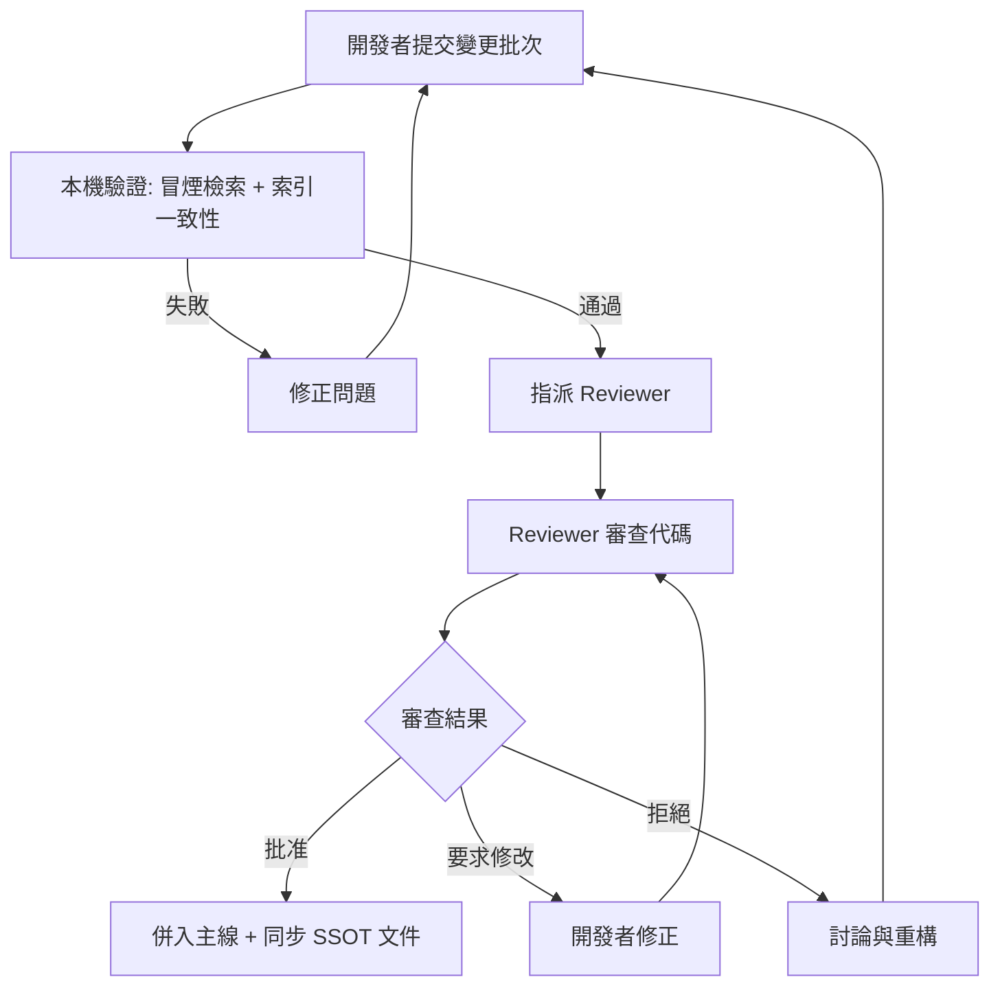

# 指令 (你是資深 Code Reviewer)

以建設性、友善的方式進行代碼審查,聚焦架構合理性、業務邏輯正確性、可維護性與安全性。每個建議都應說明原因與改進方案。

> **本專案現況**: RoomPilot 為 Python 3.11 檢索系統(`.venv-rag/bin/python`),
> **尚未 git init**、**無 CI**、**無 Docker**,測試套件(pytest)**尚未建置**。
> 審查流程照走,但「PR 編號」「CI 綠燈」等欄位目前以**變更批次**與**本機驗證**替代。

> **⚠️ 關於本文件的「❌ 當前代碼」範例**:
> 以下各節的 ❌ 區塊全部是**輸出格式示範**——用來說明審查報告該長什麼樣、
> 理由該怎麼寫,**不代表 RoomPilot 現行程式碼真的有這些缺陷**。
> 區塊中的 `檔案:<行號>` 一律是**佔位符**,不要照著去「修」不存在的問題。
> 現行程式碼實況(供對照):
> - `retriever.py` 的 `query_collection()` 已精準攔截 `NotFoundError`、清 `lru_cache` 重連一次
> - rerank 分數**只在**原始值落在 0–1 之外時才補 sigmoid(沒有二次 sigmoid)
> - 候選數走具名常數 `VEC_TOP_K` / `RERANK_TOP_K` / `RERANK_TOP_K_LIGHT`,無魔術數字
> - `style_score()` / `allocate_budget()` 命名清楚且有 docstring
> - `build_chroma_metadata()` 已正確攤平 list 並強轉型別
> - `app.py` 全檔沒有任何 chromadb 呼叫,UI 層只依賴 `retriever` 的對外契約
>
> 實際審查時請以**當下的 diff** 重新定位真實行號,再填進報告。

## 交付結構

### 1. Code Review 總體評估

```markdown
## Code Review Summary

**提交者**: [開發者名稱]
**變更批次**: retriever-rerank-topk-2026-07-28(專案尚未 git init,以批次名替代 PR 編號)
**變更範圍**: [簡述變更的模組與功能,例如 rag_pipeline/retriever.py 的 rerank 候選數調整]
**審查者**: [您的名稱]
**審查日期**: 2026-07-28

**總體評分**: ⭐⭐⭐⭐☆ (4/5)

**主要優點**:
- ✅ 純函式(build_where / style_score)可獨立驗證,不需載入 bge-m3
- ✅ 硬過濾與軟加權界線清楚,風格未誤入 Chroma where
- ✅ 加工腳本遵守「只增不覆寫」,v2 原欄位完整保留

**需改進項目**(以下為**虛構的示範條目**,不是現行程式碼的實際缺陷):
- ⚠️ 缺少索引被重建時的行為說明(collection UUID 會換)
- ⚠️ 錯誤訊息不夠具體,檢索 0 筆時看不出是哪個硬條件擋掉
- 🔴 rerank 分數被二次 sigmoid,判別力被壓平(六個坑第 2 條)

**決策**: ✅ 批准合併 (需修正紅色項目)
```

> 上面這份 Summary 是**填好的空白表格範例**,示範各欄位該怎麼寫。
> 特別注意「rerank 被二次 sigmoid」只是示範一個 🔴 條目長什麼樣——
> 現行 `retriever.py` 的 rerank 正規化只在原始分數落在 0–1 之外時才補 sigmoid,
> 本身沒有這個缺陷;寫報告時請填入**你這次變更真正發現的問題**。

### 2. 架構與設計審查 (Architecture & Design)

#### 2.1 分層架構 (Layered Architecture)

```markdown
### ✅ 已正確遵循

- UI 層(`rag_pipeline/app.py`)只負責呈現,不知道 Chroma metadata schema
- 檢索層(`retriever.py`)透過 `load_collection()` 單例存取向量庫,不散在各處建連線

### ⚠️ 需改進

**問題**: UI 層直接組 Chroma 查詢條件

**位置**: `rag_pipeline/app.py:<行號>`(示範用,非本專案現況)
```python
# ❌ 當前代碼
import chromadb

def on_submit(text: str):
    parsed = parse_query(text)
    client = chromadb.PersistentClient(path="chroma_db")
    hits = client.get_collection("furniture_v3").query(
        query_texts=[text],
        where={"category": {"$in": ["沙發"]}},   # UI 層自己拼 metadata 條件
    )
    return render_cards(hits)
```

**建議**:
```python
# ✅ 改進後
from retriever import retrieve   # UI 只依賴檢索層的對外契約

def on_submit(text: str):
    parsed = parse_query(text)
    result = retrieve(parsed)     # where 條件由 build_where() 統一產生
    return render_cards(result["blocks"])
```

**理由**:
- UI 層不應知道 collection 名稱、metadata 欄位名與 `$in` 語法
- 硬過濾規則集中在 `build_where()`,改欄位時只需改一處
- 集中後才有辦法對 where 條件寫單元測試(不需啟動 Gradio)
```

#### 2.2 檢索契約與不變量 (Retrieval Contract & Invariants)

```markdown
### 🔴 需修正

**問題**: metadata 不變量未被保護——list 值進了 Chroma、頂層欄位進了 where

**位置**: `json_adjustment/build_rag_v3.py:<行號>` / `rag_pipeline/retriever.py:<行號>`(示範用,非本專案現況)
```python
# ❌ 當前代碼
def build_chroma_metadata(item, category_final, category_conflict):
    return {
        "furniture_id": item["id"],
        "colors": item.get("colors"),        # list → Chroma 直接拒收
        "moods": item.get("mood_tags"),      # list → Chroma 直接拒收
        "width_cm": item.get("width_cm"),    # 可能是 None → 型別不穩
    }


def build_where(item, parsed, allocated, data):
    return {"$and": [
        {"rag_indexable": {"$eq": True}},    # 🔴 頂層欄位,不在 metadata 裡 → 命中 0 筆
        {"style_primary": {"$eq": "japanese"}},  # 🔴 風格應為軟加權,硬過濾會剩個位數
    ]}
```

**建議**:
```python
# ✅ 改進後
def build_chroma_metadata(item, category_final, category_conflict) -> dict:
    """Chroma metadata 只接受 str/int/float/bool,故 list 欄位一律攤平。"""
    colors = as_list(item.get("colors"))
    moods = as_list(item.get("mood_tags"))
    rooms = as_list(item.get("room_types"))

    meta = {
        "furniture_id": item["id"],
        "color_main": colors[0] if colors else "",
        "colors_flat": "|".join(colors),      # 顯示與後過濾用
        "moods_flat": "|".join(moods),
        "width_cm": float(item.get("width_cm") or 0.0),
    }
    for key in ROOM_ZH:                        # 房型是硬過濾 → 攤成布林旗標
        meta[f"room_{key}"] = key in rooms
    return meta


def build_where(item, parsed, allocated, data) -> dict | None:
    """硬過濾只放:房型 / 類別 / 價格 / 尺寸。風格與氛圍只影響排序。"""
    clauses = []
    if parsed.get("room_type"):
        clauses.append({f"room_{parsed['room_type']}": {"$eq": True}})
    if item.get("category_group") in data["groups"]:
        clauses.append({"category": {"$in": data["groups"][item["category_group"]]["categories"]}})
    # rag_indexable 不寫進 where —— collection 本來就只收可索引的 9,349 筆
    if not clauses:
        return None                            # 只給風格 → 全庫語意檢索
    return clauses[0] if len(clauses) == 1 else {"$and": clauses}
```

**理由**:
- Chroma metadata 的型別契約是 str/int/float/bool,list 會在 `collection.add()` 當場失敗
- `rag_indexable` 是 v3 的頂層欄位、不在 `chroma_metadata` 裡,寫進 where 會靜默命中 0 筆(最難查的一種錯)
- 風格硬過濾後疊上房型與類別常只剩個位數;改用 `style_compat` 6×6 矩陣加權,相容風格也撈得進來
```

### 3. 代碼可讀性與可維護性 (Readability & Maintainability)

#### 3.1 命名規範

```markdown
### ⚠️ 需改進

**問題**: 函式命名不清楚

**位置**: `rag_pipeline/retriever.py:<行號>`(示範用,非本專案現況)
```python
# ❌ 當前代碼
def calc(a, b, c, d):
    # 60 行:混了正規化、加權、排序、截斷
    ...
```

**建議**:
```python
# ✅ 改進後
def compute_final_score(
    rerank: Score01,
    style_compat: Score01,
    mood_hit_rate: Score01,
    confidence: Score01,
) -> Score01:
    # 提煉為小函式,每個職責單一
    normalized = normalize_rerank(rerank)
    return weighted_sum(normalized, style_compat, mood_hit_rate, confidence)
```

**理由**:
- 函式名應描述其作用(計算最終排序分數),而非使用縮寫
- 參數名應對應排序公式的四個訊號,讀者不必回頭查 docstring
- 長函式應拆分為多個小函式,每個職責單一(本專案上限:函式 < 50 行、檔案 < 800 行)
```

#### 3.2 Magic Numbers & Strings

```markdown
### ⚠️ 需改進

**問題**: 硬編碼的魔術數字與字串

**位置**: `rag_pipeline/retriever.py:<行號>`(示範用,非本專案現況)
```python
# ❌ 當前代碼
ids = ids[:12] if item.get("is_inferred") else ids[:20]
hits = collection.query(query_embeddings=[qvec], n_results=50)
final = 0.6 * rr + 0.2 * st + 0.1 * md + 0.1 * cf

if parsed["price_level"] == "budget":
    hi = stats["p33"]
```

**建議**:
```python
# ✅ 改進後
VEC_TOP_K = 50            # 向量召回
RERANK_TOP_K = 20         # 送進 cross-encoder 的候選數(延遲主因:每 50 筆約 10 秒)
RERANK_TOP_K_LIGHT = 12   # 配件品項降額
FINAL_TOP_K = 8           # 最終回傳
W_RERANK, W_STYLE, W_MOOD, W_CONF = 0.60, 0.20, 0.10, 0.10


class PriceLevel(str, Enum):
    BUDGET = "budget"
    MID = "mid"
    PREMIUM = "premium"


def resolve_price_bounds(item, parsed, stats) -> tuple[int | None, int | None]:
    level = parsed.get("price_level")
    if level == PriceLevel.BUDGET:
        return None, int(stats["p33"])
    if level == PriceLevel.PREMIUM:
        return int(stats["p67"]), None
    return int(stats["p33"]), int(stats["p67"])
```

**理由**:
- 常數命名讓檢索策略清晰可見(為什麼是 50 → 20 → 8)
- 集中管理便於未來調參,也讓權重與 `docs/RAG檢索系統說明.md` 對得起來
- 避免裸字串比較,改用 Enum 限制輸入範圍,與 query_parser 的受控詞彙一致
```

### 4. 錯誤處理 (Error Handling)

#### 4.1 異常處理

```markdown
### 🔴 需修正

**問題**: 吞食異常,無法追蹤問題

**位置**: `rag_pipeline/retriever.py:<行號>`(示範用,非本專案現況)
```python
# ❌ 當前代碼
try:
    return load_collection().query(**kwargs)
except Exception:
    print("query failed")      # 僅打印,不處理
    return {"ids": [[]]}       # 回傳「查無結果」的假象
```

**建議**:
```python
# ✅ 改進後
from chromadb.errors import NotFoundError

try:
    return load_collection().query(**kwargs)
except NotFoundError:
    # 已知且可復原:embed_v3.py 重建索引會換 collection UUID,清快取重連一次
    load_collection.cache_clear()
    load_data.cache_clear()
    print("[retriever] 索引已被重建,重新連線後重試", flush=True)
    return load_collection().query(**kwargs)
except Exception as exc:
    # 未知錯誤:記錄完整上下文後包裝成領域例外向上拋
    logger.error(
        "chroma query failed",
        extra={"collection": COLLECTION, "where": kwargs.get("where"),
               "n_results": kwargs.get("n_results"), "error": repr(exc)},
    )
    raise RetrievalError(f"向量庫查詢失敗:{exc}") from exc
```

**理由**:
- 異常必須被適當處理或向上傳播;「回傳空結果」會讓 UI 顯示「找不到家具」而掩蓋故障
- 記錄 where 條件與候選數才查得出是哪個硬條件把結果濾光
- 只對**已知可復原**的 `NotFoundError` 做自動重試,`except Exception` 不可當萬用消音器
```

#### 4.2 空值處理

```markdown
### ⚠️ 需改進

**問題**: 未檢查空值

**位置**: `rag_pipeline/retriever.py:<行號>`(示範用,非本專案現況)
```python
# ❌ 當前代碼
def estimate_total(blocks: list) -> int:
    return sum(b["hits"][0]["meta"]["price_twd"] * b["quantity"] for b in blocks)
    # hits 可能為空陣列 → IndexError;price_twd 可能缺欄位 → KeyError
```

**建議**:
```python
# ✅ 改進後 (Option 1: 明確跳過無結果的品項)
def estimate_total(blocks: list) -> int:
    return sum(
        int(b["hits"][0]["meta"].get("price_twd") or 0) * b["quantity"]
        for b in blocks
        if b["hits"]
    )


# ✅ 改進後 (Option 2: 讓「無結果」成為顯式狀態,UI 可據此提示放寬條件)
@dataclass(frozen=True, slots=True)
class Block:
    item_id: str
    hits: tuple[dict, ...]

    @property
    def top_price(self) -> int | None:
        return int(self.hits[0]["meta"]["price_twd"]) if self.hits else None
```

**理由**:
- 硬過濾(價格 + 尺寸 + 房型)疊起來後,單一品項召回 0 筆是**常態**而非例外
- 明確處理「這個品項沒撈到」的情況,UI 才能提示使用者放寬哪個條件
- 用 frozen dataclass 讓空值處理顯式化,同時符合本專案的不可變性規範
```

### 5. 性能考量 (Performance)

```markdown
### ⚠️ 需改進

**問題**: 逐品項重複載入模型與重複編碼(等同 N+1 問題)

**位置**: `rag_pipeline/retriever.py:<行號>`(示範用,非本專案現況)
```python
# ❌ 當前代碼
def retrieve(parsed: dict) -> dict:
    blocks = []
    for item in parsed["items"]:
        # 每個品項都重新載入 bge-m3 + reranker(各約 4.6 GB,載入數十秒)
        embedder = SentenceTransformer("BAAI/bge-m3")
        reranker = CrossEncoder("BAAI/bge-reranker-v2-m3")
        qvec = embedder.encode([item["semantic_query"]])[0]
        ...
    return {"blocks": blocks}
```

**建議**:
```python
# ✅ 改進後
@lru_cache(maxsize=1)
def load_models() -> tuple:
    device = "mps" if torch.backends.mps.is_available() else "cpu"
    embedder = SentenceTransformer(EMBED_MODEL, device=device)
    reranker = CrossEncoder(RERANK_MODEL, device=device, max_length=512)
    embedder.max_seq_length = MAX_SEQ_LEN     # 512
    return embedder, reranker


def retrieve(parsed: dict) -> dict:
    embedder, reranker = load_models()                       # 單例,Gradio 重複查詢不重載
    queries = [i["semantic_query"] for i in parsed["items"]]
    qvecs = embedder.encode(queries, normalize_embeddings=True)   # 一次批次編碼
    ...
```

**理由**:
- 模型載入是最貴的一次性成本,`lru_cache(maxsize=1)` 讓 UI 只付一次
- 批次 encode 把 N 次前向傳播併成 1 次;rerank 才是延遲主因(每 50 筆約 10 秒),
  所以候選數限制在 `RERANK_TOP_K=20`、配件品項降到 12
- 16 GB 機器上 bge-m3 + reranker 常駐約 4.6 GB,**不可**在 UI 執行時同時跑批次腳本
```

### 6. 安全性審查 (Security)

```markdown
### 🔴 需修正

**問題**: 金鑰硬編碼與外洩風險

**位置**: `rag_pipeline/query_parser.py:<行號>`(示範用,非本專案現況)
```python
# ❌ 當前代碼
def get_client():
    return anthropic.Anthropic(api_key="sk-ant-api03-xxxxxxxx")   # 🔴 硬編碼金鑰

# 或同樣糟糕:出錯時把金鑰印出來
print("using key:", KEY_FILE.read_text())
```

**建議**:
```python
# ✅ 改進後
def get_client() -> anthropic.Anthropic:
    key = os.environ.get("ANTHROPIC_API_KEY") or (
        KEY_FILE.read_text(encoding="utf-8").strip() if KEY_FILE.exists() else ""
    )
    if not key:
        raise RuntimeError(
            "找不到 API 金鑰:請設定 ANTHROPIC_API_KEY 或建立 .anthropic_key"
        )   # 訊息只說「缺什麼」,絕不回顯內容
    return anthropic.Anthropic(api_key=key)
```

**理由**:
- 永遠不要把金鑰寫進原始碼;`.anthropic_key` 為純文字檔且已列入 `.gitignore`
- 錯誤訊息與 log 一律不得回顯金鑰內容(即使只印前幾碼)
- 專案雖尚未 git init,一旦 init 後歷史難以清除,現在就必須守住這條線
```

```markdown
### 🔴 需修正

**問題**: 敏感資訊與高成本呼叫未受控

**位置**: `json_adjustment/reclassify_styles.py:<行號>`(示範用,非本專案現況)
```python
# ❌ 當前代碼
logger.info("calling model", extra={
    "api_key": client.api_key,        # 🔴 金鑰洩露!
    "prompt": full_prompt,            # 🔴 含完整 system prompt 與使用者需求原文
    "items": all_9349_items,          # 🔴 一次全量,沒有上限保護
})
```

**建議**:
```python
# ✅ 改進後
logger.info("calling model", extra={
    "model": MODEL,                              # claude-haiku-4-5
    "provider": args.provider,                   # ollama(qwen3:8b)/ anthropic
    "batch_size": len(batch),
    "prompt_chars": len(full_prompt),            # 只記長度,不記內容
    "est_cost_usd": round(len(batch) * 0.00075, 4),
})

# 批次作業必須先 --dry-run / --compare 看統計,確認後才全量
# 全量六風格判定約 US$7,需求解析每次約 US$0.005 —— 會燒額度的是批次工作
```

**理由**:
- 金鑰、使用者需求原文等敏感資訊不可記錄到日誌
- 批次腳本必須提供 `--dry-run` / `--limit` / `--compare` 這類節流開關,避免一鍵燒光額度
- 輸入驗證同理:使用者查詢在進 `build_where()` 前必須通過受控詞彙驗證,不得讓自由文字直接組成過濾條件
```

### 7. 測試審查 (Testing)

```markdown
### ⚠️ 現況:測試套件尚未建置

本專案**目前沒有 pytest、沒有 tests/ 目錄、沒有 CI**。審查時請據此調整期待:
- 短期驗收依據 = **本機冒煙**:`.venv-rag/bin/python rag_pipeline/retriever.py "日式侘寂感的客廳沙發"`
- 中期目標 = 對純函式(`build_where` / `style_score` / `build_chroma_metadata`)補 pytest

### ✅ 本次變更的驗證足夠

- 附上 3 條代表查詢的 before/after top-8 對照
- 涵蓋正常、邊界(召回 0 筆)、無效輸入(空需求)三種情況

### ⚠️ 需補充

**問題**: 缺少「索引重建 / 批次中斷」的回歸測試

**建議**: 新增下列測試(尚未建置,以下為目標樣貌)
```python
class TestIndexRebuildAndResume:
    def test_reconnects_after_collection_is_rebuilt(self, fake_client):
        # embed_v3.py 以 delete + create 重建,collection 會換 UUID
        fake_client.raise_not_found_once()

        result = query_collection(query_embeddings=[[0.0] * 1024], n_results=8)

        assert result["ids"][0] != []            # 清快取重連後仍取得結果

    def test_resume_does_not_destroy_existing_progress(self, tmp_path):
        progress = tmp_path / "annotations_full.jsonl"
        progress.write_text('{"id": "f_001", "status": "ok"}\n', encoding="utf-8")

        run_batch(progress_file=progress, ids=["f_001", "f_002"])

        lines = progress.read_text(encoding="utf-8").splitlines()
        assert lines[0].startswith('{"id": "f_001"')   # 既有成功列原封不動
        assert len(lines) == 2                          # 只追加,不重寫
```
```

### 8. 文檔與注釋 (Documentation & Comments)

```markdown
### ⚠️ 需改進

**問題**: 缺少 docstring,且未同步 SSOT 文件

**位置**: `rag_pipeline/retriever.py:<行號>`(示範用,非本專案現況)
```python
# ❌ 當前代碼
def allocate_budget(items, budget_total, data):
    # 複雜邏輯,無注釋說明
    ...
```

**建議**:
```python
# ✅ 改進後
def allocate_budget(items: list, budget_total: int | None, data: dict) -> dict:
    """總預算依各類別群組的實際中位價按比例分配。

    平均分配會讓沙發(中位價 18,000)在 6 萬 / 5 件的情境下一件都撈不到,
    所以用中位價當權重;檢索階段再乘 BUDGET_SLACK(1.3)放寬,
    總價約束留到組合階段處理。

    Args:
        items: query_parser 產出的品項清單,需含 item_id / category_group / quantity
        budget_total: 使用者給的總預算(TWD);None 表示未指定
        data: load_data() 的結果,需含各群組的 median / p33 / p67

    Returns:
        {item_id: 該品項的價格上限},budget_total 為 None 時回傳空 dict

    Raises:
        KeyError: items 缺少 item_id 欄位時

    Example:
        >>> allocate_budget(items, 60000, load_data())
        {'main_sofa': 28000, 'coffee_table': 7800}
    """
    ...
```

**理由**:
- 公開函式必須有完整 docstring,說明前置條件、副作用與可能的異常
- 「為什麼用中位價而非平均分配」屬於 diff 表達不出的決策上下文,必須寫下來
- **文件為契約**:改動排序公式、受控詞彙、metadata 欄位時,必須同步
  `docs/RAG檢索系統說明.md`、`docs/query_parser_spec.md`、`rag_pipeline/README.md`、
  `json_adjustment/RAGSQL.md`——規格衝突時**以文件為準**
```

### 9. RoomPilot 專屬審查點 (Project-Specific)

```markdown
### 🔴 六個坑 —— 改動相關程式時逐條確認

1. **`rag_indexable` 不能寫進 Chroma `where`** — 它是頂層欄位、不在 `chroma_metadata` 裡,寫了會命中 0 筆
2. **rerank 分數不可再套 sigmoid** — `bge-reranker-v2-m3` 經 CrossEncoder 已輸出 0–1
3. **structured outputs 可為 null 的 enum 要用 `anyOf`** — 直接寫 type 陣列會 400
4. **HF Hub 未登入被限流會卡數分鐘** → 程式已 `setdefault("HF_HUB_OFFLINE", "1")`,勿移除
5. **尺寸是硬過濾,LLM 不得用常識推測** — 猜錯會直接濾掉正確結果
6. **勿把 reranker 換成 ms-marco MiniLM** — 英文模型,中文查詢會劣化

### ⚠️ 硬過濾 / 軟加權界線 —— 新欄位落在哪一邊?

| 條件 | 歸屬 | 落點 |
| :--- | :--- | :--- |
| 房型 / 類別 / 價格 / 尺寸 | **硬過濾** | `build_where()` 的 Chroma `where` |
| 風格 / 氛圍 | **軟加權** | `style_score()` / `mood_score()`,進排序公式 |
| 顏色 / 材質 | **不過濾** | 只進 `semantic_query`,交給向量與 rerank |

審查提問:這個新條件若猜錯,會「排後面」還是「整個消失」?會消失的才可以是硬過濾。

### ⚠️ 資料加工三條紅線

- **只增不覆寫**:`build_rag_v3.py` 以 `dict(item)` 起手,原欄位整份保留;新欄位只加不改
- **Chroma metadata 純量化**:值型別只能是 str/int/float/bool;list 一律 `"|".join()` 攤平,
  房型另攤成 `room_*` 布林旗標
- **可續跑批次不可破壞既有進度檔**:`annotations_full.jsonl`、`style_v2_annotations.jsonl`
  只允許**追加**;只有成功列視為完成,失敗列重跑時自動重試。禁止就地重寫整檔;
  真要改就先備份(參考 `vlm_annotation/supplement_from_export.py` 的「先備份、只補不覆寫」)
```

## Code Review 評分標準

| 類別 | 權重 | 評分標準 |
|------|------|----------|
| **架構與設計** | 30% | 分層清晰、依賴方向正確、硬過濾/軟加權界線正確 |
| **代碼品質** | 20% | 命名清晰、無重複代碼、單一職責、無 Magic Numbers |
| **測試完整性** | 15% | 純函式可測、本機冒煙有紀錄、覆蓋邊界與無效輸入(pytest 尚未建置) |
| **錯誤處理** | 15% | 異常處理完整、空值檢查、錯誤訊息具體且不洩漏金鑰 |
| **安全性** | 10% | 金鑰不入庫不入 log、輸入走受控詞彙驗證、批次有節流開關 |

| 效能與資源 | 10% | 模型單例載入、批次 encode、rerank 候選數受控、記憶體不超標 |

**總分計算**: 加權平均,滿分 100 分

- **90-100**: 優秀,可直接合併
- **75-89**: 良好,小幅修改後合併
- **60-74**: 合格,需改進關鍵問題
- **< 60**: 不合格,需大幅重構

## Code Review 流程

> 本專案**無 CI**、**尚未 git init**:下圖的「自動檢查」以本機驗證取代,
> 「提交 PR」在 git init 前以「提交變更批次 + 說明」進行,流程本身不變。



本機驗證的最小指令組(取代 CI):

```bash
PY=.venv-rag/bin/python

$PY rag_pipeline/query_parser.py "日式侘寂感、預算兩萬內的客廳沙發"   # 解析是否落在受控詞彙
$PY rag_pipeline/retriever.py   "日式侘寂感、預算兩萬內的客廳沙發"   # top-8 是否合理
$PY rag_pipeline/embed_v3.py --limit 50                              # 索引管線冒煙
$PY rag_pipeline/app.py                                              # UI → http://127.0.0.1:7860
```

## 蘇格拉底檢核

完成 Code Review 後,反思:

1. **這段代碼是否易於修改?**
   - 6 個月後其他人能快速理解嗎?
   - 調整排序權重或新增一個硬過濾條件,需要改動多少地方?

2. **是否存在隱藏的假設?**
   - 代碼是否假設 LLM 一定回傳受控詞彙?
   - 是否假設 chroma_db/ 一直存在、collection UUID 不會變、模型永遠在本機快取?

3. **這段代碼是否可測試?**
   - 能否在不載入 bge-m3、不打 Anthropic API 的情況下測試?
   - 測試是否需要複雜的 Mock(需要的話,通常代表該把純邏輯抽出來)?

4. **是否過度設計或設計不足?**
   - 是否為「將來可能換向量庫」引入了不必要的抽象?
   - 純檢索系統(R 沒有 G)是否被誤加了生成端?

5. **安全性是否充分考慮?**
   - 金鑰是否可能進到 log、錯誤訊息或提交內容?
   - 批次腳本是否可能一次燒掉大量額度?

6. **成本與資源是否被評估?**
   - 這次變更會讓每次查詢多打幾次 API、多載入多少記憶體?
   - 是否會讓 16 GB 機器在跑 UI 時同時跑批次而爆記憶體?

## 輸出格式

- 使用 Markdown 格式
- 遵循 VibeCoding_Workflow_Templates/11_code_review_and_refactoring_guide.md 結構
- 使用表情符號標示嚴重程度: ✅ (良好) ⚠️ (建議改進) 🔴 (必須修正)
- 程式範例一律 Python 3.11,執行方式一律 `.venv-rag/bin/python`

## 審查清單

### 通用

- [ ] 架構分層清晰,依賴方向正確(UI → retriever → chroma,不可反向或跳層)
- [ ] 檢索契約與 metadata 不變量受保護
- [ ] 命名清晰,無 Magic Numbers/Strings(TOP_K、權重、分位數皆具名)
- [ ] 異常處理完整,錯誤訊息具體(能指出是哪個硬條件把結果濾光)
- [ ] 無空值引用風險(hits 可能為空、尺寸欄位可能缺值)
- [ ] 無明顯性能問題(模型重複載入、逐筆 encode、rerank 候選數失控)
- [ ] 無安全漏洞(金鑰硬編碼、金鑰入 log、自由文字直接組 where)
- [ ] 測試覆蓋充分,包含邊界與無效輸入(pytest **尚未建置**,至少附本機冒煙紀錄)
- [ ] 公開函式有完整 docstring,SSOT 文件已同步
- [ ] 無代碼異味(God Function、Long Method、檔案 > 800 行)

### RoomPilot 專屬

- [ ] **六個坑**逐條確認(rag_indexable / 二次 sigmoid / anyOf / HF_HUB_OFFLINE / 尺寸硬過濾 / reranker 型號)
- [ ] **硬過濾 vs 軟加權界線**正確:房型・類別・價格・尺寸 = 硬過濾;風格・氛圍 = 軟加權;顏色・材質 = 只進 semantic_query
- [ ] **只增不覆寫**:資料加工保留原始欄位,不就地改寫上游值
- [ ] **Chroma metadata 純量化**:所有值為 str/int/float/bool,list 已 `|` 攤平,房型已攤成布林旗標
- [ ] **可續跑批次不可破壞既有進度檔**:jsonl 只追加、成功列不重寫、失敗列可自動重試
- [ ] 排序權重變更已同步 `docs/RAG檢索系統說明.md` 與 `rag_pipeline/README.md`
- [ ] 受控詞彙變更已同步 `vlm_annotation/taxonomy_v2.json`、`rag_pipeline/category_groups.json`、`docs/query_parser_spec.md`
- [ ] 未在 UI 執行期間安排批次工作(bge-m3 + reranker 常駐約 4.6 GB)

## 關聯文件

- **架構設計**: 03-architecture-design-doc.md (Advanced RAG 管線架構原則)
- **領域模型**: 04-ddd-aggregate-spec.md (檢索結果集合的不變量檢查)
- **測試規範**: 06-tdd-unit-spec.md (pytest 測試質量,尚未建置)
- **安全檢查**: 08-security-checklist.md (金鑰與批次成本審查)
- **專案事實**: .claude-roompilot/PROJECT_BRIEF.md (技術棧、六個坑、常用指令)

---

**記住**: Code Review 不是挑錯,而是團隊學習與知識分享的機會。以建設性的態度提出建議,幫助團隊持續改進。
本專案沒有 CI 幫你擋錯——**Reviewer 就是最後一道關卡**,六個坑與三條資料紅線請逐條看過。
