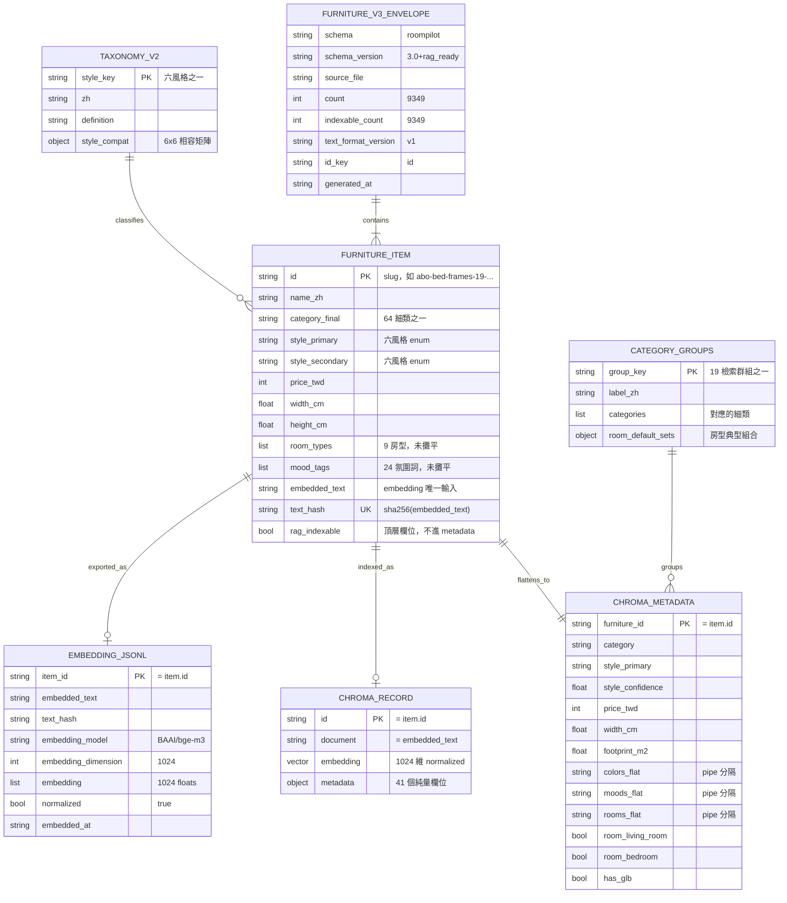

# 指令 (你是資料架構師)

以 DDD 聚合為基礎,輸出具體的**資料 schema 規格**。優先考量資料完整性、檢索效能與未來演進的彈性。

> **本專案沒有 RDBMS**(無 PostgreSQL / MySQL / SQLite 連線,無 ORM,無 SQL DDL)。
> 資料載體只有三種,本文件的「schema」一律指這三者:
>
> | 載體 | 位置 | 角色 |
> | :--- | :--- | :--- |
> | **資料集 JSON** | `rag_dataset/furniture_enriched_v3.json` | 事實來源(9,349 筆,`schema_version = 3.0+rag_ready`) |
> | **向量索引** | `chroma_db/` collection **`furniture_v3`** | 檢索用(cosine、bge-m3 1024 維、metadata 41 欄) |
> | **交付檔** | `rag_export/` 四個檔案 | 交給 SQL 端匯入(規格見 `json_adjustment/i_need_rag.md`) |
>
> SQL 端(下游合作方)確實有 PostgreSQL,但**建表、匯入、索引都由對方負責**;
> RAG 端只負責交出符合規格的 jsonl 與 metadata,本文件不撰寫任何 SQL DDL。

## 交付結構

### 1. 邏輯模型對應

說明 DDD 聚合/實體如何映射至資料載體。

```markdown
## 聚合 → 資料載體映射

### 家具聚合 (Furniture Aggregate)
- **聚合根**: Furniture → `furniture_enriched_v3.json` 的 `items[]` 一筆(以 `id` 識別)
- **成員實體**: ChromaRecord → collection `furniture_v3` 的一筆(id / document / embedding / metadata)
- **值對象**: Style(六風格 + style_card)、Dimension(width/depth/height)、Price(price_twd + price_is_estimated)
  → 攤平為 `chroma_metadata` 的純量欄位

### 詞彙聚合 (Taxonomy Aggregate)
- **聚合根**: Taxonomy → `vlm_annotation/taxonomy_v2.json`(六風格詞表 + 6×6 `style_compat` 矩陣)
- **成員實體**: CategoryGroup → `rag_pipeline/category_groups.json`(64 細類 → 19 檢索群組 + 房型典型組合)

**設計決策**:
- Furniture 與 ChromaRecord 在同一次寫入邊界內(`embed_v3.py` 一次算向量、同時寫 Chroma 與 jsonl),
  保證兩邊是同一批向量、同一個 `text_hash`
- Price 值對象以 `price_twd` (int) + `price_is_estimated` (bool) 兩欄位存儲,不用字串
- Style 以受控 enum 字串存儲(`style_primary` / `style_secondary` ∈ 六風格),相容度不落地、
  查詢時才由 `taxonomy_v2.json` 的 `style_compat` 矩陣算出
- **Chroma metadata 只接受 `str` / `int` / `float` / `bool`**,所有 list 欄位必須攤平
  (見 3.3;`build_rag_v3.py:238` 的 `build_chroma_metadata()` 是唯一產生點)
```

### 2. 實體關係圖 (ERD)

使用 Mermaid 語法描述資料載體關聯。**沒有外鍵約束**(JSON / Chroma 都不提供),
關聯全靠 `id` 一致性與 `text_hash` 指紋維持,因此驗證必須在 `embed_v3.py` 與交付前人工執行。



### 3. 資料結構定義 (Schema)

以 Python 3.11 型別註記 + JSON 範例描述每個載體的欄位與限制(取代 SQL `CREATE TABLE`)。
所有驗證腳本一律以 `.venv-rag/bin/python` 執行。

#### 3.1 資料集信封 (`rag_dataset/furniture_enriched_v3.json` 頂層)

```python
from typing import TypedDict, Literal

class FurnitureV3Envelope(TypedDict):
    """v3 頂層信封。欄位皆為必填，缺一即視為資料集損毀。"""
    schema: Literal["roompilot"]
    schema_version: Literal["3.0+rag_ready"]      # 版本演進見第 6 節
    source_schema_version: str                    # v2 的完整版本字串（回溯用）
    source_file: str                              # "rag_dataset/furniture_enriched_v2.json"
    source_catalog: Literal["merged_furniture"]
    dataset_name: str
    count: int                                    # 9349
    source_item_count: int                        # 9350（v2 筆數）
    indexable_count: int                          # 9349
    excluded_items: list[dict]                    # 被排除者的 id / name_zh / category / reason
    taxonomy_version: str
    text_format_version: Literal["v1"]            # embedded_text 組法版本
    text_fields: list[str]                        # 15 個參與 embedded_text 的欄位名
    embedding_target: dict                        # model / dimension / distance_metric / normalized
    id_key: Literal["id"]
    generated_at: str                             # ISO8601 +08:00
    notes: list[str]
    items: list[dict]                             # 見 3.2
```

**約束（等同 CHECK 條件，由 `build_rag_v3.py` 保證、交付前需複驗）**:

| 約束 | 內容 |
| :--- | :--- |
| 筆數一致 | `count == len(items) == indexable_count == 9349` |
| 排除紀錄完整 | `source_item_count - count == len(excluded_items)`(目前 1 筆,`is_active=False`) |
| id 唯一 | `len({i["id"] for i in items}) == count` |
| 版本鎖定 | `embedding_target == {"embedding_model": "BAAI/bge-m3", "embedding_dimension": 1024, "distance_metric": "cosine", "normalized": True}` |

```bash
# 驗證信封
.venv-rag/bin/python - <<'PY'
import json
d = json.load(open("rag_dataset/furniture_enriched_v3.json", encoding="utf-8"))
assert d["schema_version"] == "3.0+rag_ready"
assert d["count"] == len(d["items"]) == 9349
assert len({i["id"] for i in d["items"]}) == d["count"], "id 不唯一"
assert d["source_item_count"] - d["count"] == len(d["excluded_items"])
print("信封 OK：", d["generated_at"])
PY
```

#### 3.2 `furniture_enriched_v3.json` → `items[]` 欄位字典（聚合根）

每筆 45–53 個欄位(多數為 49 個;差異來自 v2 標註的選填欄位)。
分三層:**v2 繼承欄位**(原封不動保留)、**v2 風格層**、**v3 衍生欄位**。

**A. v2 繼承 — 基本屬性**

| 欄位 | 型別 | 必填 | 說明 / 約束 |
| :--- | :--- | :--- | :--- |
| `id` | `str` | ✅ | 主鍵,slug 形式(`abo-…` / `jp-…`),全庫唯一 |
| `name_en` | `str` | ✅ | 原始英文品名 |
| `name_zh` | `str` | ✅ | 中文品名,UI 卡片標題 |
| `canonical_category_zh` | `str` | ✅ | 原始細類(64 類之一) |
| `color` / `colors` | `str` / `list[str]` | ✅ | 單值 + 多值並存;**只進 `semantic_query`,不做過濾** |
| `material` / `materials` | `str` / `list[str]` | ✅ | 同上 |
| `width_cm` / `depth_cm` / `height_cm` | `float` | ✅ | 公分;**硬過濾條件**,`>= 0` |
| `glb_url` / `object_key` | `str` | ✅ | CloudFront 3D 模型位置 |
| `product_url` | `str` | ⭕ | 商品頁,UI 卡片外連 |
| `room_types` | `list[str]` | ✅ | 9 房型子集;**硬過濾**(攤平後見 3.3) |
| `role` | `Literal["anchor","accent"]` | ✅ | 主件 / 配件;**硬過濾** |
| `visual_weight` / `height_zone` / `size_class` | `str` | ✅ | `size_class ∈ {S,M,L}`;**硬過濾** |
| `price_twd` | `int` | ✅ | 台幣整數,`>= 0`;**硬過濾** |
| `price_is_estimated` | `bool` | ✅ | 是否為估價 |
| `consistency_flag` / `consistency_severity` / `suggested_category` | `str` | ⭕ | 名稱與類別矛盾的標記(865 筆) |

**B. v2 風格層 — VLM 標註與六風格判定**

| 欄位 | 型別 | 必填 | 說明 / 約束 |
| :--- | :--- | :--- | :--- |
| `style_primary` / `style_secondary` | `str` | ✅ | **六風格 enum**:`scandinavian` / `japanese` / `modern_minimal` / `cream` / `industrial` / `american`;**軟加權,不硬過濾** |
| `style_card_id` / `style_card` | `str` | ✅ | 18 張色卡之一(如 `american_1` / 「鄉村溫馨」) |
| `style_palette_hex` | `list[str]` | ✅ | 色卡三色 hex |
| `style_confidence` | `float` | ✅ | `0.0–1.0` |
| `style_reason` / `style_source` | `str` | ✅ | 判定理由與來源(`text_reclassify_v2` 等) |
| `style_primary_v1` / `style_secondary_v1` | `str` | ✅ | 舊 12 風格,保留供回溯比對 |
| `mood_tags` | `list[str]` | ✅ | 24 個氛圍詞的子集;**軟加權** |
| `pattern` | `str` | ✅ | `素色` / `木紋` / `幾何` / `花紋` |
| `shape_tags` | `list[str]` | ✅ | 造型詞 |
| `description` / `features` / `search_keywords` / `rag_text` | `str` / `list[str]` | ✅ | VLM 產出的敘述層,構成 `embedded_text` |
| `object_type_zh` | `str` | ✅ | 物件類型短語 |
| `confidence` | `float` | ✅ | 標註信心 `0.0–1.0`,占最終分 10% |
| `desc_source` / `rag_text_source` | `str` | ✅ | 敘述來源(`glb_render` / `original` 等) |

**C. v3 衍生欄位（`build_rag_v3.py` 新增，v2 既有欄位原封不動）**

| 欄位 | 型別 | 必填 | 說明 / 約束 |
| :--- | :--- | :--- | :--- |
| `category_final` | `str` | ✅ | 解衝突後的最終類別;865 筆改用 `suggested_category` |
| `category_conflict` | `bool` | ✅ | 是否曾發生 `name_category_conflict` |
| `embedded_text` | `str` | ✅ | **embedding 的唯一輸入來源**;中位 326 字,`MAX_SEQ_LEN=512` 足夠 |
| `text_hash` | `str` | ✅ | `sha256(embedded_text)` 64 字元十六進位;增量重算的判斷依據 |
| `text_format_version` | `Literal["v1"]` | ✅ | 組法版本,改組法必須進版 |
| `rag_indexable` | `bool` | ✅ | ⚠️ **頂層欄位,不在 `chroma_metadata` 內** — 寫進 Chroma `where` 會命中 0 筆 |
| `chroma_metadata` | `dict` | ✅ | 41 個純量欄位,見 3.3 |

```python
# embedded_text 的組法（build_rag_v3.py:203 build_embedded_text）
# 名稱：… 。類別：… 。物件類型：… 。顏色：… 。材質：… 。適用空間：… 。
# 風格：美式(american)、工業風(industrial)。色卡：… 。氛圍：… 。表面圖樣：… 。
# 造型：… 。描述：… 。特徵：… 。關鍵字：…
#
# 鐵律：query_parser 產出的 semantic_query 必須寫成「同一句式」，
#       HyDE 才有效；改句式 = text_format_version 進版 = 全量重建索引。
import hashlib
text_hash = hashlib.sha256(embedded_text.encode("utf-8")).hexdigest()
assert len(text_hash) == 64
```

#### 3.3 `chroma_metadata` — 41 個純量欄位（本文件最關鍵的一節）

> **鐵律:Chroma metadata 只接受 `str` / `int` / `float` / `bool` 四種純量。**
> `list` / `dict` / `None` 一律不被接受 —— 寫入時直接拋錯,或(舊版)靜默丟欄位。
> 因此所有多值欄位必須**攤平**,所有可空欄位必須有**非 None 預設值**。

**攤平規則（`build_rag_v3.py:238`）**

| 來源(list) | 攤平後欄位 | 型別 | 規則 |
| :--- | :--- | :--- | :--- |
| `colors` | `colors_flat` | `str` | `"\|".join(colors)`,如 `"木色"`、`"米白\|木色"` |
| `materials` | `materials_flat` | `str` | 同上 |
| `mood_tags` | `moods_flat` | `str` | 同上,如 `"溫馨\|質樸\|自然"` |
| `room_types` | `rooms_flat` | `str` | 同上,如 `"bedroom\|living_room"` |
| `colors[0]` | `color_main` | `str` | 空 list → `""`,**不可為 None** |
| `materials[0]` | `material_main` | `str` | 同上 |
| `room_types` | `room_*` × 9 | `bool` | 房型是硬過濾條件,另外攤成 9 個布林欄位 |

> **為何氛圍不開布林欄位?** 氛圍走語意比對與軟加權,若比照房型會多出 24 個欄位;
> 需要後過濾時以 `moods_flat` 字串比對即可(`mood_score()` 的作法)。

**A. 識別與分類（5 欄）**

| 欄位 | 型別 | 預設 | 說明 |
| :--- | :--- | :--- | :--- |
| `furniture_id` | `str` | — | `= item["id"]`;⚠️ metadata 內叫 `furniture_id`,交付 jsonl 內叫 `item_id`,Chroma 的 `ids` 用 `item["id"]` —— 三個名字同一個值 |
| `name_zh` | `str` | `""` | 卡片標題 |
| `category` | `str` | — | `= category_final`;**硬過濾**,以 `$in` 吃 19 群組展開後的細類清單 |
| `category_original` | `str` | `""` | `= canonical_category_zh`,回溯用 |
| `category_conflict` | `bool` | `False` | 是否曾發生類別衝突 |

**B. 風格（6 欄，全部軟加權，不進 `where`）**

| 欄位 | 型別 | 預設 | 說明 |
| :--- | :--- | :--- | :--- |
| `style_primary` | `str` | `""` | 六風格 enum;括號註記已剝除(`"american(美式)"` → `"american"`) |
| `style_secondary` | `str` | `""` | 同上,加權時乘 0.6 |
| `style_card_id` | `str` | `""` | 18 色卡之一 |
| `style_card` | `str` | `""` | 色卡中文名 |
| `style_primary_v1` | `str` | `""` | 舊 12 風格,回溯比對 |
| `style_confidence` | `float` | `0.0` | `0.0–1.0` |

**C. 型態與尺寸（10 欄，全部硬過濾）**

| 欄位 | 型別 | 預設 | 說明 |
| :--- | :--- | :--- | :--- |
| `pattern` | `str` | `""` | 已正規化為 4 值之一 |
| `role` | `str` | `""` | `anchor` / `accent` |
| `size_class` | `str` | `""` | `S` / `M` / `L` |
| `visual_weight` | `str` | `""` | 視覺量體 |
| `height_zone` | `str` | `""` | 高度分區 |
| `width_cm` / `depth_cm` / `height_cm` | `float` | `0.0` | **必須 `float()` 強轉**,int 會導致 `$lte` 比較型別不一致 |
| `max_dim_cm` | `float` | `0.0` | `max(w, d, h)`,單邊尺寸限制用 |
| `footprint_m2` | `float` | `0.0` | `round(w * d / 10000, 4)`,佔地面積 |

**D. 價格與多值攤平（8 欄）**

| 欄位 | 型別 | 預設 | 說明 |
| :--- | :--- | :--- | :--- |
| `price_twd` | `int` | `0` | **必須 `int()` 強轉**;硬過濾 `$gte` / `$lte` |
| `price_is_estimated` | `bool` | `False` | 估價旗標 |
| `color_main` / `material_main` | `str` | `""` | 主色 / 主材質 |
| `colors_flat` / `materials_flat` / `moods_flat` / `rooms_flat` | `str` | `""` | pipe 分隔字串 |

**E. 其他（3 欄）**

| 欄位 | 型別 | 預設 | 說明 |
| :--- | :--- | :--- | :--- |
| `has_glb` | `bool` | `False` | `bool(glb_url)` |
| `duplicate_group` | `str` | `""` | ⚠️ 來源可能為 `None`,**必須 `or ""`** —— 直接寫 None 會被 Chroma 拒絕 |
| `confidence` | `float` | `0.0` | 標註信心,占最終分 10% |

**F. 房型布林（9 欄，硬過濾主力）**

```python
# 9 個房型布林欄位，順序即 query_parser 的 ROOM_TYPES enum
ROOM_FLAGS = [
    "room_living_room",   # 客廳
    "room_bedroom",       # 臥室
    "room_dining_room",   # 餐廳
    "room_study",         # 書房
    "room_entryway",      # 玄關
    "room_kids_room",     # 兒童房
    "room_outdoor",       # 戶外
    "room_bathroom",      # 衛浴
    "room_kitchen",       # 廚房
]
# 每筆家具 9 個欄位皆為 bool，不得缺欄、不得為 None
# where 用法： {"room_bedroom": {"$eq": True}}
```

**型別驗證（交付前必跑）**

```bash
.venv-rag/bin/python - <<'PY'
import json, collections
SCALAR = (str, int, float, bool)
ROOMS = ["living_room","bedroom","dining_room","study","entryway",
         "kids_room","outdoor","bathroom","kitchen"]
d = json.load(open("rag_dataset/furniture_enriched_v3.json", encoding="utf-8"))
keysets = collections.Counter(tuple(sorted(i["chroma_metadata"])) for i in d["items"])
assert len(keysets) == 1, f"metadata 欄位集不一致：{len(keysets)} 種"
keys = next(iter(keysets))
assert len(keys) == 41, f"欄位數應為 41，實際 {len(keys)}"
for i in d["items"]:
    m = i["chroma_metadata"]
    for k, v in m.items():
        assert isinstance(v, SCALAR), f"{i['id']}.{k} 型別 {type(v).__name__} 不被 Chroma 接受"
        assert v is not None, f"{i['id']}.{k} 為 None"
    assert m["furniture_id"] == i["id"]
    for r in ROOMS:
        assert isinstance(m[f"room_{r}"], bool)
    assert isinstance(m["price_twd"], int) and not isinstance(m["price_twd"], bool)
    assert isinstance(m["width_cm"], float)
print("41 欄位 × 9,349 筆型別驗證通過")
PY
```

#### 3.4 ChromaDB collection `furniture_v3`（向量索引）

```python
# rag_pipeline/embed_v3.py：建立 collection 的完整參數
import chromadb

COLLECTION = "furniture_v3"
MODEL_NAME = "BAAI/bge-m3"

client = chromadb.PersistentClient(path="chroma_db")          # 本機持久化目錄
try:
    client.delete_collection(COLLECTION)                       # 重建 = 先刪再建
except Exception:
    pass                                                       # 首次執行時不存在，忽略

coll = client.create_collection(
    COLLECTION,
    metadata={
        "hnsw:space": "cosine",          # 距離度量；bge-m3 已 normalize，cosine 為正解
        "embedding_model": MODEL_NAME,   # 索引層級的來源標記
        "source": "3.0+rag_ready",       # = v3 的 schema_version
    },
)

# 寫入：每批 1000 筆，四個平行陣列長度必須相同
coll.add(
    ids=[i["id"] for i in batch],                       # 主鍵，全庫唯一
    embeddings=[[float(x) for x in v] for v in vecs],   # 1024 維 float，normalized
    documents=[i["embedded_text"] for i in batch],      # 原文，rerank 階段的輸入
    metadatas=[i["chroma_metadata"] for i in batch],    # 41 個純量欄位（見 3.3）
)
```

**Collection 契約**

| 項目 | 值 | 驗證方式 |
| :--- | :--- | :--- |
| collection 名稱 | `furniture_v3` | `client.get_collection("furniture_v3")` |
| 筆數 | 9,349 | `coll.count() == 9349` |
| 向量維度 | 1024 | `len(coll.get(limit=1, include=["embeddings"])["embeddings"][0]) == 1024` |
| 距離度量 | cosine | `coll.metadata["hnsw:space"] == "cosine"` |
| document | `= embedded_text` | 與 v3 逐筆比對 |
| metadata 欄位數 | 41 | 見 3.3 驗證腳本 |
| **重建行為** | `delete` + `create` → **collection UUID 會變** | UI 端以 `NotFoundError` 攔截後清 `lru_cache` 重連 |

> ⚠️ **`rag_indexable` 不在 metadata 裡**(它是 v3 頂層欄位)。
> 寫進 `where` 會命中 0 筆;而且 collection 本來就只收 `rag_indexable=True` 的 9,349 筆,
> 完全不需要這個條件。

```bash
# collection 健檢
.venv-rag/bin/python - <<'PY'
import chromadb
coll = chromadb.PersistentClient(path="chroma_db").get_collection("furniture_v3")
print("count:", coll.count())                       # 期望 9349
print("space:", coll.metadata.get("hnsw:space"))    # 期望 cosine
one = coll.get(limit=1, include=["metadatas", "documents", "embeddings"])
print("dim:", len(one["embeddings"][0]))            # 期望 1024
print("meta 欄位數:", len(one["metadatas"][0]))      # 期望 41
PY
```

#### 3.5 `rag_export/` 交付檔 schema（交給 SQL 端）

規格出處:`json_adjustment/i_need_rag.md`(現行)、`json_adjustment/RAGSQL.md`(舊版,ID 欄位叫 `furniture_id`)。
`embed_v3.py` 一次算向量、同時寫 Chroma 與這四個檔,保證兩邊同批同 hash。

**① `furniture_embeddings_bge_m3.jsonl` — 主交付檔（一行一件家具）**

| 欄位 | 型別 | 必要性 | 約束 |
| :--- | :--- | :--- | :--- |
| `item_id` | `str` | ✅ 必要 | 對應官方家具 JSON 的 `id`;9,349 筆不得重複 |
| `embedded_text` | `str` | ✅ 必要 | 必須與 v3 的 `embedded_text` **完全一致** |
| `text_hash` | `str` | ✅ 必要 | `sha256(embedded_text)`,64 字元 |
| `embedding_model` | `str` | ✅ 必要 | 固定 `"BAAI/bge-m3"` |
| `embedding_dimension` | `int` | ✅ 必要 | 固定 `1024` |
| `embedding` | `list[float]` | ✅ 必要 | 1024 個有限浮點數;**不得含 NaN / Infinity / null / 字串**;已 normalized;寫出時 `round(x, 6)` |
| `embedded_at` | `str` | ⭕ 建議 | ISO8601 `+08:00` |
| `text_format_version` | `str` | ⭕ 建議 | `"v1"` |
| `source_schema_version` | `str` | ⭕ 建議 | `"3.0+rag_ready"` |
| `normalized` | `bool` | ⭕ 建議 | 固定 `true` |

```json
{"item_id":"abo-bed-frames-19-amazon-brand-rivet-a8910-dresser","embedded_text":"名稱：Rivet Fisher 鄉村木質床架平臺，帶床頭板。類別：床。…","text_hash":"b4ecf0a12cadbf7be7a6ebcbe11e6fa0d5bb01ddadff2c0ce3a8fd8a506a1eea","embedding_model":"BAAI/bge-m3","embedding_dimension":1024,"embedding":[0.012431,-0.036142,0.008755],"embedded_at":"2026-07-28T02:17:09+08:00","text_format_version":"v1","source_schema_version":"3.0+rag_ready","normalized":true}
```

> ⚠️ **ID 欄位名的三重身分**:v3 內是 `id`、Chroma metadata 內是 `furniture_id`、
> 交付 jsonl 內是 `item_id`(舊規格 `RAGSQL.md` 用 `furniture_id`)。
> `embed_v3.py` 在增量模式讀舊檔時會把 `furniture_id` 正規化成 `item_id`,
> **否則舊欄位名會殘留在新交付檔裡**。

**② `embedding_metadata.json` — 批次詮釋資料（單一 JSON 物件）**

| 欄位 | 型別 | 說明 |
| :--- | :--- | :--- |
| `dataset_name` | `str` | 資料集全名 |
| `source_file` | `str` | `"rag_dataset/furniture_enriched_v3.json"` |
| `source_schema_version` | `str` | `"3.0+rag_ready"` |
| `source_item_count` / `embedded_count` | `int` | 9349 / 9349 |
| `reused_vector_count` | `int` | 增量模式沿用的舊向量筆數 |
| `failed_count` | `int` | 期望 `0` |
| `embedding_model` / `embedding_dimension` / `distance_metric` / `normalized` | — | `BAAI/bge-m3` / `1024` / `cosine` / `true` |
| `text_format_version` / `text_fields` | `str` / `list[str]` | `v1` / 15 個參與欄位 |
| `id_key` | `str` | `"item_id"` |
| `encode_seconds` / `device` / `generated_at` | `float` / `str` / `str` | 效能與環境紀錄(`device` = `mps` 或 `cpu`) |

**③ `embedding_failures.jsonl` — 失敗清單（可為空檔）**

| `error_type` | 觸發條件 | 附帶欄位 |
| :--- | :--- | :--- |
| `model_error` | 整批 `model.encode()` 拋錯 | `error_message` |
| `invalid_dimension` | 向量維度 ≠ 1024 | `expected_dimension` / `actual_dimension` |
| `empty_embedded_text` | `embedded_text` 為空白 | `error_message` |
| `not_indexable` | `rag_indexable=False` | `error_message`(v3 已預先排除,故現況為空) |

**④ `embedding_validation_report.json` — 驗收報告（交付前必附）**

| 欄位 | 期望值 |
| :--- | :--- |
| `total_source_items` / `total_embedding_records` | 9349 / 9349 |
| `unique_furniture_ids` | 9349 |
| `duplicate_furniture_ids` / `missing_furniture_ids` | 0 / 0 |
| `invalid_vector_count` / `null_vector_count` | 0 / 0 |
| `dimension_distribution` | `{"1024": 9349}` |
| `model_distribution` | `{"BAAI/bge-m3": 9349}` |
| `coverage_percent` | `100.0` |

```bash
# 交付前驗收（對照 i_need_rag.md 的清單）
.venv-rag/bin/python - <<'PY'
import json, math
rows = [json.loads(l) for l in open("rag_export/furniture_embeddings_bge_m3.jsonl", encoding="utf-8")]
assert len(rows) == 9349, len(rows)
assert len({r["item_id"] for r in rows}) == 9349, "item_id 不唯一"
assert all("furniture_id" not in r for r in rows), "舊欄位名 furniture_id 殘留"
for r in rows:
    assert r["embedding_model"] == "BAAI/bge-m3"
    assert r["embedding_dimension"] == 1024 and len(r["embedding"]) == 1024
    assert all(isinstance(x, float) and math.isfinite(x) for x in r["embedding"])
    assert abs(sum(x * x for x in r["embedding"]) ** 0.5 - 1.0) < 1e-2, "未正規化"
print("交付檔驗收通過：9,349 筆 / 1024 維 / normalized")
PY
```

### 4. 索引與過濾策略

Chroma 只有一種索引:**HNSW 向量索引(cosine)**,metadata 端沒有可自訂的 B-Tree / GIN。
因此「索引策略」在本專案 = **硬過濾條件的選擇與組合方式**,取捨在於「濾太緊 → 命中 0 筆」。

#### 4.1 查詢場景分析

```markdown
| 查詢場景 | 頻率 | 過濾策略 | 權衡說明 |
|---------|------|----------|----------|
| 房型 + 類別群組（「客廳沙發」） | 極高 | `$and` [room_* 布林, category `$in`] | 房型布林是最便宜的收斂，優先放 |
| 房型 + 類別 + 預算（「兩萬內」） | 極高 | 再疊 price_twd `$lte` | 預算乘 BUDGET_SLACK=1.3 放寬，總價約束留到組合階段 |
| 純風格需求（「日式侘寂感」） | 高 | **不進 where**，走 style_compat 軟加權 | 硬過濾單一風格疊房型後常剩個位數，故走加權 |
| 尺寸受限（「寬度 180 以內」） | 中 | width_cm / height_cm `$lte` | **硬過濾，LLM 不得用常識推測** —— 猜錯直接濾掉正確結果 |
| 主件 / 配件（anchor / accent） | 中 | role `$eq` + size_class `$eq` | 配件另用 RERANK_TOP_K_LIGHT=12 降延遲 |
| 顏色 / 材質（「奶油白布沙發」） | 高 | **完全不過濾**，只進 semantic_query | 顏色詞彙開放且主觀，過濾必誤殺 |
| 語意檢索（無任何硬條件） | 中 | `where=None` → 全庫 9,349 筆向量檢索 | VEC_TOP_K=50 已足夠，reranker 再收斂 |
```

#### 4.2 複合條件 vs 單一條件

```python
# ✅ 好的複合條件設計（rag_pipeline/retriever.py:build_where）
clauses = []
if room:                       # 1. 房型布林 —— 最便宜、收斂最快
    clauses.append({f"room_{room}": {"$eq": True}})
if group in data["groups"]:    # 2. 類別群組展開成細類清單
    clauses.append({"category": {"$in": data["groups"][group]["categories"]}})
if hi:                         # 3. 預算上限
    clauses.append({"price_twd": {"$lte": hi}})

where = None if not clauses else (clauses[0] if len(clauses) == 1 else {"$and": clauses})
# 支援以下查詢：
# 1. 只有房型              → {"room_bedroom": {"$eq": True}}
# 2. 房型 + 類別 + 預算    → {"$and": [ ..., ..., ... ]}
# 3. 完全沒有硬條件        → where=None，全庫語意檢索

# ❌ 不好的設計（過度收斂）
where = {"$and": [
    {"room_bedroom": {"$eq": True}},
    {"category": {"$in": ["沙發"]}},
    {"style_primary": {"$eq": "japanese"}},   # ❌ 風格是軟加權，不該進 where
    {"colors_flat": {"$eq": "奶油白"}},        # ❌ 顏色只進 semantic_query
    {"rag_indexable": {"$eq": True}},          # ❌ 頂層欄位不在 metadata → 命中 0 筆
]}
# 結果：命中 0 筆，使用者看到空白卡片區卻沒有任何錯誤訊息
```

#### 4.3 局部收斂（相當於 Partial Index）

```python
# ✅ 只在使用者「明講」時才加條件 —— 沒講的一律不濾
if item.get("max_width_cm"):                      # LLM 未給值時為 None，不加條件
    clauses.append({"width_cm": {"$lte": float(item["max_width_cm"])}})
if item.get("size_hint"):                         # S/M/L，只在明確暗示尺碼時使用
    clauses.append({"size_class": {"$eq": item["size_hint"]}})

# ✅ 相對價格詞（便宜/高級）換算成該類別群組的實際分位數，而非硬塞絕對值
stats = data["prices"].get(group)                 # {"median":…, "p33":…, "p67":…}
if level == "budget":
    clauses.append({"price_twd": {"$lte": int(stats["p33"])}})
elif level == "premium":
    clauses.append({"price_twd": {"$gte": int(stats["p67"])}})

# ✅ 索引本身即為「部分索引」：collection 只收 rag_indexable=True 的 9,349 筆，
#    被排除者（is_active=False）不進索引，因此查詢端完全不需要這個條件
```

#### 4.4 索引維護

```bash
PY=.venv-rag/bin/python

# 全量重建（約 27 分鐘）—— text_format_version 或模型變更時
$PY rag_pipeline/embed_v3.py

# 增量重建（text_hash 比對，646 筆約 1.5 分鐘）—— 只有部分品項文字變動時
$PY rag_pipeline/embed_v3.py --only-changed

# 冒煙測試（50 筆）—— 改動 embed 流程後先驗證，不要直接跑全量
$PY rag_pipeline/embed_v3.py --limit 50

# MPS 出問題時退回 CPU
$PY rag_pipeline/embed_v3.py --device cpu

# 只出交付檔、不動 Chroma（SQL 端要重拿檔案時）
$PY rag_pipeline/embed_v3.py --skip-chroma
```

```python
# 索引使用情況檢查（取代 pg_stat_user_indexes）
# 1. 筆數與維度是否正常
# 2. 哪些硬過濾條件把結果濾到 0 —— 這是本專案最常見的「索引失效」
from collections import Counter
probe = {
    "客廳沙發":       {"$and": [{"room_living_room": {"$eq": True}}, {"category": {"$in": ["沙發"]}}]},
    "臥室兩萬內床":   {"$and": [{"room_bedroom": {"$eq": True}}, {"price_twd": {"$lte": 20000}}]},
    "戶外配件":       {"$and": [{"room_outdoor": {"$eq": True}}, {"role": {"$eq": "accent"}}]},
}
for label, where in probe.items():
    n = len(coll.get(where=where, limit=10_000)["ids"])
    print(f"{label:12s} 命中 {n:5d} 筆" + ("   ⚠️ 過度收斂" if n < 8 else ""))
```

### 5. 查詢模式與優化

列出關鍵查詢的 Python 範例,並說明 schema 如何支援其效能。

#### 5.1 兩階段檢索（硬過濾 → 向量召回）

```python
# 查詢：「日式侘寂感、預算兩萬內的客廳沙發」
qvec = embedder.encode([item["semantic_query"]], normalize_embeddings=True)[0].tolist()

hits = coll.query(
    query_embeddings=[qvec],
    n_results=VEC_TOP_K,                 # 50：夠 reranker 挑，又不拖慢
    where={"$and": [
        {"room_living_room": {"$eq": True}},          # 房型布林
        {"category": {"$in": ["沙發", "雙人沙發", "L型沙發"]}},   # 群組展開的細類
        {"price_twd": {"$lte": 26000}},               # 20000 × BUDGET_SLACK 1.3
    ]},
    include=["metadatas", "documents", "distances"],
)

# 優化說明：
# 1. metadata 過濾在向量搜尋「之前」完成，候選集大幅縮小
# 2. 風格（japanese）刻意不入 where —— 留到加權階段，避免命中 0 筆
# 3. include 只取需要的三項，不取 embeddings（1024 維 × 50 筆的傳輸浪費）
```

**執行成本分析**:
```text
# 實測（Apple Silicon / MPS，bge-m3 + bge-reranker-v2-m3 常駐約 4.6 GB）
Haiku 需求解析      ≈ 1–2 s    （structured outputs + prompt caching，每次約 US$0.005）
bge-m3 query 編碼   ≈ 0.05 s
Chroma where+向量   ≈ 0.02 s   （9,349 筆規模，HNSW cosine）
cross-encoder rerank ≈ 10 s / 50 筆  ← 延遲主因，故 RERANK_TOP_K=20、配件 12
加權 + 去重收斂     ≈ 0.01 s
```

#### 5.2 卡片完整資料（等同 JOIN 回聚合根）

```python
# Chroma 只回 41 個 metadata 欄位；卡片需要的 description / features / glb_url
# 不在 metadata 內，要回 v3 資料集取（記憶體字典，等同 PK JOIN）
data = load_data()                        # lru_cache(maxsize=1)，UI 重複查詢不重載
items_by_id = data["items"]               # {id: 完整 item dict}

cards = []
for fid, meta, doc in zip(hits["ids"][0], hits["metadatas"][0], hits["documents"][0]):
    full = items_by_id[fid]               # O(1) 查表，等同用 PK JOIN
    cards.append({
        "id": fid,
        "name_zh": meta["name_zh"],       # 熱欄位走 metadata，免查表
        "price_twd": meta["price_twd"],
        "style_card": meta["style_card"],
        "description": full["description"],       # 冷欄位回 v3 取
        "features": full["features"],
        "product_url": full.get("product_url"),
    })

# 優化說明：
# 1. metadata 只放「過濾 + 卡片摘要」需要的欄位，冷資料不進索引（縮小索引體積）
# 2. items_by_id 一次建好常駐記憶體，避免每張卡片重讀 JSON（等同避免 N+1）
# 3. 因此 metadata 的 41 欄不是「越多越好」—— 新增欄位前先問是否用於 where 或卡片
```

#### 5.3 語意檢索 + 加權排序（取代全文檢索）

```python
# 沒有 GIN 全文索引；「模糊搜尋」由 bge-m3 向量 + cross-encoder 承擔
pairs = [(query, doc) for doc in docs[:RERANK_TOP_K]]
rerank_scores = reranker.predict(pairs)   # bge-reranker-v2-m3 已內建 sigmoid，輸出即 0–1

final = (
    0.60 * rerank                          # 語意相關性（主力）
    + 0.20 * style_compat[dominant][meta["style_primary"]]   # 6×6 相容矩陣
    + 0.10 * mood_hit_rate                 # moods_flat 命中率
    + 0.10 * meta["confidence"]            # 標註信心
)
results = sorted(scored, key=lambda r: r["final"], reverse=True)[:FINAL_TOP_K]   # 8

# 優化說明：
# 1. rerank 分數不可再套 sigmoid —— CrossEncoder 已輸出 0–1，再套會壓縮鑑別度
# 2. style_compat 不落地成欄位，查詢時才由 taxonomy_v2.json 算 —— 改矩陣不用重建索引
# 3. mood 命中率吃 moods_flat 字串（"溫馨|質樸|自然"），這是不開 24 個布林欄位的代價與理由
# 4. FINAL_TOP_K=8 限制輸出量，控制 UI 卡片渲染與 base64 縮圖成本
```

### 6. 資料演進計畫

描述 schema 變更 (如新增欄位、修改型別) 的遷移策略。
本專案不用 migration 框架,改以**世代檔案 + 建置腳本 + `text_hash` 增量**達成同樣效果。

#### 6.1 世代檔案管理（取代 Flyway/Liquibase）

```markdown
目錄結構（每個世代都是完整檔案，不是差異腳本；舊世代永久保留供回溯）:
```
rag_dataset/
├── furniture_enriched_v1.json     # 原始合併目錄（ABO + IKEA）
├── furniture_enriched_v2.json     # + VLM 標註、六風格判定、色卡（source_schema_version 的來源）
└── furniture_enriched_v3.json     # + embedded_text / text_hash / category_final / chroma_metadata（現役）

json_adjustment/                   # 「遷移腳本」本體
├── build_official_catalog.py      # 目錄合併與正式化
├── build_taxonomy_v2.py           # v1 的 12 風格 → v2 的六風格詞表 + 6×6 相容矩陣
├── build_rag_v3.py                # v2 → v3 加工（唯一產生 chroma_metadata 的地方）
└── reclassify_styles.py           # 六風格重判（Ollama qwen3:8b / --provider anthropic）
```

**世代語意**

| 世代 | `schema_version` | 新增了什麼 | 為何需要進版 |
| :--- | :--- | :--- | :--- |
| v1 | 原始合併 | `id` / 尺寸 / 價格 / `glb_url` / 12 風格 | 建立唯一主鍵與基本屬性 |
| v2 | `2.0+enriched…` | VLM 描述、`features`、`search_keywords`、六風格 + 色卡、`mood_tags` | 敘述層是 `embedded_text` 的原料 |
| v3 | `3.0+rag_ready` | `embedded_text` / `text_hash` / `text_format_version` / `category_final` / `rag_indexable` / `chroma_metadata` | 讓資料可直接餵 Chroma,且可用 hash 做增量 |

> **鐵律:v3 只新增衍生欄位,v2 既有欄位原封不動保留。**
> 這讓任何 v3 欄位都能回頭追到 v2 來源,也讓 `build_rag_v3.py` 可以重跑而不損失資料。

#### 6.2 遷移腳本範例

**`build_rag_v3.py`（v2 → v3，相當於 V3__add_rag_fields）**:
```bash
# 先 dry-run 看統計（不寫檔）——相當於 migration 的 plan 階段
python3 json_adjustment/build_rag_v3.py --dry-run
# 輸出重點：
#   category_final 改寫 : 865 筆（name_category_conflict → suggested_category）
#   rag_indexable=False : 1 筆（is_active=False，寫入 excluded_items）
#   text_hash 重複      : N 筆（文字完全相同的家具，屬正常）

# 確認統計無誤後才實際產生 v3
python3 json_adjustment/build_rag_v3.py
```

**`embed_v3.py --only-changed`（v3 → 索引，相當於增量 migration）**:
```bash
PY=.venv-rag/bin/python

# text_hash 比對：只重算文字變動的品項，其餘沿用舊向量
$PY rag_pipeline/embed_v3.py --only-changed
# 輸出：增量模式：9349 筆中 646 筆 text_hash 變動需重算，8703 筆沿用舊向量
#      → 約 1.5 分鐘（全量需 27 分鐘）
```

```python
# 增量的判斷邏輯（embed_v3.py:92）—— text_hash 就是這套機制的全部
changed = [i for i in items
           if reused.get(i["id"], {}).get("text_hash") != i["text_hash"]]

# 沿用舊列時必須把舊欄位名正規化，否則舊規格的 furniture_id 會殘留進新交付檔
if "furniture_id" in row:
    row = {("item_id" if k == "furniture_id" else k): v for k, v in row.items()}
```

#### 6.3 向後相容變更 vs 破壞性變更

**✅ 向後相容變更 (安全，不需全量重建索引)**:
- 新增 `chroma_metadata` 純量欄位(帶非 None 預設值)
- 新增 v3 頂層衍生欄位(不影響 `embedded_text`)
- 新增檢索群組 / 色卡 / 氛圍詞(只改 JSON 詞表)
- 放寬硬過濾條件(如把 `size_class` 從硬過濾改為軟提示)

```python
# ✅ 安全的新增 metadata 欄位（build_rag_v3.py:238 內）
meta["has_product_url"] = bool(item.get("product_url"))   # bool，有預設值

# ✅ 帶預設值、且來源可能為 None 時務必 or ""
meta["duplicate_group"] = item.get("duplicate_group") or ""   # 絕不可留 None
```

**❌ 破壞性變更 (需謹慎，必須全量重建 27 分鐘)**:
- 修改 `embedded_text` 組法(所有 `text_hash` 全變 → 增量失效)
- 更換 embedding 模型或維度(1024 → 其他)
- 修改欄位型別(`price_twd` 由 int 改 float,`$lte` 比較行為改變)
- 移除 `chroma_metadata` 欄位或改名(`retriever.build_where` 會靜默命中 0 筆)
- 更動六風格 key(`taxonomy_v2.json` 的 `style_compat` 與 `style_primary` 同時失配)

```python
# ❌ 危險：直接改 embedded_text 組法卻不進版
add("材質", "、".join(materials))        # 改了順序或標籤 → 9,349 筆 text_hash 全變

# ✅ 較安全的做法：先進版、標明棄用、保留舊欄位一個世代
new["text_format_version"] = "v2"        # 版本進版，讓下游能辨識
new["embedded_text_v1"] = old_text       # 舊文本保留一個世代供比對
# 交付檔的 text_format_version 同步變 v2，SQL 端才知道要重新匯入
```

#### 6.4 零中斷重建策略（取代 Zero-Downtime Migration）

`embed_v3.py` 的重建方式是 `delete_collection` + `create_collection`,
**新 collection 會拿到新的 UUID**;長時間執行的 Gradio UI 因 `lru_cache` 抓著舊 handle,
重建後第一次查詢會噴 `NotFoundError`。多階段作法如下:

**階段 1**: 先以冒煙測試驗證新流程,不動現役索引
```bash
.venv-rag/bin/python rag_pipeline/embed_v3.py --limit 50 --skip-chroma
```

**階段 2**: 應用程式端具備重連能力（相當於雙寫期的容錯）
```python
# rag_pipeline/retriever.py:query_collection —— 攔下 NotFoundError，清快取重取一次
from chromadb.errors import NotFoundError
try:
    return load_collection().query(**kwargs)
except NotFoundError:
    load_collection.cache_clear()
    load_data.cache_clear()        # 索引重建通常伴隨 v3 更新，價格分位數等一併重讀
    return load_collection().query(**kwargs)
```

**階段 3**: 資料重建（增量優先，全量為備援）
```bash
PY=.venv-rag/bin/python
$PY rag_pipeline/embed_v3.py --only-changed     # 1.5 分鐘
# 若 text_format_version 或模型有變，必須全量：
$PY rag_pipeline/embed_v3.py                    # 27 分鐘
```

**階段 4**: 驗證新索引後才對外展示
```bash
.venv-rag/bin/python - <<'PY'
import chromadb
coll = chromadb.PersistentClient(path="chroma_db").get_collection("furniture_v3")
assert coll.count() == 9349, coll.count()
print("索引就緒：", coll.count(), "筆")
PY
.venv-rag/bin/python rag_pipeline/retriever.py "日式侘寂感、預算兩萬內的客廳沙發"
```

**階段 5**: 交付檔同步更新，舊世代歸檔
```bash
# rag_export/ 四個檔已由同一次 embed_v3.py 產出，與 Chroma 保證同批同 hash
cat rag_export/embedding_validation_report.json     # coverage_percent 必須是 100.0
# 舊世代 JSON 保留於 rag_dataset/（v1/v2 供回溯），不刪除
```

## 蘇格拉底檢核

1. **正規化程度**:
   - `chroma_metadata` 的 41 欄是否都真的被 `where` 或卡片用到?沒用到的就是索引體積的浪費
   - 在什麼情境下會考慮冗餘? (如把 `name_zh` 同時放進 metadata 與 v3 —— 為了免查表)

2. **過濾取捨**:
   - 硬過濾是否過度收斂?(房型 + 類別 + 風格 + 顏色一起濾 → 命中 0 筆)
   - 該用布林欄位還是 pipe 分隔字串?(房型 9 個布林 vs 氛圍 24 個詞走 `moods_flat`)

3. **擴展性**:
   - 9,349 筆之後若擴到 10 萬筆,`VEC_TOP_K=50` 與 HNSW 參數是否仍夠?
   - 是否需要多 collection 切分?(如依房型或類別分索引)

4. **並發控制**:
   - 索引重建期間 UI 仍在查詢會怎樣?(`NotFoundError` 重連機制是否還在)
   - 全量重建 27 分鐘期間是否有可用的舊索引?(目前是先刪再建 —— 這段有空窗)

5. **資料完整性**:
   - `text_hash` 是否確實等於 `sha256(embedded_text)`?增量的正確性全靠它
   - metadata 是否有 `None` 或 `list` 漏網?(Chroma 只吃 str/int/float/bool)
   - Chroma 的筆數、交付 jsonl 的筆數、v3 的 `count` 三者是否都是 9,349?

## 輸出格式

- Schema 定義使用 Python 3.11 型別註記 + JSON 範例(**本專案無 SQL DDL**)
- ERD 使用 Mermaid 語法
- 驗證腳本一律以 `.venv-rag/bin/python` 執行
- 遵循 VibeCoding_Workflow_Templates/05_architecture_and_design_document.md 的資料架構章節

## 審查清單

- [ ] 所有資料載體有主鍵(`id` / `furniture_id` / `item_id` 為同一值,且全庫唯一)
- [ ] 三處筆數一致(v3 `count` = Chroma `count()` = 交付 jsonl 行數 = 9,349)
- [ ] `chroma_metadata` 只含 `str` / `int` / `float` / `bool`,無 `None`、無 `list`
- [ ] 所有 list 欄位已攤平(`colors_flat` / `materials_flat` / `moods_flat` / `rooms_flat`)
- [ ] 9 個 `room_*` 布林欄位齊全且皆為 `bool`
- [ ] `price_twd` 為 `int`、尺寸欄位為 `float`(型別不一致會讓 `$lte` 行為異常)
- [ ] 硬過濾欄位確實存在於 metadata(⚠️ `rag_indexable` 不在,不可寫進 `where`)
- [ ] 向量為 1024 維、有限數值、已 normalized,`distance_metric` 為 cosine
- [ ] `text_hash` == `sha256(embedded_text)`,且與交付檔完全一致
- [ ] 版本欄位齊全(`schema_version` / `text_format_version` / `source_schema_version`)
- [ ] 演進可回溯(v1/v2 保留、`excluded_items` 有明細、`embedding_validation_report.json` 已產出)

## 關聯文件

- **領域模型**: 04-ddd-aggregate-spec.md (聚合 → 資料載體映射)
- **架構設計**: 03-architecture-design-doc.md (資料架構)
- **需求解析契約**: `docs/query_parser_spec.md` (受控詞彙 → 硬過濾條件的對應)
- **SQL 端交付規格**: `json_adjustment/i_need_rag.md`、`json_adjustment/RAGSQL.md`
- **安全檢查**: 08-security-checklist.md (LLM 輸出當查詢條件的白名單驗證)

---

**記住**: 資料 schema 是系統的基石。本專案沒有資料庫幫你擋型別、擋 NOT NULL、擋外鍵 ——
**所有約束都必須由 `build_rag_v3.py` 產生時保證、由驗證腳本在交付前複查**。
設計需兼顧欄位精簡與檢索效能,演進需確保向後相容(能用 `text_hash` 增量就不要全量重建)。
