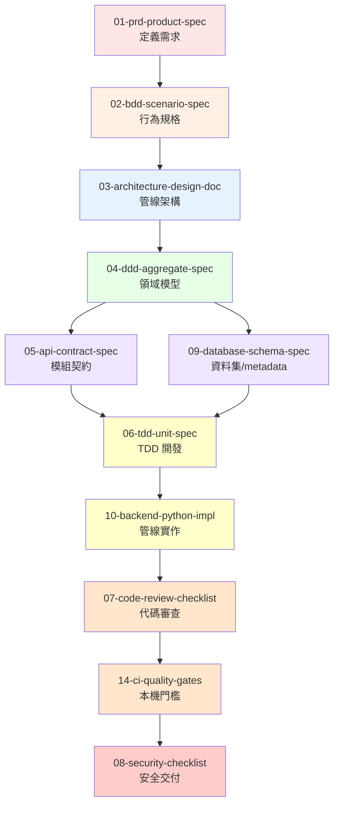
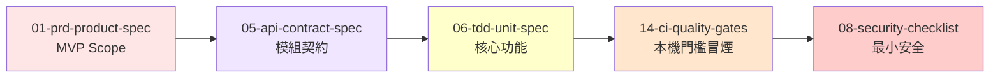
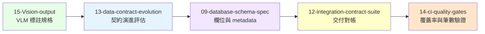

# Claude Code Output Styles 使用指南（RoomPilot 專用版）

> **版本**: v2.0
> **最後更新**: 2026-07-28
> **適用專案**: RoomPilot 家具風格檢索系統（純檢索 RAG，Python 3.11.15 + Gradio 6.20.0）
> **事實來源**: `.claude-roompilot/PROJECT_BRIEF.md`（本檔與其衝突時以 PROJECT_BRIEF 為準）

---

## 📚 總覽

本目錄包含 15 個精心設計的 Output Styles，涵蓋從需求規劃到交付檢查的完整開發流程。這些樣式整合了業界最佳實踐 (IEEE 1016, DDD, TDD, BDD, OWASP) 與 Claude Code 的 AI 協作能力，並**全數改寫為 RoomPilot 語境**：家具檢索、六風格 taxonomy、ChromaDB `furniture_v3`、`bge-m3` 向量、`bge-reranker-v2-m3` 重排、`claude-haiku-4-5` 需求解析、Gradio 卡片呈現、`embed_v3.py` 建索引、`rag_export/` 交付。

**本專案的三個前提**（所有樣式都已依此改寫）：

- **無 CI、無 Docker** —— 一切在本機 macOS（Apple Silicon，MPS 優先退 CPU）執行
- **尚未 git init** —— git／PR 流程照走，但指令目前無法執行
- **尚無正式測試套件** —— 測試相關樣式以 **pytest** 為預設建議，並標明「尚未建置」

程式範例一律 Python 3.11，執行方式一律 `.venv-rag/bin/python`。

## 🎯 快速開始

### 1. 切換 Output Style

```bash
# 在 Claude Code 中執行
/output-style 01-prd-product-spec

# Claude 會以 PRD 模式回應，產出產品需求文件
```

### 2. 查看當前樣式

```bash
# 查看當前使用的 Output Style
cat .claude-roompilot/settings.local.json | grep outputStyle
```

### 3. 恢復預設模式

```bash
# 取消當前 Output Style
/output-style default
```

---

## 🗂️ 一頁索引

| # | 樣式 | 一句話用途 | 什麼時候切過去 |
| :-- | :--- | :--- | :--- |
| 01 | `01-prd-product-spec` | 產品需求文件 (PRD) | 要加新檢索功能、要說清楚「為何做」 |
| 02 | `02-bdd-scenario-spec` | Gherkin 行為規格 | 需求要變成可驗證的檢索場景 |
| 03 | `03-architecture-design-doc` | C4 + DDD 架構文件 | 動管線結構、換模型、加階段 |
| 04 | `04-ddd-aggregate-spec` | 聚合、不變量、領域事件 | 釐清 Query／Item／Set 的邊界 |
| 05 | `05-api-contract-spec` | 內部介面契約 | 定 parser→retriever→app 的欄位契約 |
| 06 | `06-tdd-unit-spec` | TDD 紅綠重構（pytest，尚未建置） | 寫或改純函式（加權、去重、正規化） |
| 07 | `07-code-review-checklist` | 結構化自我審查 | 改完核心管線、交付前 |
| 08 | `08-security-checklist` | 安全與交付檢查 | 交付前；金鑰與本機暴露面 |
| 09 | `09-database-schema-spec` | 資料綱要（v3 JSON + `chroma_metadata`） | 加欄位、改索引、規劃遷移 |
| 10 | `10-backend-python-impl` | Python 管線實作骨架 | 真的要動 `rag_pipeline/` 程式碼 |
| 11 | `11-frontend-component-bdd` | Gradio 元件行為規格 | 改 `app.py` 的卡片／追問／條件面板 |
| 12 | `12-integration-contract-suite` | 模組間整合與失效注入 | 串接與交付對帳出問題時 |
| 13 | `13-data-contract-evolution` | 資料契約演進（v1→v2→v3） | 改 `embedded_text`／換詞表／交付 SQL 端 |
| 14 | `14-ci-quality-gates` | 本機品質門檻（無 CI） | 每次提交前、交付前 |
| 15 | `15-Vision-output` | VLM 標註輸出規格 | 做或審 `vlm_annotation/` 的家具標註 |

---

## 📋 Output Styles 清單

### 🎨 階段一：規劃與需求 (Planning)

#### 01-prd-product-spec
**用途**: 產出結構化的產品需求文件 (PRD)
**適用時機**: 功能啟動，定義問題、用戶、範圍與成功指標
**產出重點**:
- 執行摘要與價值主張
- 用戶畫像與用戶旅程（找家具的人、佈置整個房間的人）
- 功能需求 (Must/Should/Could)
- 非功能需求 (檢索延遲、解析成本、記憶體占用)
- 風險評估與里程碑

**使用範例**:
```bash
/output-style 01-prd-product-spec

# 然後詢問:
"我想為 RoomPilot 加上『依房型典型組合一次推整套家具』的功能，請幫我產出 PRD"
```

**關聯模板**: `VibeCoding_Workflow_Templates/02_project_brief_and_prd.md`

---

#### 02-bdd-scenario-spec
**用途**: 將需求轉化為可執行的 Gherkin 規格
**適用時機**: PRD 完成後，需將業務需求轉為精確的行為場景
**產出重點**:
- Feature 檔案 (Given-When-Then)
- Scenario Outline (參數化場景，如六風格逐一驗證)
- 步驟定義骨架（pytest-bdd，尚未建置）
- 正常流程、邊界條件、異常流程

**使用範例**:
```bash
/output-style 02-bdd-scenario-spec

# 然後詢問:
"根據『使用者只說風格沒說房型時要追問』的需求，產出 BDD Feature 檔案"
```

**關聯模板**: `VibeCoding_Workflow_Templates/03_behavior_driven_development_guide.md`

---

### 🏗️ 階段二：架構與設計 (Architecture & Design)

#### 03-architecture-design-doc
**用途**: 輸出系統架構與設計文件 (SAD/SDD)
**適用時機**: 需求明確後，設計或調整 Advanced RAG 管線架構
**產出重點**:
- C4 模型 (Context, Container, Component)
- DDD 界限上下文映射
- 品質屬性權衡 (ATAM：延遲 vs 準確率 vs 記憶體)
- 架構決策記錄 (ADR)
- 本機執行架構與資料流（無 CI／無 Docker）

**使用範例**:
```bash
/output-style 03-architecture-design-doc

# 然後詢問:
"畫出 RoomPilot 管線架構：Query Understanding → Metadata Filtering → Vector Retrieval
 → Re-ranking → Budget Allocation → Set Composition → Result Presenter"
```

**關聯模板**: `VibeCoding_Workflow_Templates/05_architecture_and_design_document.md`

---

#### 04-ddd-aggregate-spec
**用途**: DDD 戰術設計 - 聚合、不變量、領域事件
**適用時機**: 架構確定後，設計核心領域模型
**產出重點**:
- 界限上下文與統一語言（六風格、色卡、氛圍、房型、檢索群組）
- 聚合根與成員實體（FurnitureItem／ParsedQuery／ResultSet）
- 不變量與一致性邊界（ChromaDB 無 transaction，靠不可變取代 + `text_hash` 重算）
- 領域事件（風格重判完成、索引重建完成）
- 倉儲接口（Chroma repository、資料集 repository）
- 應用服務（檢索用例編排）

**使用範例**:
```bash
/output-style 04-ddd-aggregate-spec

# 然後詢問:
"設計『結果集合 (ResultSet)』聚合，包含主導風格收斂、去重、預算分配等業務規則"
```

**關聯模板**: `VibeCoding_Workflow_Templates/05_architecture_and_design_document.md` (DDD 章節)

---

#### 05-api-contract-spec
**用途**: 內部介面契約設計（本專案無對外 HTTP API）
**適用時機**: 架構設計完成，需定義模組之間與對 SQL 端的介面契約
**產出重點**:
- JSON Schema 規範（`query_parser.py` 的 structured outputs）
- 請求/回應 Schema（parser → retriever → app）
- 錯誤處理策略（LLM 400／限流／模型載入失敗）
- 版本控制規則（`text_format_version`、`schema_version`）
- 金鑰保護與冪等性
- 契約驗證範例

**使用範例**:
```bash
/output-style 05-api-contract-spec

# 然後詢問:
"定義 query_parser 解析結果的欄位契約：哪些進硬過濾、哪些進軟加權、哪些只進 semantic_query"
```

**關聯模板**: `VibeCoding_Workflow_Templates/06_api_design_specification.md`

---

#### 09-database-schema-spec
**用途**: 資料綱要設計（本專案為 JSON 資料集 + Chroma metadata，非關聯式資料庫）
**適用時機**: 領域模型確定後，設計 `furniture_enriched_v3.json` 欄位與 `chroma_metadata`
**產出重點**:
- 聚合 → 欄位映射
- 資料關係圖 (Mermaid 語法)
- 欄位定義與約束（純量、無 null，Chroma 不吃 null）
- 索引策略（cosine、1024 維、`furniture_v3` collection）
- 查詢優化（`where` 硬過濾先收斂再向量召回）
- 遷移腳本（全量重建 vs `--only-changed` 增量）

**使用範例**:
```bash
/output-style 09-database-schema-spec

# 然後詢問:
"規劃 furniture_enriched_v4 的欄位變更，並說明 chroma collection 要不要重建"
```

**關聯模板**: `VibeCoding_Workflow_Templates/05_architecture_and_design_document.md` (數據架構章節)

---

### 💻 階段三：開發與測試 (Development & Testing)

#### 06-tdd-unit-spec
**用途**: TDD 單元測試驅動開發（pytest，**尚未建置**）
**適用時機**: 實作函式或類別時，遵循紅綠重構循環
**產出重點**:
- 測試清單 (Test List)
- 紅階段 (失敗的測試)
- 綠階段 (最小實作)
- 重構階段 (改善設計)
- 契約式設計 (前後置條件)
- 四類測試（正常／邊界／無效輸入／業務規則）

**使用範例**:
```bash
/output-style 06-tdd-unit-spec

# 然後詢問:
"用 TDD 實作排序公式 final = 0.60×rerank + 0.20×style_compat + 0.10×mood命中率 + 0.10×confidence"
```

**關聯模板**: `VibeCoding_Workflow_Templates/07_module_specification_and_tests.md`

---

#### 10-backend-python-impl
**用途**: RoomPilot Python 管線實作 —— 以務實版 Clean Architecture 生成程式碼骨架
**適用時機**: 真的要動 `rag_pipeline/` 的程式碼時
**產出重點**:
- 完整型別註記、frozen dataclass 值物件
- 職責分離（parser／retriever／presenter）
- 明確錯誤處理與重試策略（LLM 限流、模型載入）
- 不可變模式（永遠建新物件）
- 執行方式一律 `.venv-rag/bin/python`

**使用範例**:
```bash
/output-style 10-backend-python-impl

# 然後詢問:
"重構 retriever.py 的去重收斂邏輯，抽成可單測的純函式"
```

**關聯模板**: `VibeCoding_Workflow_Templates/07_module_specification_and_tests.md`

---

#### 11-frontend-component-bdd
**用途**: Gradio 元件行為規格（家具卡片、追問按鈕、條件面板）
**適用時機**: 要改 `rag_pipeline/app.py` 的 UI 行為時
**產出重點**:
- 以「使用者行為」描述元件，避免過早耦合實作細節
- 卡片呈現契約（縮圖 base64、價格、風格標籤、色卡）
- 互動場景（送出需求 → 預熱模型 → 出 8 張卡 → 追問）
- 可用性與錯誤狀態（查無結果、模型載入中）

**使用範例**:
```bash
/output-style 11-frontend-component-bdd

# 然後詢問:
"為家具卡片元件產出行為場景，涵蓋『價格為估算值』與『無渲染圖』兩種狀態"
```

**關聯模板**: `VibeCoding_Workflow_Templates/12_frontend_architecture_specification.md`

---

#### 12-integration-contract-suite
**用途**: 模組間整合與契約驗證、失效注入
**適用時機**: `parser → retriever → Chroma → app` 串接或 `rag_export/` 對帳出問題時
**產出重點**:
- 介面契約規格（Provider/Consumer 對應到本專案的模組角色）
- 整合測試骨架（pytest，尚未建置）
- 失效注入案例（LLM 429、Chroma 空集合、模型載入失敗、圖片缺檔）
- 交付對帳（`embedding_failures.jsonl` 逐筆核對）

**使用範例**:
```bash
/output-style 12-integration-contract-suite

# 然後詢問:
"設計 parser 回傳非法風格值時，retriever 的降級行為與整合測試案例"
```

**關聯模板**: `VibeCoding_Workflow_Templates/07_module_specification_and_tests.md`

---

### ✅ 階段四：品質保證 (Quality Assurance)

#### 07-code-review-checklist
**用途**: 結構化 Code Review 檢查清單
**適用時機**: 改動核心管線後的自我審查（**專案尚未 git init**，目前無 PR 流程，改以自我審查執行）
**產出重點**:
- 架構與設計審查
- 代碼可讀性檢查
- 錯誤處理審查
- 性能考量（模型常駐 4.6 GB、全量建索引 27 分鐘）
- 安全性檢查（金鑰、輸入驗證）
- 六個坑檢核（`rag_indexable`、sigmoid、`anyOf`、`HF_HUB_OFFLINE`、尺寸硬過濾、reranker 選型）

**使用範例**:
```bash
/output-style 07-code-review-checklist

# 然後詢問:
"審查這次 retriever.py 的加權邏輯改動"
```

**關聯模板**: `VibeCoding_Workflow_Templates/11_code_review_and_refactoring_guide.md`

---

#### 13-data-contract-evolution
**用途**: 資料契約演進 —— v1→v2→v3 世代、只增不覆寫、`text_hash` 漂移偵測
**適用時機**: 要改 `embedded_text` 組成、換 taxonomy、或交付 `rag_export/` 給 SQL 端時
**產出重點**:
- 世代演進與只增不覆寫鐵律
- `rag_indexable` 排除規則（**不能寫進 Chroma `where`**）
- `text_hash` 相容性與 `--only-changed` 增量
- taxonomy v1（12 風格）→ v2（6 風格）遷移與 `style_primary_v1` 回溯欄位
- `rag_export` 對 SQL 端的五條相容承諾
- 漂移偵測與測試資料集生成指南

**使用範例**:
```bash
/output-style 13-data-contract-evolution

# 然後詢問:
"我想在 embedded_text 加進 style_reason，請評估這是相容變更還是破壞性變更"
```

**關聯模板**: `VibeCoding_Workflow_Templates/05_architecture_and_design_document.md`

---

#### 14-ci-quality-gates
**用途**: 本機品質門檻（**本專案無 CI**，以本機檢查清單取代 pipeline）
**適用時機**: 每次提交前、交付 `rag_export/` 前
**產出重點**:
- 八道本機門檻（環境自檢、語法匯入、解析冒煙、檢索冒煙、索引覆蓋率、資料筆數與重複 ID、金鑰掃描、單元測試）
- 門檻表與不通過處理
- 常見失敗症狀 → 修法對照表
- 未來若導入 CI 可對應的 job 一覽（含導入前提）
- 交付前 Runbook

**使用範例**:
```bash
/output-style 14-ci-quality-gates

# 然後詢問:
"我剛改完 build_rag_v3.py，請列出交付前該跑哪些門檻與判定標準"
```

**關聯模板**: `VibeCoding_Workflow_Templates/14_deployment_and_operations_guide.md`

---

### 🔒 階段五：安全與交付 (Security & Delivery)

#### 08-security-checklist
**用途**: 安全與交付檢查清單 (OWASP Top 10)
**適用時機**: 交付前安全審查
**產出重點**:
- OWASP Top 10 對映
- 金鑰管理（`.anthropic_key` / `ANTHROPIC_API_KEY` 絕不提交、絕不回顯）
- Prompt Injection 與輸入驗證
- 本機服務暴露面（Gradio 僅綁 `127.0.0.1:7860`）
- 隱私與資料外流（渲染圖、商品連結）
- 本機生產就緒檢查（無 CI／無 Docker）

**使用範例**:
```bash
/output-style 08-security-checklist

# 然後詢問:
"檢查 RoomPilot 的金鑰管理與 Gradio 本機服務暴露面"
```

**關聯模板**: `VibeCoding_Workflow_Templates/13_security_and_readiness_checklists.md`

---

#### 15-Vision-output
**用途**: VLM 標註輸出規格（`vlm_annotation/`，模型 `claude-haiku-4-5`）
**適用時機**: 產出或審查家具外觀標註時
**產出重點**:
- 受控詞彙 7 類（6 風格／4 圖樣／24 氛圍／9 房型／2 角色／3 視覺重量／3 高度分區）
- `description` 固定 80–120 字繁體中文，禁提「圖片／模型」
- `confidence` 誠實給分；灰模不得超過 0.5
- enum 正規化去括號（半形與全形都要處理）、不合法即降信心
- 批次續跑與 merge 前備份

**使用範例**:
```bash
/output-style 15-Vision-output

# 然後詢問:
"為這批灰模家具產出標註 JSON，並列出不合法的 style_primary"
```

**關聯模板**: `VibeCoding_Workflow_Templates/07_module_specification_and_tests.md`

---

## 🔄 推薦工作流程

### 完整流程 (Full Process)



### MVP 快速迭代（本專案常態）



### 資料流改動路線（改資料集／換詞表時走這條）



---

## 💡 使用技巧

### 1. 樣式組合使用

某些樣式適合組合使用：

```bash
# 先定義領域模型
/output-style 04-ddd-aggregate-spec
"設計結果集合 (ResultSet) 聚合"

# 再基於領域模型設計資料欄位
/output-style 09-database-schema-spec
"根據剛才的聚合，規劃 furniture_enriched 欄位與 chroma_metadata"

# 最後定義模組契約
/output-style 05-api-contract-spec
"基於聚合與資料設計，定義 retriever 回傳給 app.py 的結果契約"
```

### 2. 迭代改進

```bash
# 第一輪: 產出初稿
/output-style 03-architecture-design-doc
"設計 RoomPilot 檢索管線架構"

# 第二輪: 針對性改進
/output-style 03-architecture-design-doc
"優化剛才的架構，在 Re-ranking 後加入 Budget Allocation 以控制總預算"
```

### 3. 結合 Hooks 自動化

在 `.claude-roompilot/hooks-config.json`（或 `.claude-roompilot/settings.json` 的 `hooks` 區塊）中配置：

```json
{
  "PostToolUse": [
    {
      "matcher": "Write",
      "hooks": [
        {
          "type": "command",
          "command": "bash .claude-roompilot/hooks/post-write.sh '{{args.file_path}}'",
          "timeout": 20
        }
      ]
    }
  ]
}
```

可用來自動跑語法檢查（`.venv-rag/bin/python -m compileall -q rag_pipeline`）、
自動掃描是否誤寫入金鑰等。**本專案無 CI，這類 hook 就是唯一的自動化把關點。**

---

## 📖 學習路徑

### 新手 (第一次接觸 RoomPilot)

1. **閱讀**: `.claude-roompilot/PROJECT_BRIEF.md`（唯一事實來源）與 `docs/RAG檢索系統說明.md`
2. **實踐**: 從 `01-prd-product-spec` 開始，替一個小功能走完整流程
3. **參考**: 對照 `VibeCoding_Workflow_Templates` 中的對應模板與 `rag_pipeline/README.md`

### 進階 (熟悉基本流程)

1. **組合使用**: 嘗試 `04-ddd-aggregate-spec` + `09-database-schema-spec` 組合
2. **客製化**: 修改 Output Style 以適應本專案的實際慣例（六風格、硬過濾／軟加權界線）
3. **自動化**: 結合 Hooks 建立本機自動化把關（無 CI 的替代方案）

### 專家 (帶人／交付)

1. **定製樣式**: 新增專案專屬的 Output Styles（例如「色卡調校」樣式）
2. **流程標準化**: 把 `14-ci-quality-gates` 的門檻表定為交付前強制清單
3. **持續改進**: 每次踩到新坑就回頭補進 `07-code-review-checklist` 與 PROJECT_BRIEF 的「六個坑」

---

## 🛠️ 維護與更新

### 版本控制

Output Styles 使用語義化版本：
- **Major**: 結構性變更，不向後相容
- **Minor**: 新增章節或檢查項目
- **Patch**: 修正錯誤、改善說明

> ⚠️ **專案尚未 git init**：目前無法用 git 追蹤這些檔案的版本。
> 版本資訊靠本檔的「更新記錄」表與各檔 frontmatter 維持；git init 後再補上真正的歷史。

### 更新記錄

| 版本 | 日期 | 變更內容 |
|------|------|----------|
| v1.0 | 2025-10-13 | 初始版本，9 個核心樣式 |
| v1.1 | 2026-07-27 | 補齊 10–15 號樣式，共 15 個 |
| v2.0 | 2026-07-28 | 全數改寫為 RoomPilot 專用版；移除本專案不存在的技術棧；13/14/15 依實際資料契約、本機門檻與 VLM 標註規格重寫 |

### 反饋與改進

如有改進建議，請：
1. 在 `.claude-roompilot/context/decisions/` 留下決策記錄（取代 Issue）
2. 直接修改對應的 `.md` 並在「更新記錄」表補一列（取代 Pull Request；專案尚未 git init）
3. 與 SSOT 文件（`docs/`、`rag_pipeline/README.md`）同步，衝突時以文件為準

---

## 📚 參考資源

### 官方文檔
- [Claude Code Output Styles 官方文檔](https://docs.claude.com/en/docs/claude-code/output-styles)
- [Claude Code Hooks 指南](https://docs.claude.com/en/docs/claude-code/hooks-guide)
- [Claude Code 最佳實踐](https://www.anthropic.com/engineering/claude-code-best-practices)

### 方法論參考
- [IEEE Std 1016-2009 (SDD)](https://standards.ieee.org/ieee/1016/4502/)
- [Domain-Driven Design Reference (Eric Evans)](https://www.domainlanguage.com/ddd/reference/)
- [Test Driven Development (Martin Fowler)](https://martinfowler.com/bliki/TestDrivenDevelopment.html)
- [Gherkin Reference (Cucumber)](https://cucumber.io/docs/gherkin/reference/)
- [OWASP Top 10 (2021)](https://owasp.org/Top10/)

### 本專案技術參考
- `BAAI/bge-m3`（1024 維、normalized、`MAX_SEQ_LEN=512`）
- `BAAI/bge-reranker-v2-m3`（中文 cross-encoder，經 CrossEncoder 已輸出 0–1）
- ChromaDB 1.5.9（`chroma_db/`，collection `furniture_v3`，cosine，9,349 筆）
- Gradio 6.20.0（`rag_pipeline/app.py`，theme 在 `launch()` 傳）
- `claude-haiku-4-5` structured outputs + prompt caching（需求解析與 VLM 標註）

### 專案 SSOT 文件
- `docs/RAG檢索系統說明.md`、`docs/query_parser_spec.md`、`docs/GLB標註pipeline執行說明.md`
- `rag_pipeline/README.md`、專案根 `README.md`
- `vlm_annotation/taxonomy_v2.json`、`rag_pipeline/category_groups.json`
- `json_adjustment/RAGSQL.md`、`json_adjustment/i_need_rag.md`

---

## ❓ 常見問題

### Q: Output Style 會影響 Claude 的其他功能嗎？
A: 不會。Output Style 只影響產出格式與觀點，不影響工具調用、指令執行等功能。

### Q: 可以同時使用多個 Output Style 嗎？
A: 一次只能啟用一個 Output Style。但可以在對話中切換，組合使用不同樣式的產出。

### Q: 如何客製化 Output Style？
A: 直接編輯 `.claude-roompilot/output-styles/` 中的 `.md` 文件，修改「指令」與「交付結構」章節。
YAML frontmatter 的欄位鍵（`name`／`description`／`stage`／`template_ref`）必須保留且合法，只改值。

### Q: Output Style 會被記錄到 Git 嗎？
A: **本專案目前不是 git repo**。git init 後，`.claude-roompilot/output-styles/` 應納入版本控制供共享；
`settings.local.json` 中的當前樣式設定是個人偏好，可選擇性納入。切記 `.anthropic_key`、
`chroma_db/`、`rag_dataset/*.json`、`rag_export/*.jsonl` 一律要進 `.gitignore`。

### Q: 如何建立交付前的標準流程？
A: 以 `14-ci-quality-gates` 的門檻表為準（本專案無 CI，那份清單就是 CI），
交付 `rag_export/` 前逐項確認，並在 `07-code-review-checklist` 檢查六個坑。

### Q: 為什麼樣式裡看不到 Docker／CI／前端框架的內容？
A: 因為本專案**沒有這些東西**。所有相關章節都已改寫為本機執行、runbook 與 Gradio 對應物，
並在檔內明確標明「本專案無 CI／無 Docker」。程式範例一律 Python 3.11 + `.venv-rag/bin/python`。

---

## 🎓 最佳實踐

1. **功能啟動使用 01-prd-product-spec**，確保需求明確
2. **關鍵決策使用 03-architecture-design-doc**，記錄 ADR（如換 embedding 模型）
3. **核心業務邏輯使用 04-ddd-aggregate-spec**，明確聚合邊界
4. **模組介面使用 05-api-contract-spec**，確保 parser／retriever／app 契約穩定
5. **交付前必用 08-security-checklist**，重點是金鑰絕不外洩
6. **TDD 開發使用 06-tdd-unit-spec**，保持紅綠重構節奏（pytest 尚未建置，先寫規格）
7. **自我審查使用 07-code-review-checklist**，結構化檢查（含六個坑）
8. **改資料集前必用 13-data-contract-evolution**，先判斷是相容還是破壞性變更
9. **每次提交前跑 14-ci-quality-gates**，本機門檻就是這個專案的 CI
10. **做 VLM 標註用 15-Vision-output**，受控詞彙一鬆，檢索品質就跟著鬆

---

**記住**: Output Styles 是你的 AI 協作夥伴的「專業模式切換器」。善用它們，讓 Claude Code 成為 RoomPilot 的產品經理、架構師、資料工程師與安全專家！

**開始使用**: `/output-style 01-prd-product-spec` 🚀
