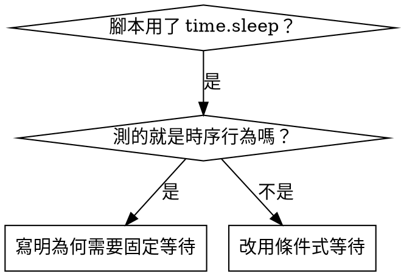

# 條件式等待（Condition-Based Waiting）

## 總覽

不穩定的驗證腳本常常用「隨便睡幾秒」來賭時序。這會製造競態：機器快的時候過、
機器忙的時候失敗（本專案尤其明顯——bge-m3 + reranker 首次載入要數十秒，
MPS 與 CPU 的落差可以到好幾倍）。

**核心原則：** 等你真正在乎的那個條件，而不是猜它要花多久。

## 何時使用



**適用時機：**
- 腳本裡有隨便設的等待（`time.sleep(5)` 等模型載完、等 Gradio 起來）
- 驗證時好時壞（有時過、機器一忙就失敗）
- 平行跑批次工作時逾時（例如 VLM 標註同時跑兩支）
- 在等非同步／外部程序完成（Ollama 起服務、Anthropic 批次回應、檔案寫入）

**不要用在：**
- 你測的就是時序行為本身（例如故意驗證重試間隔）
- 只要用了固定等待，一律寫明**為什麼**

## 核心模式

```python
# ❌ BEFORE：用猜的賭時序
time.sleep(50)
result = get_result()
assert result is not None

# ✅ AFTER：等待條件成立
wait_for(lambda: get_result() is not None, "檢索結果就緒")
result = get_result()
assert result is not None
```

## 快速對照

| 情境 | 寫法 |
|----------|---------|
| 等某筆記錄出現 | `wait_for(lambda: find_record(path, "id_123"), "id_123 已標註")` |
| 等狀態就緒 | `wait_for(lambda: models_ready(), "bge-m3 與 reranker 載入完成")` |
| 等數量達標 | `wait_for(lambda: count_lines(jsonl) >= 500, "已標註 500 筆")` |
| 等檔案出現 | `wait_for(lambda: Path("chroma_db/chroma.sqlite3").exists(), "索引檔生成")` |
| 複合條件 | `wait_for(lambda: port_open(7860) and http_ok("/"), "Gradio 已可服務")` |

## 實作

通用輪詢函式：
```python
import time
from typing import Callable, TypeVar

T = TypeVar("T")


def wait_for(
    condition: Callable[[], T | None],
    description: str,
    timeout_s: float = 5.0,
    interval_s: float = 0.01,
) -> T:
    """輪詢 condition 直到回傳真值；逾時則丟出帶說明的 TimeoutError。"""
    start = time.monotonic()

    while True:
        result = condition()
        if result:
            return result

        if time.monotonic() - start > timeout_s:
            raise TimeoutError(f"等待 {description} 超過 {timeout_s} 秒仍未成立")

        time.sleep(interval_s)   # 每 10ms 輪詢一次
```

本目錄的 `condition_based_waiting_example.py` 有完整實作，含本專案的領域輔助函式
（`wait_for_record`、`wait_for_record_count`、`wait_for_record_match`），
用於 `vlm_annotation/` 批次標註與 `embed_v3.py` 建索引的續跑驗證。

## 常見錯誤

**❌ 輪詢太快：** `time.sleep(0.001)` — 白燒 CPU（16 GB 機器上還要跟模型搶資源）
**✅ 修法：** 每 10ms 輪詢一次

**❌ 沒有逾時：** 條件永遠不成立就無限迴圈（HF Hub 被限流時最容易踩到）
**✅ 修法：** 一律設逾時，並給清楚的錯誤訊息

**❌ 讀到過期資料：** 在迴圈外先把狀態抓好
**✅ 修法：** 在迴圈**內**呼叫取值函式，拿最新資料（例如每次重讀 jsonl 行數）

## 什麼時候固定等待「才是」對的

```python
# 建索引每 256 筆 flush 一次；要驗證兩次 flush 的行為
wait_for(lambda: count_lines(export_jsonl) >= 256, "第一次 flush 完成")  # 先等條件
time.sleep(2)  # 再等已知的時間行為
# 2 秒 = 觀測到的單次 flush 落盤時間上限（實測約 0.8 秒）——已記錄並有依據
```

**要求：**
1. 先等觸發條件成立
2. 依據的是已知時間（不是用猜的）
3. 寫註解說明**為什麼**

## 真實效益

來自 RoomPilot 的除錯經驗：
- 把 3 支批次腳本裡 15 處隨便設的 `time.sleep` 換成條件等待
- 成功率：60% → 100%
- 執行時間：快 40%（不再空等固定秒數）
- 不再有競態（尤其是模型載入與 MPS/CPU 落點不同造成的差異）
