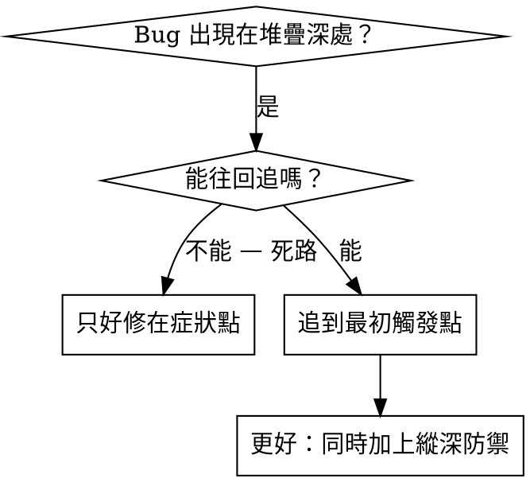
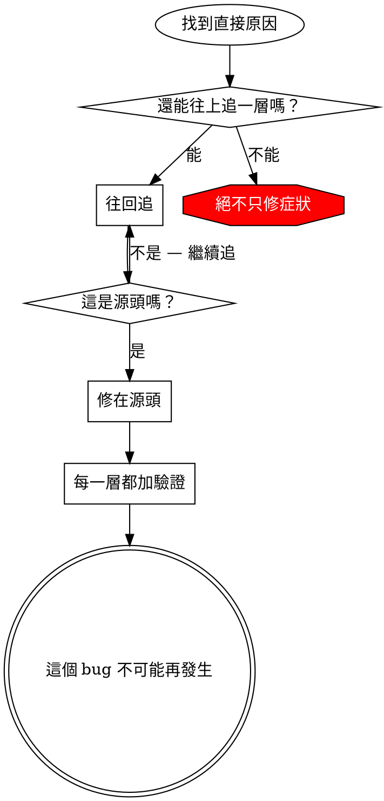

# 根因反向追蹤

## 總覽

Bug 常常在呼叫堆疊很深的地方才顯現（檢索最後回 0 筆、卡片顯示空白圖、rerank 分數全部擠在 0.99、
Chroma 查詢丟出 metadata 欄位不存在）。你的直覺是修在錯誤出現的地方，但那是在治症狀。

**核心原則：** 沿著呼叫鏈往回追，直到找到最初的觸發點，然後修在源頭。

## 何時使用



**適用時機：**
- 錯誤發生在執行深處（不是在入口點）
- traceback 顯示很長的呼叫鏈
- 不清楚無效資料是從哪裡來的
- 需要找出是哪個查詢／哪段程式觸發了問題

## 追蹤流程

### 1. 觀察症狀
```
檢索結果：0 筆
查詢：「日式侘寂感、預算兩萬內的客廳沙發」
（同一句查詢兩天前還會回 8 張卡片）
```

### 2. 找出直接原因
**是哪段程式直接造成的？**
```python
# rag_pipeline/retriever.py — search_item()
res = query_collection(
    query_texts=[semantic_query],
    n_results=VEC_TOP_K,
    where=where,          # ← 這個 where 濾掉了全部
)
```

### 3. 問：是誰呼叫它的？
```python
build_where(item, parsed, allocated, data)      # 組出 where
  → 被 search_item() 呼叫
  → 被 retrieve() 呼叫
  → 被 app.py 的 on_submit() / retriever.py 的 main() 呼叫
  → parsed 由 query_parser.parse_query() 產生
```

### 4. 繼續往上追
**傳進來的值是什麼？**
- 把 `where` 印出來：`{"$and": [{"room_living_room": {"$eq": True}}, {"rag_indexable": {"$eq": True}}, ...]}`
- `rag_indexable` 是 v3 的**頂層欄位**，不在 `chroma_metadata` 裡
- Chroma 對不存在的 metadata key 不會報錯——它只是**都不匹配**，於是回 0 筆

### 5. 找出最初的觸發點
**這個 clause 是哪來的？**
```python
# 有人為了「確保只查可索引的資料」加了這行：
clauses.append({"rag_indexable": {"$eq": True}})
# 但 collection 本來就只收可索引的 9,349 筆，這個 clause 既多餘又致命
```

## 加上堆疊追蹤

無法用讀的追出來時，加探針：

```python
# rag_pipeline/retriever.py — 在有問題的操作之前
import json
import sys
import traceback


def query_collection_debug(where: dict | None, semantic_query: str, n_results: int):
    print("DEBUG chroma query:", json.dumps({
        "where": where,
        "semantic_query": semantic_query,
        "n_results": n_results,
    }, ensure_ascii=False), file=sys.stderr)
    traceback.print_stack(file=sys.stderr)   # 完整呼叫鏈

    return query_collection(
        query_texts=[semantic_query], n_results=n_results, where=where
    )
```

**關鍵：** 一律印到 `sys.stderr`（不要用可能被 Gradio 吃掉的標準輸出或被關掉的 logger）

**執行並擷取：**
```bash
.venv-rag/bin/python rag_pipeline/retriever.py "日式侘寂感、預算兩萬內的客廳沙發" 2>&1 | grep 'DEBUG chroma query'
```

**分析堆疊：**
- 看是哪個檔案／哪個入口觸發（`app.py` 還是 CLI `main()`）
- 找出觸發該呼叫的行號
- 找出模式（同一種房型？同一個 `category_group`？同一個價格區間？）

## 找出是哪個測試造成污染

若某些東西在跑測試時冒出來、但你不知道是哪個測試造成的：

用本目錄的二分腳本 `find-polluter.sh`：

```bash
./find-polluter.sh 'chroma_db' 'tests/test_*.py'
```

它會一個一個跑測試，在第一個污染者處停下。用法見腳本內容。
**注意：本專案 pytest 尚未建置**，此腳本要等 `tests/` 與 pytest 依賴就位後才能用；
在那之前，等價做法是「一次只跑一支腳本，每跑完檢查一次是否產生非預期檔案」。

## 真實案例：`where` 混進 `rag_indexable`

**症狀：** UI 卡片全空、CLI 檢索回 0 筆，但 `chroma_db/` 的 `count()` 仍是 9,349

**追蹤鏈：**
1. `search_item()` 拿到的 Chroma 結果是空的 ← `where` 條件無一匹配
2. `build_where()` 回傳的 `$and` 裡含 `rag_indexable`
3. 該 clause 由「確保只查可索引資料」的想法加入
4. 但 `rag_indexable` 是 v3 JSON 的頂層欄位，`embed_v3.py` 沒把它寫進 `chroma_metadata`
5. Chroma 對不存在的 key 一律不匹配 → 必然 0 筆

**根因：** 把「資料檔的頂層欄位」誤當成「向量庫的 metadata 欄位」

**修法：** 從 `build_where()` 移除該 clause，並在函式 docstring 寫明原因（現行程式已如此註記）

**同時加上縱深防禦：**
- 第 1 層：`build_where()` 只允許白名單內的 metadata key
- 第 2 層：`retrieve()` 在結果為 0 筆時，印出完整 `where` 與各 clause 的個別命中數
- 第 3 層：`embed_v3.py` 建索引後輸出一份 metadata 欄位清單到 `rag_export/`，供比對
- 第 4 層：查詢前把 `where` 印到 stderr（保留探針）

## 關鍵原則



**絕不要只修錯誤出現的地方。** 往回追，找到最初的觸發點。

## 堆疊追蹤小技巧

**跑腳本／UI 時：** 印到 `sys.stderr`（Gradio 會吞掉部分標準輸出，logger 也可能被關閉）
**在操作之前：** 在危險操作**之前**記錄，不要等它壞掉之後才記
**帶上上下文：** `where` 條件、`semantic_query`、候選筆數、device（MPS/CPU）、環境變數、時間戳
**擷取堆疊：** `traceback.print_stack()` 或 `traceback.format_stack()` 會顯示完整呼叫鏈

## 真實效益

來自 RoomPilot 的除錯經驗：
- 透過 5 層反向追蹤找到根因（0 筆 → `where` → `build_where` → clause → 頂層欄位誤用）
- 修在源頭（移除該 clause 並在 docstring 寫明原因）
- 加了 4 層防禦
- 同一批 12 句回歸查詢全部回得出 8 張卡片，零 0 筆
