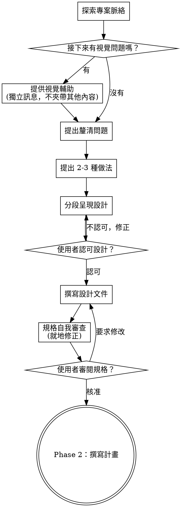
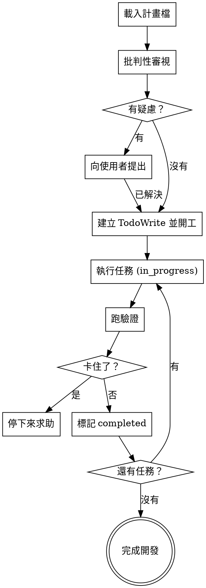

> **繁體中文說明**：此 skill 整合了完整設計流程（探索需求 → 撰寫計畫 → 執行計畫），見 [SUPERPOWERS-EXTRAS-USAGE-zh-TW.md](../SUPERPOWERS-EXTRAS-USAGE-zh-TW.md)（全系列 `sp-*` 摘要）。

# 設計工作流（RoomPilot）

## 總覽

本 skill 涵蓋任何創造性或多步驟實作工作的完整「思考 → 計畫 → 執行」循環：

- **Phase 1（腦力激盪）：** 透過協作對話探索使用者意圖、需求與設計。產出一份經核准的規格文件。
- **Phase 2（撰寫計畫）：** 把核准的規格轉成細切、細節完整的實作計畫。產出一份計畫文件。
- **Phase 3（執行計畫）：** 載入計畫、批判性審視、依檢查點執行所有任務，並回報完成。

<HARD-GATE>
在 Phase 1 產出經核准的規格、且 Phase 2 產出書面計畫之前，**不得**撰寫任何程式碼、建立任何腳手架、或採取任何實作動作。此規則適用於每一項工作，不論它看起來多簡單——包括「只是把 `retriever.py:47` 的權重從 0.60 改成 0.55」這種一行改動。
</HARD-GATE>

---

## Phase 1：腦力激盪（Brainstorm）

**INPUT：** 使用者的一個想法、功能需求或改動描述——再模糊都算。

**OUTPUT：** 一份經核准的規格文件，存到 `docs/specs/YYYY-MM-DD-<主題>-design.md`，並取得使用者明確核准。

> **本專案尚未 git init**：原流程要求「規格寫完即 commit」。本專案目前不是 git repo，
> 所以改為「寫檔並在對話中回報路徑」；待 `git init` 後再補上 commit 這一步，流程其餘不變。

**開場宣告：** 「我正在使用 design skill — 開始 Phase 1：腦力激盪。」

### 反模式：「這太簡單，不需要設計」

每一項工作都要走這個階段。加一個檢索群組、調一個排序權重、改一行 `category_groups.json`——全都要。
「簡單」的改動正是未檢驗假設造成最多白工的地方（例如以為風格可以硬過濾，結果疊上房型後只剩個位數命中）。
設計可以很短（真的簡單時幾句話就好），但你**必須**呈現出來並取得核准。

### Phase 1 檢查清單

依序完成：

1. **探索專案脈絡** — 查檔案、查 `docs/` 與 `rag_pipeline/README.md`、查最近改動（專案尚未 git init，改以檔案時間與文件差異判讀）
2. **提供視覺輔助**（若主題涉及視覺問題，如 Gradio 卡片版面）— 獨立一則訊息，不與釐清問題混在一起
3. **提出釐清問題** — 一次一個；目的、限制、成功標準
4. **提出 2-3 種做法** — 附取捨與你的推薦
5. **呈現設計** — 分段、長度依複雜度調整；每段後取得使用者認可
6. **撰寫設計文件** — 存到 `docs/specs/YYYY-MM-DD-<主題>-design.md`（git init 後補 commit）
7. **規格自我審查** — 就地檢查佔位符、矛盾、歧義、範圍
8. **使用者審閱書面規格** — 等到明確核准才往下走
9. **轉場** — 進入 Phase 2

### Phase 1 流程圖



### 理解這個想法

- 先確認專案現況（`rag_pipeline/` 各檔、`docs/` SSOT 文件、最近改動；專案尚未 git init，改看檔案時間與文件差異）。
- 在問細節之前先評估範圍。若需求描述了多個彼此獨立的子系統（例如「同時改檢索排序、重跑 VLM 標註、換掉 Gradio UI、再產一份 SQL 交付檔」），立刻標示出來。協助使用者拆成子專案：哪些是獨立的、彼此關係為何、應該用什麼順序做？每個子專案各自跑一輪「規格 → 計畫 → 執行」。
- 範圍適當的專案，就一次問一個問題來收斂想法。
- 盡量用選擇題；開放式問題也可以。
- 每則訊息只問一個問題——同一主題需要更多探索時，拆成多個問題。
- 聚焦在：目的、限制、成功標準（例如「調權重後，`日式侘寂客廳沙發` 這句查詢的前 8 張卡片主導風格一致率要提高」）。

### 探索做法

- 提出 2-3 種不同做法並附取捨（例如「新增檢索群組」可以：A. 在 `category_groups.json` 開新 group、B. 併入既有 group 再靠 `role` 區分、C. 只改 `semantic_query` 不動群組）。
- 先講你推薦的那個，並解釋原因。

### 呈現設計

- 一旦你理解要做什麼，就把設計呈現出來。
- 每段長度依複雜度調整：單純的幾句話，細膩的可到 200-300 字。
- 每段結束後問使用者到目前為止是否正確。
- 需涵蓋：架構、元件、資料流、錯誤處理、測試（本專案 pytest **尚未建置**，測試段落要寫清楚打算怎麼驗證——CLI 實跑、`--limit 50` 冒煙、還是人工比對前 8 筆）。

### 設計原則

- 把系統拆成各有單一明確職責、透過清楚介面溝通、可獨立理解與測試的小單元（本專案即 `query_parser.py` / `retriever.py` / `embed_v3.py` / `app.py` 的分工）。
- 每個單元都要回答：它做什麼、怎麼用、依賴什麼。
- 更小、邊界更清楚的單元比較好推理、也比較容易安全修改。
- 在既有程式庫中，先探索現有結構再提出改動，並沿用既有慣例（例如新增硬過濾條件一律加在 `build_where()` 的 `clauses` 串列，不要另開一條查詢路徑）。只在直接服務當前目標時納入針對性改善——不要順手提出無關的重構。

### 規格自我審查

寫完規格文件後：

1. **佔位符掃描：** 有沒有「TBD」「TODO」、未完成段落、或含糊的需求？修掉它們。
2. **內部一致性：** 有沒有段落互相矛盾？架構描述是否與功能描述一致？（例如一段說風格走軟加權、另一段又寫進 `where`）
3. **範圍檢查：** 這份規格夠聚焦到能寫成單一份實作計畫嗎？還是需要拆解？
4. **歧義檢查：** 有沒有需求可以有兩種解讀？有的話挑一種並寫明白（例如「尺寸限制」是硬過濾還是加權——本專案答案是**硬過濾**）。

就地修正。不必再審一輪——修完就往下走。

### 使用者審查關卡

規格自我審查通過後：

> 「規格已寫入 `<path>`（專案尚未 git init，暫不 commit）。請審閱，若要調整請告訴我，確認後我再開始撰寫實作計畫。」

等使用者回覆。若要求修改，改完再跑一次規格自我審查。只有使用者核准後才進入 Phase 2。

### 視覺輔助（Visual Companion）

腦力激盪期間用來展示樣稿、圖表與視覺選項的瀏覽器輔助。預期接下來有視覺問題時提供一次：

> 「我們接下來討論的東西，也許用瀏覽器直接show給你看會比較好懂。我可以邊做邊生出樣稿、圖表、比較圖等視覺內容。這功能還很新、也比較耗 token。要試試看嗎？（需要開一個本機網址）」

**這個提議必須自成一則訊息。** 不要和其他內容混在一起。等使用者回覆再繼續。

即使使用者接受，仍要逐題判斷：內容本身**就是視覺**的（Gradio 卡片版面樣稿、線框圖、版面比較、架構圖）才用瀏覽器；概念性問題、取捨清單、範圍決策用終端機就好。問題主題與 UI 有關，不代表它就是視覺問題。

> 本專案已有一個現成的視覺參照：`.venv-rag/bin/python rag_pipeline/app.py` 起在 `http://127.0.0.1:7860`。
> 討論卡片呈現時，直接請使用者看現行 UI 往往比另做樣稿更快。

### Phase 1 關鍵原則

- 一次一個問題——不要用一堆問題壓垮使用者。
- 優先用選擇題。
- 無情執行 YAGNI——把不必要的功能從所有設計中拿掉。
- 探索替代方案——定案前一律先提 2-3 種做法。
- 漸進驗證——呈現設計、取得認可，再往下走。

---

## Phase 2：撰寫計畫（Write Plan）

**INPUT：** Phase 1 產出、且路徑經使用者確認的規格文件。

**OUTPUT：** 一份完整的實作計畫，存到 `docs/plans/YYYY-MM-DD-<功能名>.md`，已自我審查、可直接執行。

**開場宣告：** 「我正在使用 design skill — 開始 Phase 2：撰寫計畫。」

### 範圍檢查

若規格涵蓋多個 Phase 1 未拆解的獨立子系統，建議拆成多份計畫——一個子系統一份。
每份計畫都要能自己產出可運作、可驗證的軟體（本專案的「可驗證」通常是：CLI 跑得出結果、或 UI 卡片呈現正確）。

### 檔案結構對應

定義任務之前，先把「會新增／修改哪些檔案、各自負責什麼」攤開來。這一步鎖定拆解決策。

- 設計邊界清楚、介面明確的單元。每個檔案有一個明確職責。
- 一起變動的檔案要放在一起。依職責切分，不要依技術分層切。
- 在既有程式庫中沿用既有慣例。若你要改的檔案已經長得太大，在計畫中納入一次針對性拆分是合理的——但不要擅自重構整個程式庫。

範例（任務：**新增一個檢索群組**「戶外休閒椅」）：

| 檔案 | 動作 | 職責 |
| :--- | :--- | :--- |
| `rag_pipeline/category_groups.json` | 修改 | 新增 group 定義與其 `categories`；更新 `room_default_sets` 的 `outdoor` |
| `rag_pipeline/query_parser.py` | 修改 | `build_schema()` 的 `group_keys` 由 groups 讀入，確認新 group 進入受控詞彙 |
| `rag_pipeline/retriever.py` | 檢查 | `load_data()` 的 `prices` 會自動為新 group 算中位價，確認不會除零 |
| `docs/RAG檢索系統說明.md` | 修改 | 同步群組表（文件為契約，程式改了文件必須跟著改） |

這個結構決定任務拆解。每個任務都應該產出自成一體、單獨看也合理的改動。

### 計畫文件標頭

每份計畫**必須**以此標頭開始：

```markdown
# [功能名稱] 實作計畫

> **給 agent 執行者：** 必用子技能：以 sunnydata-parallel-agents 做 subagent 驅動執行（推薦），
> 或用 sunnydata-design 的 Phase 3 逐任務實作本計畫。步驟採 checkbox（`- [ ]`）語法追蹤。

**目標：** [一句話描述這份計畫要建出什麼]

**架構：** [2-3 句說明做法]

**技術棧：** Python 3.11.15（`.venv-rag/bin/python`）、ChromaDB 1.5.9（`furniture_v3`）、
`BAAI/bge-m3`、`BAAI/bge-reranker-v2-m3`、`claude-haiku-4-5`、Gradio 6.20.0

---
```

### 細切的任務顆粒度

每一步是一個動作（2-5 分鐘）：

- 「寫一個會失敗的測試」— 一步
- 「跑它、確認它真的失敗」— 一步
- 「寫剛好能讓測試通過的最小實作」— 一步
- 「跑測試、確認通過」— 一步
- 「提交」— 一步（**專案尚未 git init**，此步暫時改為「記錄改動摘要，待 git init 後補提交」）

### 任務結構

````markdown
### Task N：[元件名稱]

**檔案：**
- 修改：`rag_pipeline/retriever.py:47`（權重常數）
- 修改：`docs/RAG檢索系統說明.md`（排序公式段落）
- 測試：`tests/test_ranking.py`（**pytest 尚未建置**，本任務同時新增 `tests/` 與 `pytest` 依賴）

- [ ] **Step 1：寫一個會失敗的測試**

```python
# tests/test_ranking.py
import sys
from pathlib import Path

sys.path.insert(0, str(Path(__file__).resolve().parent.parent / "rag_pipeline"))

from retriever import W_RERANK, W_STYLE, W_MOOD, W_CONF  # noqa: E402


def test_weights_sum_to_one():
    assert round(W_RERANK + W_STYLE + W_MOOD + W_CONF, 6) == 1.0


def test_style_weight_raised_to_030():
    """調整排序權重：style_compat 由 0.20 提高到 0.30，rerank 由 0.60 降到 0.50。"""
    assert (W_RERANK, W_STYLE) == (0.50, 0.30)
```

- [ ] **Step 2：跑測試確認它失敗**

執行：`.venv-rag/bin/python -m pytest tests/test_ranking.py -v`
預期：FAIL，訊息為 `assert (0.6, 0.2) == (0.5, 0.3)`

- [ ] **Step 3：寫最小實作**

```python
# rag_pipeline/retriever.py:47
W_RERANK, W_STYLE, W_MOOD, W_CONF = 0.50, 0.30, 0.10, 0.10
```

- [ ] **Step 4：跑測試確認它通過**

執行：`.venv-rag/bin/python -m pytest tests/test_ranking.py -v`
預期：PASS

- [ ] **Step 5：以實查驗證（本專案的必要步驟）**

執行：`.venv-rag/bin/python rag_pipeline/retriever.py "日式侘寂感、預算兩萬內的客廳沙發"`
預期：前 8 筆的 `style_primary` 以 `japanese` / `scandinavian` 為主，且結果數仍為 8

- [ ] **Step 6：提交**

```bash
# 專案尚未 git init：以下指令目前無法執行，待 git init 後補跑
git add rag_pipeline/retriever.py tests/test_ranking.py docs/RAG檢索系統說明.md
git commit -m "feat(retriever): raise style_compat weight to 0.30"
```
````

### 不准有佔位符

每一步都必須包含工程師真正需要的內容。以下都是計畫的失敗——絕對不要寫：

- 「TBD」「TODO」「之後再實作」「細節待補」
- 「加上適當的錯誤處理」／「加上驗證」／「處理邊界情況」
- 「幫上面補測試」（沒有實際測試碼）
- 「跟 Task N 類似」（把程式碼重寫一遍——工程師可能不照順序讀）
- 只說要做什麼、沒說怎麼做的步驟（涉及程式碼的步驟一律要附程式碼區塊）
- 引用了任何任務都沒定義的型別、函式或方法

### 計畫自我審查

寫完整份計畫後，對照規格檢查：

1. **規格覆蓋：** 逐段掃過規格的每個需求。你能指出哪個任務實作了它嗎？列出缺口並補上任務。
2. **佔位符掃描：** 搜尋上一節「不准有佔位符」列出的所有樣式。修掉它們。
3. **命名一致性：** 後面任務用到的型別、函式簽章、欄位名，是否與前面任務的定義一致？
   （例如 Task 3 寫 `build_where()`、Task 7 卻寫 `build_where_clause()`，這就是 bug；
   又如 metadata 欄位 Task 3 用 `style_primary`、Task 7 卻用 `primary_style`，Chroma 會直接查不到。）

就地修正。不必再審一輪——修完就往下走。

### Phase 2 提醒

- 一律寫精確檔案路徑（含行號，如 `rag_pipeline/retriever.py:47`）。
- 每一步都要有完整程式碼——步驟若會改程式碼，就把程式碼寫出來。
- 精確的指令與預期輸出（指令一律 `.venv-rag/bin/python`，不要寫裸 `python`，也不要引用任何其他虛擬環境——本專案只有 `.venv-rag/`）。
- DRY、YAGNI、TDD、頻繁提交（提交步驟先寫在計畫裡，待專案 git init 後即可照跑）。

---

## Phase 3：執行計畫（Execute Plan）

**INPUT：** Phase 2 產出的書面計畫文件（提供路徑）。

**OUTPUT：** 所有任務完成並驗證通過；開發分支可以收尾（**專案尚未 git init**，暫時改為「改動集中、可整批回報與回滾」）。

**開場宣告：** 「我正在使用 design skill — 開始 Phase 3：執行計畫。」

> **注意：** Phase 3 在有 subagent 支援時效果好得多（例如 Claude Code）。若可用 subagent，優先採 subagent 驅動執行：每個任務派一個全新 subagent，任務之間做兩階段審查（可搭配 sunnydata-parallel-agents）。Phase 3 的 inline 執行是沒有 subagent 環境下的退路。

### Step 1：載入並審視計畫

1. 讀計畫檔。
2. 批判性審視——開工前先找出對計畫的疑問或疑慮。
3. 有疑慮：開工前先向使用者提出。
4. 沒疑慮：建立 TodoWrite 追蹤清單，開始執行。

### Step 2：執行任務

每個任務：

1. 標記為 `in_progress`。
2. 完全照著寫好的步驟做（計畫已經切成細步驟）。
3. 依指定方式跑驗證（例如 `.venv-rag/bin/python rag_pipeline/embed_v3.py --limit 50` 冒煙、`retriever.py "<需求>"` 實查）。
4. 標記為 `completed`。

### Step 3：完成開發

所有任務完成且驗證通過後：

- 宣告：「所有任務完成，進入收尾。」
- 確認驗證全過（測試套件尚未建置時，以 CLI 實查 + 文件同步檢查代替），提出合併／PR 選項，執行使用者的選擇。
- **本專案尚未 git init**：合併／PR 選項目前不可用，改為列出「已改動檔案清單 + 對應 SSOT 文件是否已同步」讓使用者驗收。

### 流程圖



### 何時停下來求助

**立刻停止執行的情況：**

- 撞到阻礙（缺依賴、測試失敗、指示不清楚；本專案常見：`.venv-rag/` 缺套件、`chroma_db/` 尚未建索引、`.anthropic_key` 不存在）
- 計畫有關鍵缺口導致無法開工
- 你看不懂某個指示
- 驗證反覆失敗（例如檢索一直回 0 筆——這時改載入 sunnydata-debugging）

寧可請對方澄清，也不要用猜的。

### 何時回頭重做前面的步驟

**回到 Step 1（審視）的情況：**

- 使用者依你的回饋更新了計畫
- 根本做法需要重新思考（例如發現風格根本不該進 `where`，整份計畫的過濾設計要重來）

不要硬闖阻礙——停下來問。

### Phase 3 提醒

- 開工前先批判性審視計畫。
- 完全照計畫步驟走——不要即興發揮。
- 不要跳過驗證。
- 卡住就停；絕不用猜的。
- 未取得使用者明確同意，絕不在 main/master 分支上開始實作（**專案尚未 git init**；一旦 init，此規則立即生效）。

---

## 交接（Handoffs）

### Phase 1 產出 → Phase 2 輸入

Phase 1 完成的條件：
- 規格文件已寫好、已存檔（git init 後補 commit），且**經使用者明確核准**。
- 規格範圍收斂到單一可實作單元（不是多個獨立子系統）。

Phase 2 收到：
- 規格檔路徑（經使用者確認）。
- Phase 1 範圍檢查時做出的所有拆解決策。

給使用者的轉場訊息：「規格已核准。進入 Phase 2：撰寫實作計畫。」

### Phase 2 產出 → Phase 3 輸入

Phase 2 完成的條件：
- 計畫文件已寫好並存到 `docs/plans/`。
- 計畫自我審查通過（無佔位符、規格全覆蓋、命名一致）。

給使用者選執行方式：

> 「計畫完成，已存到 `docs/plans/<檔名>.md`。兩種執行方式：
>
> **1. Subagent 驅動（推薦）** — 每個任務一個全新 subagent，任務間做審查，迭代快。
>
> **2. Inline 執行** — 在本 session 用 Phase 3 執行，依檢查點批次推進。
>
> 選哪一種？」

Phase 3（inline）收到：
- 計畫檔路徑。
- 確認開工前已備好隔離工作區。**專案尚未 git init**，無法開 worktree／分支；
  替代做法是先備份會被改動的資料檔（`chroma_db/`、`rag_dataset/furniture_enriched_v3.json`、`rag_export/`），
  避免建索引失敗後無法回復。

### Phase 3 完成

Phase 3 完成的條件：
- 所有任務標記為 `completed`。
- 所有驗證通過（含 CLI 實查與 SSOT 文件同步）。
- 開發成果可供審查或合併（git init 前：可整批回報與回滾的改動集）。
