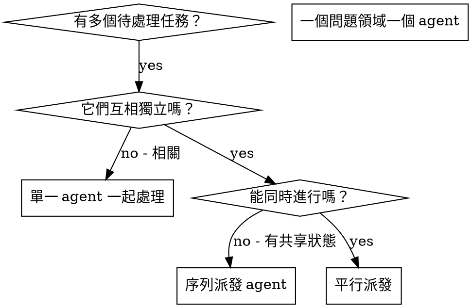

> **繁體中文說明**：見 [SUPERPOWERS-EXTRAS-USAGE-zh-TW.md](../SUPERPOWERS-EXTRAS-USAGE-zh-TW.md)（全系列 `sp-*` 合併對照）。

# 派發平行 Agent（RoomPilot 版）

## 總覽

你把任務委派給擁有獨立 context 的專門 agent。透過精準撰寫它們的指令與上下文，你確保它們保持專注並完成任務。它們**不應**繼承你這個 session 的 context 或歷史——你要精確地建構它們需要的東西。這同時也保留了你自己的 context 給協調工作用。

在 RoomPilot 這種單人專案裡，最常見的情境是：同一個下午你既要跑六風格批次判定、又要重建 `furniture_v3` 索引、還要把 `docs/` 的規格補齊。逐項處理會浪費時間，而這三條線本來就互不相干。

**核心原則：** 每一個獨立問題領域派一個 agent，讓它們同時進行。

## 何時使用



**適用時機：**
- 3 條以上互不相干的工作線（批次標註 / 索引重建 / 文件同步）
- 多個子系統各自出問題（`query_parser.py` 解析錯 vs `app.py` 卡片渲染錯）
- 每個問題不需要其他問題的上下文就能理解
- 各調查之間沒有共享狀態（不寫同一批檔案、不搶同一份記憶體）

**不適用時機：**
- 問題彼此相關（修好一個可能連帶修好其他）
- 需要理解系統的完整狀態（例如整條 Advanced RAG 管線的分數為何整體偏低）
- Agent 之間會互相干擾（同時寫 `chroma_db/`、同時載入 bge-m3 + reranker 撐爆 16 GB）

## 模式

### 1. 辨識獨立領域

依「壞掉的是什麼」分組。RoomPilot 的三條典型獨立線：

- **批次線**：`vlm_annotation/annotate_full.py` 續跑補標 → 只寫 `vlm_annotation/*.jsonl`
- **索引線**：`.venv-rag/bin/python rag_pipeline/embed_v3.py --only-changed` → 只寫 `chroma_db/` 與 `rag_export/`
- **文件線**：同步 `docs/query_parser_spec.md` 與 `rag_pipeline/README.md` → 只寫 `.md`

每個領域彼此獨立：補標註不會動到索引，改文件不會動到向量。

### 2. 建立聚焦的 Agent 任務

每個 agent 拿到：
- **明確範圍：** 一支腳本或一個子系統
- **清楚目標：** 讓這條線跑完並產出可驗證的結果
- **限制條件：** 不要動其他人的檔案
- **預期輸出：** 你發現了什麼、你改了什麼的摘要

### 3. 平行派發

```python
# 在 Claude Code / AI 環境中（示意，非可執行程式碼）
Task("續跑 vlm_annotation/annotate_full.py，補完未標註的 GLB，只寫 annotations_full.jsonl")
Task("執行 .venv-rag/bin/python rag_pipeline/embed_v3.py --only-changed，驗 rag_export/ 四個交付檔")
Task("同步 docs/query_parser_spec.md 與 rag_pipeline/README.md 的受控詞彙章節")
# 三條線同時進行
```

### 4. 審查與整合

Agent 回來之後：
- 讀每一份摘要
- 確認彼此的修改沒有衝突（有沒有人越界改了別人的檔案）
- 跑一次完整冒煙：`.venv-rag/bin/python rag_pipeline/retriever.py "北歐風客廳沙發"`
- 整合所有變更

## Agent Prompt 結構

好的 agent prompt 具備：
1. **聚焦** — 一個明確的問題領域
2. **自足** — 理解問題所需的全部上下文都在裡面
3. **明確輸出** — agent 該回傳什麼？

```markdown
修好 rag_pipeline/query_parser.py 的 3 個解析失敗案例：

1. 「找一組侘寂自然色卡的臥室家具」— color_card 沒被解析出來
2. 「三萬以內的日式餐桌」— budget_twd 解析成 30（單位當成萬）
3. 「工業風但要溫暖一點」— styles 回傳 null，structured outputs 報 400

這些都是需求解析（claude-haiku-4-5 structured outputs）層的問題。你的任務：

1. 讀 docs/query_parser_spec.md，確認每個欄位的受控詞彙與允收條件
2. 找出根因 — 是 schema 定義錯，還是 prompt 的受控詞彙沒列全？
3. 修法：
   - 可為 null 的 enum 必須用 anyOf（直接寫 type 陣列會 400）
   - 顏色／材質只進 semantic_query，不做過濾
   - 尺寸與預算是硬過濾，不得用常識推測

不要為了讓案例通過就放寬硬過濾條件 — 找出真正的原因。

回傳：你找到的根因與實際改動摘要。
```

## 常見錯誤

**❌ 太廣：**「把檢索修好」— agent 會迷路
**✅ 具體：**「修 query_parser.py 的 3 個解析失敗案例」— 範圍聚焦

**❌ 沒有上下文：**「修那個排序問題」— agent 不知道在哪
**✅ 有上下文：** 貼上查詢字串、實際回傳的前 8 筆與期望結果

**❌ 沒有限制：** agent 可能順手重構整個 `retriever.py`
**✅ 有限制：**「只准改 `query_parser.py`，不要動排序權重」

**❌ 模糊輸出：**「修好它」— 你不知道改了什麼
**✅ 具體輸出：**「回傳根因與改動摘要」

## 什麼時候「不要」用

**相關的失敗：** 修一個可能連帶修好其他 — 先一起調查
**需要完整脈絡：** 要理解整條 Query Understanding → Rerank → Set Composition 的分數流動
**探索式除錯：** 你還不知道哪裡壞了
**共享狀態：** Agent 會互相干擾——RoomPilot 的三個真實地雷：
1. 兩個 agent 同時寫 `chroma_db/` 的 `furniture_v3` collection → 後寫的覆蓋前寫的
2. 兩個 agent 同時載入 bge-m3 + bge-reranker-v2-m3（各約 4.6 GB）→ 16 GB 機器直接爆記憶體
3. 兩個 agent 同時打 `claude-haiku-4-5` 批次 → 額度與速率限制互相排擠

## 實際案例

**情境：** 一次要收尾三條線（資料標註、索引、文件），彼此無關

**任務：**
- `vlm_annotation/annotate_full.py`：還有 128 件 GLB 未標註（可續跑）
- `rag_pipeline/embed_v3.py --only-changed`：646 筆 `text_hash` 有變，需增量重建（約 1.5 分鐘）
- `docs/query_parser_spec.md`：受控詞彙與程式碼已不同步

**判斷：** 獨立領域 — 標註寫 jsonl、索引寫 chroma_db、文件寫 md，三者無交集

**派發：**
```
Agent 1 → 續跑 annotate_full.py 補完 128 件
Agent 2 → embed_v3.py --only-changed 並驗 rag_export/ 四個交付檔
Agent 3 → 同步 docs/query_parser_spec.md 的受控詞彙
```

**結果：**
- Agent 1：補完 128 件，另回報 6 件渲染圖缺正面圖（已列清單）
- Agent 2：646 筆重建完成，`rag_export/` 四檔一致，失敗清單為空
- Agent 3：補上 18 張色卡與 24 個氛圍詞的完整列表，標出程式與文件的 3 處差異

**整合：** 三者改動互不重疊，無衝突，冒煙檢索正常

**省下的時間：** 3 件事平行完成，而非依序排隊（原本索引那條線要等標註跑完）

## 關鍵效益

1. **平行化** — 多條調查同時進行
2. **聚焦** — 每個 agent 範圍窄，要追蹤的 context 少
3. **獨立性** — Agent 之間不互相干擾
4. **速度** — 3 個問題用 1 個問題的時間解決

## 驗證

Agent 回傳後：
1. **讀每份摘要** — 了解改了什麼
2. **檢查衝突** — Agent 有沒有改到同一份檔案（特別是 `rag_dataset/furniture_enriched_v3.json`）
3. **跑完整冒煙** — `retriever.py "<需求>"` 與 `app.py` 各一次，確認合起來仍正常
4. **抽查** — Agent 會犯系統性錯誤（例如三個 agent 都把 `rag_indexable` 寫進 Chroma `where`）

## 真實影響

來自一次收尾工作：
- 3 條互不相干的線（批次標註 / 索引重建 / 文件同步）
- 3 個 agent 平行派發
- 所有調查同時完成
- 所有改動順利整合
- Agent 之間零衝突（前提：事前已切清楚各自可寫的檔案範圍）
