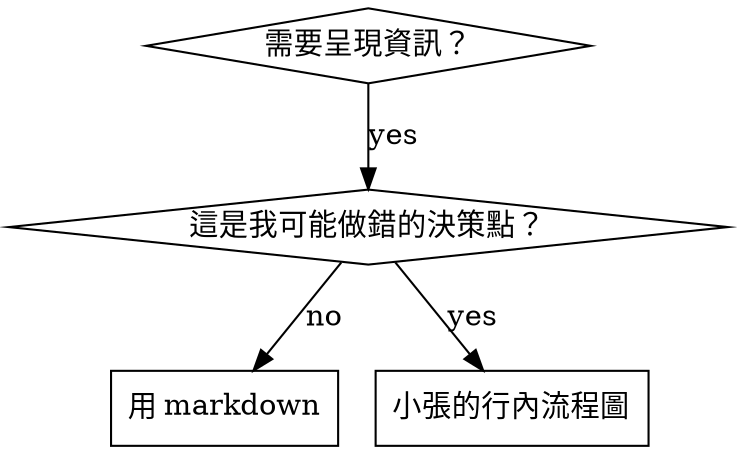

> **繁體中文說明**：見 [SUPERPOWERS-EXTRAS-USAGE-zh-TW.md](../SUPERPOWERS-EXTRAS-USAGE-zh-TW.md)（全系列 `sp-*` 合併對照）。

# 撰寫 Skill（RoomPilot 版）

## 總覽

**撰寫 skill 就是把測試驅動開發（TDD）套用在流程文件上。**

**個人 skill 放在 agent 專屬目錄（Claude Code 用 `~/.claude/skills`、Codex 用 `~/.agents/skills/`）；
本專案的 skill 一律放 `.claude-roompilot/skills/`。**

你先寫測試案例（用 subagent 跑壓力情境）、看它失敗（基準行為）、寫 skill（文件）、看測試通過（agent 遵守）、
再重構（堵住漏洞）。

**核心原則：** 如果你沒有親眼看過 agent 在「沒有這個 skill」時失敗，你就不知道這個 skill 教的是不是對的事。

**必要背景：** 使用本 skill 前你**必須**先理解 superpowers:sunnydata-testing。那個 skill 定義了基本的
RED-GREEN-REFACTOR 循環。本 skill 是把 TDD 套用到文件上。

**官方指引：** Anthropic 官方的 skill 撰寫最佳實踐見 anthropic-best-practices.md。該文件提供補充的
模式與準則，與本 skill 以 TDD 為核心的方法互補。

## 什麼是 Skill？

**Skill** 是「已驗證的技巧、模式或工具」的參考指南。Skill 幫助未來的 Claude 找到並套用有效的做法。

**Skill 是：** 可重用的技巧、模式、工具、參考指南

**Skill 不是：** 「我某次怎麼解掉某個問題」的敘事故事

## Skill 的 TDD 對照

| TDD 概念 | Skill 建立 |
|-------------|----------------|
| **測試案例** | 用 subagent 跑的壓力情境 |
| **產品程式碼** | Skill 文件（SKILL.md） |
| **測試失敗（RED）** | 沒有 skill 時 agent 違反規則（基準） |
| **測試通過（GREEN）** | 有 skill 時 agent 遵守 |
| **重構** | 在維持遵守的前提下堵住漏洞 |
| **先寫測試** | 在寫 skill **之前**先跑基準情境 |
| **看它失敗** | 逐字記錄 agent 用了哪些合理化說詞 |
| **最小程式碼** | 只寫針對那些具體違規的 skill 內容 |
| **看它通過** | 驗證 agent 現在會遵守 |
| **重構循環** | 找到新的合理化說詞 → 堵住 → 重新驗證 |

整個 skill 建立流程都遵循 RED-GREEN-REFACTOR。

## 何時該建立 Skill

**該建立：**
- 這個技巧對你來說不是直覺就能想到的
- 你之後在別的專案還會再參考它
- 這個模式適用範圍廣（不是專案專屬）
- 別人也會受益

**不要為以下情況建立：**
- 一次性的解法
- 其他地方已有完整文件的標準做法
- 專案專屬慣例（放 `.claude-roompilot/CLAUDE.md`，例如「`rag_indexable` 不能寫進 Chroma `where`」）
- 機械式限制（若能用 regex／驗證腳本強制，就自動化它——文件留給需要判斷的部分）

## Skill 類型

### 技巧型（Technique）
有步驟可循的具體方法（condition-based-waiting、root-cause-tracing）

### 模式型（Pattern）
思考問題的方式（flatten-with-flags、test-invariants）

### 參考型（Reference）
API 文件、語法指南、工具說明（例如 Chroma `where` 語法速查、bge-m3 參數速查）

## 目錄結構


```
skills/
  skill-name/
    SKILL.md              # 主要參考（必要）
    supporting-file.*     # 只在需要時才加
```

**扁平命名空間** — 所有 skill 在同一個可搜尋的命名空間

**要另開檔案的情況：**
1. **大量參考資料**（100+ 行）— API 文件、完整語法
2. **可重用工具** — 腳本、工具程式、模板

**保持行內：**
- 原則與概念
- 程式碼模式（< 50 行）
- 其他所有東西

## SKILL.md 結構

**Frontmatter（YAML）：**
- 兩個必要欄位：`name` 與 `description`（所有支援欄位見 [agentskills.io/specification](https://agentskills.io/specification)）
- 總長度上限 1024 字元
- `name`：只用英文字母、數字、連字號（不可有括號或特殊字元）
- `description`：第三人稱，只描述**何時使用**（不是它做什麼）
  - 以「當…時使用」開頭，聚焦在觸發條件
  - 包含具體症狀、情境與脈絡
  - **絕不摘要 skill 的流程或工作流**（原因見 CSO 章節）
  - 盡量控制在 500 字元以內

```markdown
---
name: Skill-Name-With-Hyphens
description: 當 [具體觸發條件與症狀] 時使用
---

# Skill 名稱

## 總覽
這是什麼？用 1-2 句話說核心原則。

## 何時使用
[若決策不直覺，放一張小的行內流程圖]

列出**症狀**與使用情境的清單
什麼時候不要用

## 核心模式（技巧型／模式型適用）
改動前／後的程式碼對照

## 速查
可掃讀的表格或條列，涵蓋常見操作

## 實作
簡單模式直接行內寫程式碼
大量參考或可重用工具則連到獨立檔案

## 常見錯誤
會出什麼問題 + 修法

## 真實影響（選填）
具體成果
```


## Claude 搜尋最佳化（CSO）

**對被發現至關重要：** 未來的 Claude 必須**找得到**你的 skill

### 1. 豐富的 description 欄位

**目的：** Claude 讀 description 來決定某個任務要載入哪些 skill。它必須能回答：「我現在該不該讀這個 skill？」

**格式：** 以「當…時使用」開頭，聚焦觸發條件

**關鍵：description = 何時使用，不是 skill 做什麼**

description 應**只**描述觸發條件。不要在 description 裡摘要 skill 的流程或工作流。

**為何重要：** 測試發現，當 description 摘要了 skill 的工作流，Claude 可能直接照 description 做而不去讀完整內容。
曾有一個 description 寫「任務之間做程式碼審查」，結果 Claude 只做了**一次**審查，儘管 skill 的流程圖清楚畫著**兩次**
審查（先查規格符合度、再查程式碼品質）。

當 description 改成純觸發條件「當執行含獨立任務的實作計畫時使用」（不摘要工作流）後，Claude 就正確讀了流程圖並執行兩階段審查。

**陷阱：** 摘要工作流的 description 會製造一條 Claude 一定會走的捷徑，skill 本體就變成被跳過的文件。

```yaml
# ❌ 差：摘要了工作流 — Claude 可能照這句做而不讀 skill
description: 執行計畫時使用 — 每個任務派一個 subagent，任務間做程式碼審查

# ❌ 差：流程細節太多
description: 做 TDD 時使用 — 先寫測試、看它失敗、寫最小程式碼、重構

# ✅ 好：只有觸發條件，沒有工作流摘要
description: 當在目前 session 執行含獨立任務的實作計畫時使用

# ✅ 好：純觸發條件
description: 當要實作任何功能或修 bug、在寫實作程式碼之前使用
```

**內容：**
- 用具體的觸發點、症狀與情境來說明何時適用
- 描述**問題**（競態條件、行為不一致），而非**特定語言的症狀**（`time.sleep`、`setTimeout`）
- 觸發條件盡量與技術無關，除非該 skill 本身就是技術專屬
- 若 skill 是技術專屬，就在觸發條件裡明講
- 用第三人稱寫（會被注入系統提示）
- **絕不摘要 skill 的流程或工作流**

```yaml
# ❌ 差：太抽象、含糊，沒說何時使用
description: 用於非同步測試

# ❌ 差：第一人稱
description: 測試不穩定時我可以幫你處理非同步測試

# ❌ 差：提到某技術但 skill 並非該技術專屬
description: 當測試用 time.sleep 而且不穩定時使用

# ✅ 好：以「當…時使用」開頭、描述問題、無工作流
description: 當測試有競態條件、時序相依，或時通時不通時使用

# ✅ 好：技術專屬 skill，觸發條件寫明技術
description: 當使用 ChromaDB 的 where 過濾並處理巢狀 metadata 欄位時使用
```

### 2. 關鍵字涵蓋

用 Claude 會拿去搜尋的詞：
- 錯誤訊息：「Hook timed out」、「命中 0 筆」、「structured outputs 400」
- 症狀：「不穩定」、「卡住」、「殭屍程序」、「污染」、「重排分數全 1.0」
- 同義詞：「timeout/hang/freeze」、「cleanup/teardown/收尾」
- 工具：實際指令、函式庫名稱、副檔名（`chromadb`、`bge-m3`、`.jsonl`）

### 3. 描述性命名

**用主動語態、動詞開頭：**
- ✅ `creating-skills` 而非 `skill-creation`
- ✅ `condition-based-waiting` 而非 `async-test-helpers`

### 4. Token 效率（關鍵）

**問題：** getting-started 與高頻引用的 skill 會載入**每一次**對話。每個 token 都算數。

**目標字數：**
- getting-started 工作流：每個 < 150 字
- 高頻載入的 skill：全部 < 200 字
- 其他 skill：< 500 字（仍要精簡）

**技巧：**

**把細節移到工具的 help：**
```bash
# ❌ 差：把所有旗標寫進 SKILL.md
embed_v3.py 支援 --limit、--only-changed、--dry-run、--collection NAME、--device mps

# ✅ 好：引導看 --help
embed_v3.py 支援多種模式與過濾旗標。細節請跑 --help。
```

**用交叉引用：**
```markdown
# ❌ 差：重複寫工作流細節
搜尋時派一個 subagent，帶上模板…
[20 行重複的指令]

# ✅ 好：引用其他 skill
一律使用 subagent（節省 50-100 倍 context）。必要：工作流見 [其他 skill 名稱]。
```

**壓縮範例：**
```markdown
# ❌ 差：冗長的範例（42 字）
你的人類夥伴：「我們之前在 Chroma 的 where 過濾裡怎麼處理巢狀欄位？」
你：我去搜尋過去對話裡關於 Chroma where 過濾的模式。
[派 subagent 搜尋："Chroma where 巢狀 metadata 過濾 命中 0 筆"]

# ✅ 好：精簡的範例（20 字）
夥伴：「Chroma where 過濾的巢狀欄位怎麼處理？」
你：搜尋中…
[派 subagent → 綜整]
```

**消除冗餘：**
- 不要重複交叉引用的 skill 已寫的內容
- 不要解釋指令本身就看得出來的事
- 同一個模式不要放多個範例

**驗證：**
```bash
wc -w skills/path/SKILL.md
# getting-started 工作流：目標每個 < 150
# 其他高頻載入：目標全部 < 200
```

**用「你做的事」或核心洞察來命名：**
- ✅ `condition-based-waiting` > `async-test-helpers`
- ✅ `using-skills` 而非 `skill-usage`
- ✅ `flatten-with-flags` > `data-structure-refactoring`
- ✅ `root-cause-tracing` > `debugging-techniques`

**動名詞（-ing）很適合流程：**
- `creating-skills`、`testing-skills`、`debugging-with-logs`
- 主動、描述你正在做的動作

### 4. 交叉引用其他 Skill

**在文件中引用其他 skill 時：**

只寫 skill 名稱，並加上明確的必要性標記：
- ✅ 好：`**必要子技能：** 使用 superpowers:sunnydata-testing`
- ✅ 好：`**必要背景：** 你必須理解 superpowers:sunnydata-debugging`
- ❌ 差：`見 skills/testing/test-driven-development`（不清楚是否必要）
- ❌ 差：`@skills/testing/test-driven-development/SKILL.md`（強制載入、燒 context）

**為什麼不要用 @ 連結：** `@` 語法會立刻強制載入檔案，在你需要之前就吃掉 200k+ context。

## 流程圖的使用



**流程圖**只**用於：**
- 不直覺的決策點
- 你可能太早停下來的流程迴圈
- 「什麼時候用 A、什麼時候用 B」的決策

**絕不用流程圖表達：**
- 參考資料 → 用表格、清單
- 程式碼範例 → 用 markdown 區塊
- 線性指令 → 用編號清單
- 沒有語意的標籤（step1、helper2）

Graphviz 樣式規則見 @graphviz-conventions.dot。

**為你的人類夥伴視覺化：** 用本目錄的 `render_graphs.py`（Python 3.11 + graphviz `dot`）把 skill 的流程圖輸出成 SVG：
```bash
.venv-rag/bin/python render_graphs.py ../some-skill           # 每張圖分開輸出
.venv-rag/bin/python render_graphs.py ../some-skill --combine # 所有圖合成一張 SVG
```
（需先安裝 graphviz：`brew install graphviz`。本專案沒有 Node，原本的 `render-graphs.js` 已改寫為此 Python 版本。）

## 程式碼範例

**一個優秀的範例勝過許多平庸的範例**

選最相關的語言——**本專案一律 Python 3.11，執行方式 `.venv-rag/bin/python`：**
- 檢索／重排技巧 → Python
- 系統除錯 → Shell / Python
- 資料處理 → Python

**好的範例：**
- 完整且可執行
- 註解說明**為什麼**
- 來自真實情境
- 清楚展示模式
- 可直接改用（不是填空模板）

**不要：**
- 同一件事寫 5 種以上語言的實作
- 做填空式模板
- 寫造作、不真實的範例

你很擅長移植——一個好範例就夠了。

## 檔案組織

### 自足型 Skill
```
defense-in-depth/
  SKILL.md    # 全部行內
```
時機：所有內容都塞得下，不需要大量參考資料

### 含可重用工具的 Skill
```
condition-based-waiting/
  SKILL.md    # 總覽 + 模式
  example.py  # 可直接改用的輔助程式
```
時機：工具是可重用的程式碼，不只是敘述

### 含大量參考的 Skill
```
retrieval-tuning/
  SKILL.md          # 總覽 + 工作流
  chroma-where.md   # 600 行 Chroma 過濾語法參考
  bge-params.md     # 500 行 bge-m3 / bge-reranker-v2-m3 參數與行為
  scripts/          # 可執行工具
```
時機：參考資料太大，不適合行內

## 鐵律（與 TDD 相同）

```
沒有先失敗的測試，就不准有 SKILL
```

這適用於**新 skill**，也適用於對既有 skill 的**修改**。

先寫 skill 再測試？刪掉，重來。
沒測試就改 skill？同樣是違規。

**沒有例外：**
- 不因為「只是小補充」而例外
- 不因為「只是加一個章節」而例外
- 不因為「只是更新文件」而例外
- 不要把沒測過的改動留著當「參考」
- 不要一邊跑測試一邊「順手調整」
- 刪掉就是刪掉

**必要背景：** superpowers:sunnydata-testing 說明了為何這件事重要。同樣的原則適用於文件。

## 測試所有 Skill 類型

不同類型的 skill 需要不同的測試方式：

### 紀律強制型 Skill（規則／要求）

**例子：** TDD、完成前驗證、寫程式前先設計

**測試方式：**
- 學理問題：他們理解規則嗎？
- 壓力情境：在壓力下他們會遵守嗎？
- 多重壓力疊加：時間 + 沉沒成本 + 疲勞
- 找出合理化說詞並加上明確反制

**成功標準：** Agent 在最大壓力下仍遵守規則

### 技巧型 Skill（how-to 指南）

**例子：** condition-based-waiting、root-cause-tracing、防禦性程式設計

**測試方式：**
- 應用情境：他們能正確套用這個技巧嗎？
- 變化情境：他們能處理邊界情況嗎？
- 缺資訊測試：指令有沒有缺口？

**成功標準：** Agent 能把技巧成功套用到新情境

### 模式型 Skill（心智模型）

**例子：** 降低複雜度、資訊隱藏概念

**測試方式：**
- 辨識情境：他們認得出何時適用嗎？
- 應用情境：他們能運用這個心智模型嗎？
- 反例：他們知道什麼時候**不該**套用嗎？

**成功標準：** Agent 能正確判斷何時／如何套用模式

### 參考型 Skill（文件／API）

**例子：** API 文件、指令參考、函式庫指南（如 Chroma `where` 語法速查）

**測試方式：**
- 檢索情境：他們找得到正確資訊嗎？
- 應用情境：他們能正確使用找到的資訊嗎？
- 缺口測試：常見使用情境都涵蓋了嗎？

**成功標準：** Agent 能找到並正確套用參考資訊

## 跳過測試的常見合理化說詞

| 藉口 | 現實 |
|--------|---------|
| 「這 skill 顯然很清楚」 | 對你清楚 ≠ 對其他 agent 清楚。去測。 |
| 「這只是參考資料」 | 參考資料也會有缺口、有含糊處。測檢索。 |
| 「測試太小題大作」 | 沒測過的 skill 一定有問題。15 分鐘測試省下數小時。 |
| 「有問題再測就好」 | 有問題 = agent 用不了這個 skill。部署**前**就要測。 |
| 「測試太繁瑣」 | 測試遠比在正式使用中除錯一個爛 skill 輕鬆。 |
| 「我有信心它是好的」 | 過度自信保證出問題。還是要測。 |
| 「學理檢視就夠了」 | 讀 ≠ 用。測應用情境。 |
| 「沒時間測」 | 部署沒測過的 skill，之後修它更花時間。 |

**以上全部的意思都是：部署前先測。沒有例外。**

## 讓 Skill 防彈、抵抗合理化

強制紀律的 skill（例如 TDD）必須能抵抗合理化。Agent 很聰明，在壓力下會找漏洞。

**心理學備註：** 理解**為何**說服技巧有效，能幫你系統性地運用它們。研究基礎見 persuasion-principles.md
（Cialdini, 2021；Meincke et al., 2025）關於權威、承諾、稀缺、社會認同與同一性原則。

### 明確堵住每一個漏洞

不要只陳述規則——要禁止具體的繞道方式：

<Bad>
```markdown
先寫程式碼再寫測試？刪掉。
```
</Bad>

<Good>
```markdown
先寫程式碼再寫測試？刪掉。重來。

**沒有例外：**
- 不要留著當「參考」
- 不要一邊寫測試一邊「改用」它
- 不要去看它
- 刪掉就是刪掉
```
</Good>

### 處理「精神 vs 字面」的爭論

在文件早期加入基礎原則：

```markdown
**違反規則的字面，就是違反規則的精神。**
```

這一刀切掉整類「我遵守的是精神」的合理化說詞。

### 建立合理化說詞表

從基準測試蒐集合理化說詞（見下方測試章節）。Agent 講過的每個藉口都進表：

```markdown
| 藉口 | 現實 |
|--------|---------|
| 「太簡單不用測」 | 簡單的程式碼照樣會壞。測試只要 30 秒。 |
| 「我之後再測」 | 事後立刻通過的測試什麼都證明不了。 |
| 「事後測也達到一樣目的」 | 事後測 = 「這在做什麼？」先測 = 「這**應該**做什麼？」 |
```

### 建立紅旗清單

讓 agent 容易自我檢查自己是不是在合理化：

```markdown
## 紅旗 — 停下來重新開始

- 先寫程式碼再寫測試
- 「我已經手動測過了」
- 「事後測達到一樣目的」
- 「重點是精神不是儀式」
- 「這次不一樣，因為…」

**以上全部的意思都是：刪掉程式碼，用 TDD 重來。**
```

### 針對違規症狀更新 CSO

在 description 加上「你即將要違規」的症狀：

```yaml
description: 當要實作任何功能或修 bug、在寫實作程式碼之前使用
```

## Skill 的 RED-GREEN-REFACTOR

遵循 TDD 循環：

### RED：寫失敗的測試（基準）

在**沒有** skill 的情況下用 subagent 跑壓力情境。記錄確切行為：
- 他們做了什麼選擇？
- 他們用了哪些合理化說詞（逐字）？
- 哪些壓力觸發了違規？

這就是「看著測試失敗」——你必須先看到 agent 自然狀態下會怎麼做，才能寫 skill。

### GREEN：寫最小的 Skill

寫出針對那些具體合理化說詞的 skill。不要為假想情況加額外內容。

用同樣的情境**帶著** skill 再跑一次。Agent 現在應該會遵守。

### REFACTOR：堵漏洞

Agent 找到新的合理化說詞？加上明確反制。反覆測到防彈為止。

**測試方法論：** 完整測試方法見 @testing-skills-with-subagents.md：
- 如何撰寫壓力情境
- 壓力類型（時間、沉沒成本、權威、疲勞）
- 系統性堵漏洞
- 後設測試技巧

## 反模式

### ❌ 敘事式範例
「在 2025-10-03 那次 session，我們發現 projectDir 為空導致…」
**為何不好：** 太具體、無法重用

### ❌ 多語言稀釋
example_js、example_py、example_go 三份做同一件事
**為何不好：** 品質平庸、維護負擔（本專案只有 Python 3.11，更沒有理由這樣做）

### ❌ 在流程圖裡寫程式碼
```dot
step1 [label="import json"];
step2 [label="read file"];
```
**為何不好：** 無法複製貼上、難讀

### ❌ 泛用標籤
helper1、helper2、step3、pattern4
**為何不好：** 標籤應該有語意

## 停：在進到下一個 Skill 之前

**寫完任何 skill 後，你必須停下來完成部署流程。**

**不要：**
- 一口氣批次建立多個 skill 而不逐一測試
- 在目前這個尚未驗證前就跳到下一個 skill
- 因為「批次比較有效率」而跳過測試

**下方的部署檢查清單對每一個 skill 都是強制的。**

部署沒測過的 skill = 部署沒測過的程式碼，違反品質標準。

## Skill 建立檢查清單（TDD 版）

**重要：請用 TodoWrite 為下方**每一個**檢查項目建立待辦。**

**RED 階段 — 寫失敗的測試：**
- [ ] 建立壓力情境（紀律型 skill 需 3 種以上壓力疊加）
- [ ] 在**沒有** skill 的情況下跑情境 — 逐字記錄基準行為
- [ ] 找出合理化說詞／失敗的模式

**GREEN 階段 — 寫最小的 Skill：**
- [ ] 名稱只用英文字母、數字、連字號（無括號／特殊字元）
- [ ] YAML frontmatter 具備必要的 `name` 與 `description`（上限 1024 字元；見 [spec](https://agentskills.io/specification)）
- [ ] description 以「當…時使用」開頭，含具體觸發點／症狀
- [ ] description 用第三人稱撰寫
- [ ] 全篇布滿可搜尋關鍵字（錯誤、症狀、工具）
- [ ] 清楚的總覽與核心原則
- [ ] 針對 RED 階段找到的具體失敗做處理
- [ ] 程式碼行內寫，或連到獨立檔案
- [ ] 一個優秀範例（不是多語言版本）
- [ ] **帶著** skill 再跑情境 — 驗證 agent 現在遵守

**REFACTOR 階段 — 堵漏洞：**
- [ ] 從測試中找出**新的**合理化說詞
- [ ] 加上明確反制（紀律型 skill 適用）
- [ ] 從所有測試迭代整理出合理化說詞表
- [ ] 建立紅旗清單
- [ ] 反覆測到防彈

**品質檢查：**
- [ ] 只在決策不直覺時才放小流程圖
- [ ] 有速查表
- [ ] 有常見錯誤章節
- [ ] 沒有敘事式說故事
- [ ] 支援檔案只用於工具或大量參考資料

**部署：**
- [ ] 把 skill 提交進版本控制並推到你的 fork（**RoomPilot 尚未 git init**，暫以檔案備份與 `.claude-roompilot/context/` 紀錄取代）
- [ ] 若普遍有用，考慮以 PR 回饋上游（同樣待專案 git init 後執行）

## 被發現的流程

未來的 Claude 怎麼找到你的 skill：

1. **遇到問題**（「檢索結果不穩定」）
3. **找到 SKILL**（description 相符）
4. **掃讀總覽**（這相關嗎？）
5. **讀模式**（速查表）
6. **載入範例**（只在實作時）

**針對這條路徑最佳化** — 把可搜尋的詞放在前面、且多放幾次。

## 結論

**建立 skill 就是流程文件的 TDD。**

同一條鐵律：沒有先失敗的測試就沒有 skill。
同一個循環：RED（基準）→ GREEN（寫 skill）→ REFACTOR（堵漏洞）。
同樣的效益：品質更好、意外更少、結果防彈。

如果你寫程式遵循 TDD，寫 skill 也照做。這就是同一套紀律套用在文件上。
